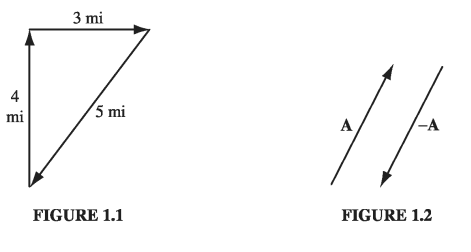

# Chapter 1: Vector Analysis

## 1.1: Vector Algebra

### 1.1.1: Vector Operations

If you walk 4 miles due north and then 3 miles due east (Fig. 1.1), you will have gone a total of 7 miles, but you're _not_ 7 miles from where you set out-you're only 5. We need an arithmetic to describe quantities like this, which evidently do not add in the ordinary way. The reason they don't, of course, is that __displacements__ (straight line segments going from one point to another) have _direction_ as well as _magnitude_ (length), and it is essential to take both into account when you combine them. Such objects are called vectors: velocity, acceleration, force and momentum are other examples. By contrast, quantities that have magnitude but no direction are called scalars: examples include mass, charge, density, and temperature.

I shall use boldface (\( \vec{A} \) , \( \vec{B} \) , and so on) for vectors and ordinary type for scalars. The magnitude of a vector \( \vec{A} \)  is written \( |\vec{A}| \)  or, more simply, \( A \) . In diagrams, vectors are denoted by arrows: the length of the arrow is proportional to the magnitude of the vector, and the arrowhead indicates its direction. Minus \( \vec{A} \)  (\( - \vec{A} \) ) is a vector with the same magnitude as A but of opposite direction (Fig. 1.2). Note that vectors have magnitude and direction but not location: a displacement of 4 miles due north from Washington is represented by the same vector as a displacement 4 miles north from Baltimore (neglecting, of course, the curvature of the earth). On a diagram, therefore, you can slide the arrow around at will, as long as you don't change its length or direction.

We define four vector operations: addition and three kinds of multiplication.

__(i) Addition of two vectors.__. Place the tail of \( \vec{B} \) at the head of \( \vec{A} \); the sum, \( \vec{A} + \vec{B} \), is the vector from the tail of \( \vec{A} \) to the head of \( \vec{B} \) (Fig 1.3). This rule generalizes the obvious procedure for combining two displacements. Addition is _commutative_:
$$
\vec{A} + \vec{B} = \vec{B} + \vec{A}
$$

3 miles east followed by 4 miles north gets you to the same place as 4 miles north followed by 3 miles east. Addition is also associative:
$$
(\vec{A} + \vec{B}) + \vec{C} = \vec{A} + (\vec{B} + \vec{C})
$$

To subtract a vector, add its opposite (Fig. 1.4):
$$
\vec{A} - \vec{B} = \vec{A} + (- \vec{B})
$$

__(ii) Multiplication by a scalar.__ Multiplication of a vector by a positive scalar a multiplies the magnitude but leaves the direction unchanged (Fig. 1.5). (If a is negative, the direction is reversed.) Scalar multiplication is distributive:
$$
a(\vec{A} + \vec{B}) = a \vec{A} + a \vec{B}
$$

__(iii) Dot product of two vectors.__ The dot product of two vectors is defined by
$$
\vec{A} \cdot \vec{B} = A B \cos \theta \label{1.1}
$$

where \( \theta \)  is the angle they form when placed tail-to-tail (Fig. 1.6). Note that \( \vec{A} \cdot \vec{B} \) is itself a scalar (hence the alternative name _scalar product_). The dot product is commutative,
$$
\vec{A} \cdot \vec{B} = \vec{B} \cdot \vec{A}
$$
and distributive
$$
\vec{A} \cdot (\vec{B} + \vec{C}) = \vec{A} \cdot \vec{B} + \vec{A} \cdot \vec{C} \label{1.2}
$$

Geometrically, \( \vec{A} \cdot \vec{B} \) is the product of A times the projection of B along A (or the product of B times the projection of A along B). If the two vectors are parallel, then \( \vec{A} \cdot \vec{B} = AB \). In particular, for any vector A
$$
 \vec{A} \cdot \vec{A} = A^2 \label{1.3}
 $$ 
If A and B are perpendicular, then \( \vec{A} \cdot \vec{B} = 0 \)

---

#### Example 1.1

> Let \( \vec{C} = \vec{A} - \vec{B} \) (Fig 1.7), and calculate the dot product of \( \vec{C} \) with itself.

__Solution__
$$
\vec{C} \cdot \vec{C} = ( \vec{A} - \vec{B} ) \cdot (\vec{A} - \vec{B}) = \vec{A} \cdot \vec{A} - \vec{A} \cdot \vec{B} - \vec{B} \cdot \vec{A} + \vec{B} \cdot \vec{B}
$$
or

$$
C^2 = A^2 + B^2 - 2AB\cos \theta
$$
This is the law of cosines.

---

__(iv) Cross product of two vectors.__ The cross product of two vectors is defined by
$$
\vec{A} \cross \vec{B} = AB \sin \theta \hat{n} \label{1.4}
$$

where \( \hat{n} \) is a unit vector (vector of magnitude 1) pointing perpendicular to the plane of A and B. (I shall use a hat \( \hat{} \) to denote unit vectors.) Of course, there are two directions perpendicular to any plane: "in" and "out." The ambiguity is resolved by the right-hand rule: let your fingers point in the direction of the first vector and curl around (via the smaller angle) toward the second; then your thumb indicates the direction of \( \hat{n} \). (In Fig. 1.8, \( \vec{A} \cross \vec{B} \) points into the page; \( \vec{B} \cross \vec{A} \)  points out of the page.) Note that \( \vec{A} \cross \vec{B} \)  is itself a vector (hence the alternative name
vector product). The cross product is distributive
$$
\vec{A} \cross ( \vec{B} + \vec{C}) = ( \vec{A} \cross \vec{B}) + (\vec{A} \cross \vec{C})
$$
but not _commutative_. In fact,
$$
(\vec{B} \cross \vec{A}) = - (\vec{A} \cross \vec{B})
$$

Geometrically, \( | \vec{A} \cross \vec{B} | \) is the area of the parallelogram generated by \( \vec{A} \) and \( \vec{B} \) (Fig 1.8). If two vectors are parallel, their cross product is zero. In particular,
$$
 \vec{A} \cross \vec{A} = 0
 $$ 
for any vector A.

### 1.1.2: Vector Algebra: Component Form

In the previous section, I defined the four vector operations (addition, scalar multiplication, dot product, and cross product) in "abstract" form-that is, without reference to any particular coordinate system. In practice, it is often easier to set up Cartesian coordinates x, y, z and work with vector components. Let \( \hat{x} \), \( \hat{y} \) , and \( \hat{z} \) be unit vectors parallel to the x, y, and z axes, respectively (Fig. 1.9(a)). An arbitrary vector A can be expanded in terms ofthese basis vectors (Fig. 1.9(b)):
$$
\vec{A} = A_x \hat{x} + A_y \hat{y} + A_z \hat{z}
$$

The numbers \( A_x \), \( A_y \), and \( A_z \) are the "components" of A; geometrically, they are the projections of A along the three coordinate axes (\( A_x = \vec{A} \cdot \hat{x}, A_y = \vec{A} \cdot \hat{y}, A_z = \vec{A} \cdot \hat{z} \) ). We can now reformulate each of the four vector operations as a rule for manipulating components:
$$
\vec{A} + \vec{B} = (A_x \hat{x} + A_y \hat{y} + A_z \hat{z}) + (B_x \hat{x} + B_y \hat{y} + B_z \hat{z}) \\
 = (A_x + B_x) \hat{x} + (A_y + B_y) \hat{y} + (A_z + B_z) \hat{z} \label{1.7}
$$

__Rule (i):__ To add vectors, add like components.
$$
a\vec{A} = (a A_x) \hat{x} + (a A_y) \hat{y} + (a A_z)\hat{z} \label{1.8}
$$

__Rule (ii):__ To multiply by a scalar, multiply each component.

Because \( \hat{x}, \hat{y} \), and \( \hat{z} \) are mutually perpendicular unit vectors
$$
\hat{x} \cdot \hat{x} = \hat{y} \cdot \hat{y} = \hat{z} \cdot \hat{z} = 1; \qquad \hat{x} \cdot \hat{y} = \hat{x} \cdot \hat{z} = \hat{y} \cdot \hat{z} = 0 \label{1.9}
$$

Accordingly,
$$
\vec{A} \cdot \vec{B} = (A_x \hat{x} + A_y \hat{y} + A_z \hat{z}) \cdot (B_x \hat{x} + B_y \hat{y} + B_z \hat{z}) \\
 = A_x B_x + A_y B_y + A_z B_z \label{1.10}
$$

__Rule (iii):__ To calculate the dot product, multiply like components and add. In particular,
$$
\vec{A} \cdot \vec{A} = A_x ^2 + A_y ^2 + A_z ^2
$$
so
$$
A = \sqrt{A_x ^2 + A_y ^2 + A_z ^2} \label{1.11}
$$

Similarly,

$$
\begin{align}
\hat{x} \cross \hat{x} & = & \hat{y} \cross \hat{y} & = & \hat{z} \cross \hat{z} = 0 \\
\hat{x} \cross \hat{y} & = & - \hat{y} \cross \hat{x} & = & \hat{z} \\
\hat{y} \cross \hat{z} & = & - \hat{z} \cross \hat{y} & = & \hat{x} \\
\hat{z} \cross \hat{x} & = & - \hat{x} \cross \hat{z} & = & \hat{y}
\end{align}
$$

Therefore,
$$
\vec{A} \cross \vec{B} = (A_x \hat{x} + A_y \hat{y} + A_z \hat{z}) \cross (B_x \hat{x} + B_y \hat{y} + B_z \hat{z}) \\
 = (A_y B_z - A_z B_y) \hat{x} + (A_z B_x - A_x B_z)\hat{y} + (A_x B_y - A_y B_x) \hat{z} \label{1.13}
$$

This cumbersome expression can be written more neatly as a determinant:
$$
\vec{A} \cross \vec{B} = \begin{vmatrix}
\hat{x} & \hat{y} & \hat{z} \\
A_x & A_y & A_z \\
B_x & B_y & B_z
\end{vmatrix}
$$

__Rule (iv):__ To calculate the cross product, form the determinant whose first row is \( \hat{x}, \hat{y}, \hat{z} \), whose second row is A, and whose third row is B.