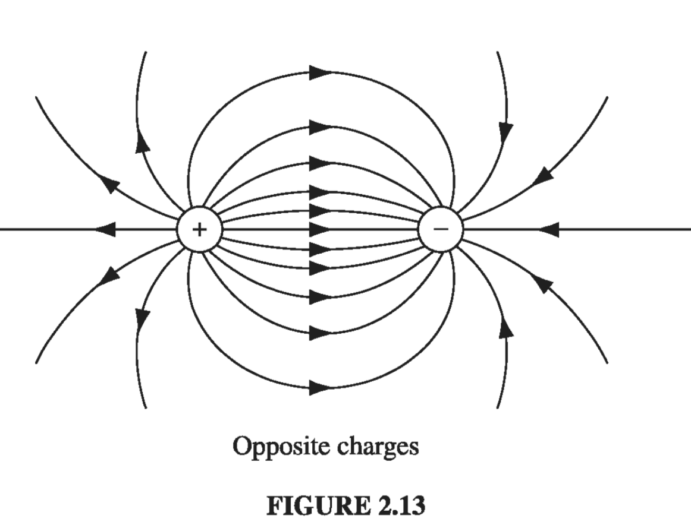
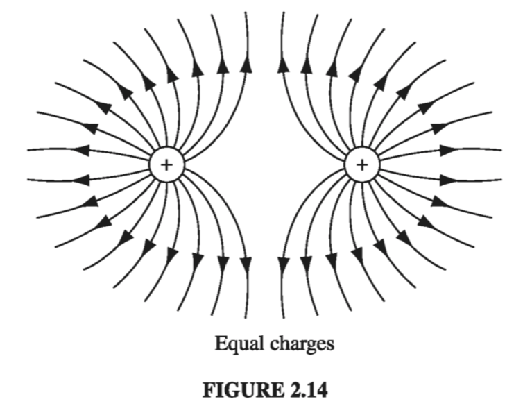
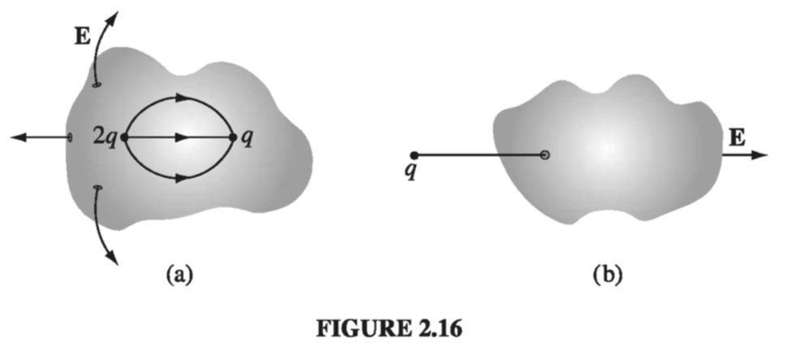

# 2.2: Divergence and Curl of Electrostatic Fields

## 2.2.1 Field Lines, Flux, and Gauss' Law

In principle, we are _done_ with the subject of electrostatics. Eq. 2.8 tells us how to compute the field of a charge distribution, and Eq. 2.3 tells us what the force on a charge Q placed in this field will be. Unfortunately, as you may have discovered, the integrals involved in computing E can be formidable, even for reasonably simple charge distributions. Much of the rest of electrostatics is devoted to assembling a bag of tools and tricks for avoiding these integrals. It all begins with the divergence and curl of **E**. I shall calculate the divergence of __E__ directly from Eq. 2.8 in section 2.2.2, but first I want to show you a more qualitative, and perhaps more illuminating, intuitive approach.

Let's begin with the simplest possible case: a single point charge _q_, situated at the origin:
$$
\vec{E}(\vec{r}) = \frac{1}{4 \pi \epsilon_0} \frac{q}{r^2} \vu{\vec{r}} \tag{2.10} \label{2.10}
$$

To get a "feel" for this field, I might sketch a few representative vectors, as in Fig. 2.12a. Because the field falls off like \( 1/r^2 \), the vectors get shorter as you go farther away from the origin; they always point radially outward. But there is a nicer way to represent this field, and that's to connect up the arrows, to form __field lines__ (Fig. 2.12b).

You might think that I have thereby thrown away information about the _strength_ of the field, which was contained in the length of the arrows. But actually I have not. The magnitude of the field is indicated by the _density_ of the field lines: it's strong near the center where the field lines are close together, and weak farther out, where they are relatively far apart.

In truth, the field-line diagram is deceptive, when I draw it on a two-dimensional surface, for the density of lines passing through a circle of radius _r_ is the total number divided by the circumference (\( n / 2 \pi r \)), which goes like \( (1/r) \), not \( (1/r^2) \). But if you imagine the model in three dimensions (a pincushion with needles sticking out in all directions), then the density of lines is the total number divided by the area of the sphere \( (n/4 \pi r^2) \), which _does_ go like \( (1/r^2) \).

Such diagrams are also convenient for representing more complicated fields. Of course, the number of lines you draw depends on how lazy you are (and how sharp your pencil is), though you ought to include enough to get an accurate sense of the field, and you must be consistent: if \( q \)  gets 8 lines, then \( 2q \)  deserves 16. And you must space them fairly - they emanate from a point charge symmetrically in all directions. Field lines begin on positive charges and end on negative ones; they cannot simply terminate in midair, though they may extend out to infinity. Moreover, field lines can never cross - at the intersection the field would have two different directions at once! With all this in mind, it is easy to sketch the field of any simple configuration of point charges: Begin by drawing the lines in the neighborhood of each charge, and then connect them up or extend them to infinity (Figs. 2.13 and 2.14)

In this model, the _flux_ of __E__ through a surface S,
$$
\Phi_E \equiv \int _S \vec{E} \cdot \dd{\vec{a}} \label{2.11} \tag{2.11}
$$

is a measure of the "number of lines" passing through S. I put this in quotes because of course we can only draw a representative _sample_ of field lines - the total number would be infinite. But for a given sampling rate the flux is _proportional_ to the number of lines drawn, because the field strength, remember, is proportional to the density of field lines (the number per unit area), and hence \( \vec{E} \cdot \dd{\vec{a}} \) is proportional to the number of lines passing through the infinitesimal area \( \dd{\vec{a}} \). (The dot product picks out the component of \( \dd{\vec{a}} \) along the direction of __E__, as indicated in Fig 2.15. It is the area in the plane perpendicular to __E__ that we have in mind when we say that the density of field lines is the number per unit area).

This suggests that the flux through any _closed_ surface is a measure of the total charge inside. For the field lines that originate on a positive charge must either pass out through the surface or else terminate on a negative charge inside (Fig 2.16a). On the other hand, a charge _outside_ the surface will contribute nothing to the total flux, since its field lines pass in one side and out the other (Fig 2.16b). This is the _essence_ of Gauss's law. Now let's make it quantitative.

In the case of a point charge _q_ at the origin, the flux of __E__ through a spherical surface or radius _r_ is
$$
\oint \vec{E} \cdot \dd{\vec{a}} = \int \frac{1}{4 \pi \epsilon_0} \left( \frac{q}{r^2} \vu{r} \right) \cdot \left( r^2 \sin \theta \dd{\theta} \dd{\phi} \vu{r} \right) = \frac{1}{\epsilon_0} q \label{2.12} \tag{2.12}
$$

Notice that the radius of the sphere cancels out, for while the surface area goes _up_ as \( r^2 \), the field goes _down_ as \( 1/r^2 \), so the product is constant. In terms of the field-line picture, this makes good sense, since the same number of field lines pass through any sphere centered at the origin, regardless of its size. In fact, it didn't have to be a sphere - any closed surface, whatever its shape, would be pierced by the same number of field lines. Evidently, the flux through any surface enclosing the charge is \( q / \epsilon_0 \).

Now suppose that instead of a single charge at the origin, we have a bunch of charges scattered about. According to the principle of superposition, the total field is the (vector) sum of all the individual fields:
$$
\vec{E} = \sum _{i = 1} ^\nu \vec{E}_i
$$

The flux through a surface that encloses them all is
$$
\oint \vec{E} \cdot \dd{\vec{l}} = \sum _{i = 1}^n \left( \oint \vec{E_i} \cdot \dd{\vec{a}} \right) = \sum_{i = 1}^n \left( \frac{1}{\epsilon_0} q_i  \right)
$$

For any closed surface, then
$$
\oint \vec{E} \cdot \dd{\vec{a}} = \frac{1}{\epsilon_0} Q_{enc} \label{2.13} \tag{2.13}
$$

where \( Q_{enc} \) is the total charge enclosed within the surface. This is the quantitative statement of Gauss's law. Although it contains no information that was not already present in Coulomb's law plus the principle of superposition, it is of almost magical power, as you will see in Sect. 2.2.3. Notice that it all hinges on the \( 1/r^2 \) character of Coulomb's law; without that, the crucial cancellation of the _r_'s in \( \eqref{2.12} \) would not take place, and the total flux of __E__ would depend on the surface chosen, not merely on the total charge enclosed. Other \( 1/r^2 \) forces (I am thinking particularly of Newton's law of universal gravitation) will obey "Gauss's laws" of their own, and the applications we develop here carry over directly.

As it stands, Gauss's law is an _integral_ equation, but we can easily turn it into a differential one by applying the divergence theorem:
$$
\oint_{S} \vec{E} \cdot \dd{\vec{a}} = \int_{\mathscr{V}} (\div{\vec{E}}) \dd{\tau}
$$
Rewriting \( Q_{enc} \) in terms of the charge density \( \rho \) we have
$$
Q_{enc} = \int_{\mathscr{V}} \rho \dd{\tau}
$$
So Gauss's law becomes
$$
\int_{\mathscr{V}} (\div{\vec{E}}) \dd{\tau} = \int_{\mathscr{V}} \left( \frac{\rho}{\epsilon_0} \dd{\tau} \right)
$$
And since this holds for _any_ volume, the integrands must be equal:
$$
\nabla \cdot \vec{E} = \frac{1}{\epsilon_0} \rho \label{2.14} \tag{2.14}
$$

Equation \( \eqref{2.14} \) carries the same message as \( \eqref{2.13} \); it is __Gauss's law in differential form__. The differential version is tidier, but the integral form has the advantage that it accommodates point, line, and surface charges more naturally.

## 2.2.2: The Divergence of E

Let's go back now, and calculate the divergence of \( \vec{E} \) directly from Eq. 2.8:
$$
\vec{E}(\vec{r}) = \frac{1}{4\pi\epsilon_0} \int_{\text{all space}} \frac{\vu{\gr}}{\gr ^2} \rho(\vec{r}') \dd{\tau'} \label{2.15}
$$

(Originally the integration was over the volume occupied by the charge, but I may as well extend it to all space, since \( \rho = 0 \) in the exterior region anyway.) Noting that the r-dependence is contained in \( \gr = r - r' \), we have
$$
\div{\vec{E}} = \frac{1}{4\pi\epsilon_0} \int \vec{\nabla} \cdot \left( \frac{\vu{\gr}}{\gr^2}  \right) \rho(\vec{r'}) \dd{\tau'} 
$$
We calculated this divergence in Section 1.5:
$$
\div{\left( \frac{\vu{\gr}}{\gr^2}  \right)} = 4 \pi \delta ^3(\gr)
$$
Thus
$$
\div{\vec{E}} = \frac{1}{4\pi\epsilon_0} \int 4 \pi \delta^3(\vec{r} - \vec{r'}) \rho(\vec{r'}) \dd{\tau'} = \frac{1}{\epsilon_0} \rho(\vec{r}) \label{2.16} \tag{2.16}
$$
which is Gauss's law in differential form \( \eqref{2.14} \). To recover the integral form \( \eqref{2.13} \) we run the previous argument in reverse - integrate over a volume and apply the divergence theorem:
$$
\int_{\mathscr{V}} \div{\vec{E}} \dd{\tau} = \oint_{\mathscr{S}} \vec{E} \cdot \dd{\vec{a}} = \frac{1}{\epsilon_0} \int_{\mathscr{V}} \rho \dd{\tau} = \frac{1}{\epsilon_0} Q_{enc}
$$

## 2.2.3: Applications of Gauss's Law

I must interrupt the theoretical development at this point to show you the extraordinary power of Gauss's law, in integral form. When symmetry permits, it affords _by far_ the quickest and easiest way of computing electric fields. I'll illustrate the method with a series of examples.

---

#### Example 2.3

!!! question "Find the field outside a uniformly charged solid sphere of radius R and total charge q"

    __Solution__
    Imagine a spherical surface at radius \( r > R \) (Fig. 2.18). This is called a __Gaussian surface__ in the trade. Gauss's law says that
    $$
    \oint_{\mathscr{S}} \vec{E} \cdot \dd{\vec{a}} = \frac{1}{\epsilon_0} Q_{enc}
    $$
    and in this case \( Q_{enc} = q \). At first glance this doesn't seem to get us very far, because the quantity we want (E) is buried inside the surface integral. Luckily, symmetry allows us to extract E from under the integral sign: __E__ certainly points radially outward, as does \( \dd{\vec{a}} \), so we can drop the dot product
    $$
    \int_{\mathscr{S}} \vec{E} \cdot \dd{\vec{a}} = \int_{\mathscr{S}} | \vec{E} | da
    $$

    

    and the magnitude of E is constant over the Gaussian surface, so it comes outside the integral:
    $$
    \int_{S} | E | da = |E| \int_{S} da = E 4 \pi r^2
    $$
    Thus
    $$
    |\vec{E}|4\pi r^2 = \frac{1}{\epsilon_0} q
    $$
    or
    $$
    \vec{E} = \frac{1}{4\pi \epsilon_0} \frac{q}{r^2} \vu{r}
    $$
    
    Notice a remarkable feature of this result: the field outside the sphere is exactly the same as it would have been if all the charge had been concentrated at the center.

---

Gauss's law is always _true_, but not always _useful_. If \( \rho \) had not been uniform (or at any rate, not spherically symmetrical), or if I had chosen some other shape for my Gaussian surface, it would have still been true that the flux of \( \vec{E} \) is \( q / \epsilon_0 \), but \( \vec{E} \) would not have pointed in the same direction as \( \dd{\vec{a}} \), and its magnitude would not have been constant over the surface, and without that I cannot get \( |\vec{E}| \) outside the integral. Symmetry is crucial to this application of Gauss's law. As far as I know, there are only three kinds of symmetry that work:

1. Spherical symmetry. Make your Gaussian survace a concentric sphere.
2. Cylindrical symmetry. Make your Gaussian surface a coaxial cylinder.
3. Plane symmetry. Use a Gaussian "pillbox" that straddles the surface.

Although 2 and 3 technically require infinitely long cylinders, and planes extending to infinity, we shall often use them to get approximate answers for "long" cylinders or "large" planes, at points far from the edges.

---

#### Example 2.4

!!! question "A long cylinder (Fig 2.21) carries a charge density that is proportional to the distance from the axis: \( \rho = ks \) for some constant \( k \). Find the electric field inside this cylinder."

    
    
    __Solution__: Draw a Gaussian cylinder of length l and radius s. For this surface, Gauss's law states
    $$
    \oint_{\mathscr{S}} \vec{E} \cdot \dd{\vec{a}} = \frac{1}{\epsilon_0} Q_{enc}
    $$
    
    The enclosed charge is
    $$
    \begin{align}
    Q_{enc} & = & \int \rho \dd{\tau} \\
    & = & \int(ks')(s' \dd{s'} \dd{\phi} \dd{z}) \\
    & = & 2 \pi k l \int_{0}^{s} s'^2 \dd{s'} \\
    & = & \frac{2}{3} \pi k l s^3
    \end{align}
    $$
    
    (I used the volume element appropriate to cylindrical coordinates, and integrated \( \phi \) from \( 0 \) to \( 2\pi \), \( \dd{z} \) from \( 0 \) to \( l \). I put a prime on the integration variable \( s' \) to distinguish it from the radius \( s \) of the Gaussian surface.)
    
    Now, symmetry dictates that \( \vec{E} \) must point radially outward, so for the curved portion of the Gaussian cylinder we have:
    $$
    \int \vec{E} \cdot \dd{\vec{a}} = \int | \vec{E}| da = | \vec{E}| \int da = |\vec{E} 2 \pi s l
    $$
    while the two ends contribute nothing (here \( \vec{E} \) is perpendicular to \( \dd{\vec{a}} \)). Thus,
    $$
    |\vec{E} | 2 \pi s l = \frac{1}{\epsilon_0} \frac{2}{3} \pi k l s^3
    $$
    or, finally,
    $$
    \vec{E} = \frac{1}{3\epsilon_0} k s^2 \vu{s}
    $$

---

#### Example 2.5

!!! question "An infinite plane carries a uniform surface charge \( \sigma \). Find its electric field."

    __Solution__
    Draw a Gaussian pillbox, extending equal distances above and below the plane (Fig. 2.22). Apply Gauss's law to this surface:
    $$
    \oint \vec{E} \cdot \dd{\vec{a}} = \frac{1}{\epsilon_0} Q_{enc}
    $$
    
    
    
    In this case, \( Q = \sigma A \), where A is the area of the lid of the pillbox. By symmetry, \( \vec{E} \) points away from the plane (upward for points above, downward for points below). So the top and bottom surfaces yield
    $$
    \int \vec{E} \cdot \dd{\vec{a}} = 2 A |\vec{E}|,
    $$
    whereas the sides contribute nothing. Thus
    $$
    2 A | \vec{E} | = \frac{1}{\epsilon_0} \sigma A 
    $$
    
    or
    $$
    \vec{E} = \frac{\sigma}{2 \epsilon_0} \vu{n}
    $$
    
    where \( \vu{n} \) is a unit vector pointing away from the surface. In Prob 2.6, you obtained this same result by a much more laborious method.
    
    It seems surprising, at first, that the field of an infinite plane is _independent of how fara away you are_. What about the \( 1/r^2 \) in Coulomb's law? The point is that as you move farther and farther away from the plane, more and more charge comes into your "field of view," and this compensates for the diminishing influence of any particular piece. The electric field of a sphere falls off like \( 1/r^2 \); the electric field of an infinite line falls off like \( 1/r \); and the electric field of an infinite plane does not fall off at all (you cannot escape from an infinite plane).
    
    Although the direct use of Gauss's law to compute fields is limited to cases of spherical, cylindrical, and planar symmetry, we can put together combinations of objects posessing such symmetry, even though the arrangement as a whole is not symmetrical. For example, invoking the principle of superposition, we could find the field in the vicinity of two uniformly charged parallel cylinders, or a sphere near an infinite charged plane.

---

#### Example 2.6

!!! question "Two infinite parallel planes carry equal but opposite uniform charge densities \( \pm \sigma \) (Fig 2.23). Find the field in each of the three regions: (i) to the left of both, (ii) between them, (iii) to the right of both."

    
    
    __Solution__
    
    The left plate produces a field \( (1/2 \epsilon_0)\sigma \), which points away from it (Fig. 2.24) to the left in region in (i) and to the right in regions (ii) and (iii). The right plate, being negatively charged, produces a field \( (1/2 \epsilon_0)\sigma \) which points _toward_ it - to the right in regions (i) and (ii) and to the left in region (iii). The two fields cancel in regions (i) and (iii); they conspire in region (ii). Conclusion: The field between the plates is \( \sigma / \epsilon_0 \), and points to the right; elsewhere it is zero.

---

## 2.2.4: The Curl of E

I'll calculate the curl of \( \vec{E} \) as I did the divergence in Sect 2.2.1, by studying first the simplest possible configuration: a point charge at the origin. In this case
$$
  \vec{E} = \frac{1}{4\pi \epsilon_0} \frac{q}{r^2} \vu{r} 
  $$  
Now, a glance at Fig 2.12 should convince you that the curl of this field has to be zero, but I suppose we ought to come up with something a little more rigorous than that. What if we calculate the line integral of this field from some point \( \vec{a} \) to some other point \( \vec{b} \) (Fig 2.29):
$$
\int_{\vec{a}}^{\vec{b}} \vec{E} \cdot \dd{\vec{l}}
$$

In spherical coordinates, \( \dd{\vec{l}} = \dd{r} \vu{r} + r \dd{\theta} \vu{\theta} + r \sin \theta \dd{\phi} \vu{\phi} \), so 
$$
\vec{E} \cdot \dd{\vec{l}} = \frac{1}{4 \pi \epsilon_0} \frac{1}{r^2} \dd{r}
$$

Therefore,
$$
\int_{\vec{a}}^{\vec{b}} \vec{E} \cdot \dd{\vec{l}} = \frac{1}{4 \pi \epsilon_0} \int_{a}^{b} \frac{q}{r^2} \dd{r} \\ 
= \left.\frac{-1}{4 \pi \epsilon_0} \frac{q}{r} \right|_{r_a} ^{r_b} \\
= \frac{1}{4 \pi \epsilon_0} \left( \frac{q}{r_a} - \frac{q}{r_b}  \right)
$$
The integral around a _closed_ path is evidently zero (for then \( r_a = r_b \) ):
$$
\oint \vec{E} \cdot \dd\vec{l} = 0 \label{2.19} \tag{2.19}
$$
and hence, applying Stokes' theorem
$$
\curl{\vec{E}} = 0 \label{2.20} \tag{2.20}
$$

Now, I proved eqs. \( \eqref{2.19} \) and \( \eqref{2.20} \) only for the field of a single point charge at the origin, but these results make no reference to what is, after all, a perfectly arbitrary choice of coordinates; they hold no matter where the charge is located. Moreover, if we have many charges, the principle of superposition states that the total field is a vector sum of their individual fields:
$$
 \vec{E} = \vec{E_1} + \vec{E_2} + \ldots
 $$ 
so
$$
\curl{\vec{E}} = \curl{(\vec{E_1} + \vec{E_2} + \ldots)} = (\curl{\vec{E_1}}) + (\curl{\vec{E_2}}) + \ldots = 0
$$

Thus, Eqs.  \( \eqref{2.19} \) and \( \eqref{2.20} \) hold for any _static_ charge distribution whatever.