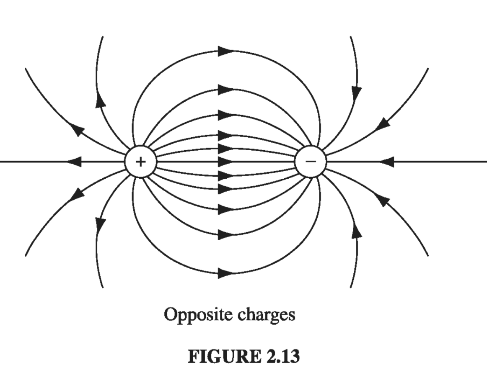
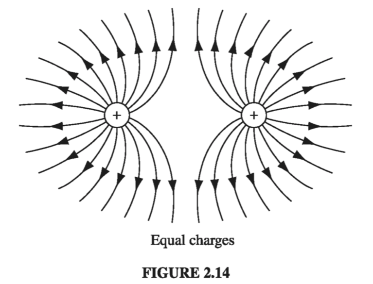
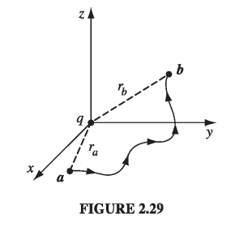

# Chapter 2: Electrostatics

## 2.1: The Electric Field

### 2.1.1: Introduction

The fundamental problem electrodynamics hopes to solve is this (Fig 2.1): We have some electric charges \( q_1, q_2, q_3, \ldots \) (call them *source charges*); what force do they exert on another charge, \( Q \) (call it the *test charge*)? The positions of the source charges are given (as functions of time); the trajectory of the test particle is to be calculated. In general, both the source charges and the test charge are in motion.

The solution to this problem is facilitated by the principle of superposition, which states that the interaction between any two charges is completely unaffected by the presence of others. This means that to determine the force on Q, we can first compute the force \( \vec{F_1} \), due to \( q_1 \) alone (ignoring all the others); then we compute the force \( \vec{F_2} \), due to \( q_2 \) alone, and so in. Finally, we take the vector sum of all these individual forces: \( \vec{F} = \vec{F_1} + \vec{F_2} + \vec{F_3} + \ldots \) Thus, if we can find the force on Q due to a _single_ source charge \( q \), we are, in principle, done (the rest is just a question of repeating the same operation over and over, and adding it all up)

 > The principle of superposition may seem "obvious" to you, but it did not have to be so simple: if the electromagnetic force were proportional to the _square_ of the total source charge, for instance, the principle of superposition would not hold, since \( (q_1 + q_2)^2 \neq q_1 ^2 + q_2 ^2 \) (there would be "cross terms" to consider). Superposition is not a logical necessity, but an experimental fact.

Well, at first sight this looks very easy: Why don't I just write down the formula for the force on Q due to q, and be done with it? I _could_, and in Chapter 10 I shall, but you would be shocked to see it at this stage, for not only does the force on Q depend on the separation distance \( \gr \) between the charges (Fig 2.2), it also depends on both their velocities and on the acceleration of \( q \). Moreover, it is not the position, velocity, and acceleration of \( q \) _right now_ that matter: electromagnetic "news" travels at the speed of light, so what concerns Q is the position, velocity, and acceleration q had at some earlier time, when the message left.

Therefore, in spite of the fact that the basic question ("What is the force on Q due to q?") is easy to state, it does not pay to confront it head on; rather, we shall go at it by stages. In the meantime, the theory we develop will allow for the solution of more subtle electromagnetic problems that do not present themselves in quite this simple format. To begin with, we shall consider the special case of *electrostatics* in which all the source charges are stationary (though the test charge may be moving).

### 2.1.2: Coulomb's Law

What is the force on a test charge Q due to a single point charge q, that is at _rest_ a distance \( \gr \) away? The answer (based on experiments) is given by *Coulomb's Law*:

$$
\vec{F} = \frac{1}{4 \pi \epsilon_0}\frac{q Q}{\gr^2} \hat{\vec{\gr}}   \label{coulomblaw}
$$

The constant \( \epsilon_0 \)  is called (ludicrously) the *permittivity of free space*. In SI units, where force is in newtons (N), distance in meters (m), and charge in coulombs (C), 
$$
\epsilon_0 = 8.85 \times 10^{-12} \frac{C^2}{N \cdot m ^2} 
$$

In words, the force is proportional to the product of the charges and inversely proportional to the square of the separation distance. As always (Sect 1.1.4), \( \vec{\gr} \) is the separation vector from \( \vec{r'} \) (the location of q) to \( \vec{r} \) (the location of Q): $$
\vec{\gr} = \vec{r} - \vec{r}'
$$

\( \gr \) is its magnitude, and \( \hat{\gr} \) is its direction. The force points along the line from q to Q; it is repulsive if _q_ and _Q_ have the same sign, and attractive if their signs are opposite.

Coulomb's law and the principle of superposition constitute the physical input for electrostatics - the rest, except for some special properties of matter, is mathematical elaboration of these fundamental rules.

### 2.1.3: The Electric Field

If we have _several_ point charges \( q_1, q_2, \ldots , q_n \)  at distances \( \gr_1 \gr_2 \ldots, \gr_n \) from _Q_, the total force on _Q_ is evidently
$$
\begin{align}
\vec{F} & = & \vec{F_1} + \vec{F_2} + \ldots \\
& = & \frac{1}{4 \pi \epsilon_0} \left( \frac{q_1 Q}{\gr_1 ^2} \hat{\gr}_1 + \frac{q_2 Q}{\gr_2 ^2} \hat{\gr}_2 + \ldots \right) \\
& = & \frac{Q}{4 \pi \epsilon _0} \left( \frac{q_1}{\gr ^2 _1} \hat{\gr_1} + \frac{q_2}{\gr _2 ^2}\hat{\gr_2} + \ldots \right) 
\end{align}
$$

or
$$
\vec{F} = Q \vec{E} \label{2.3}
$$

where 
$$
\vec{E}(\vec{r}) \equiv \frac{1}{4 \pi \epsilon_0} \sum_{i = 1}^n \frac{q_i}{\gr_{i}^2} \hat{\gr_i} \label{2.4}
$$

**E** is called the **electric field** of the source charges. Notice that it is a function of position (**r**), because the separation vectors \( \gr_i \) depend on the location of the field point P (Fig 2.3). But it makes no reference to the test charge Q. The electric field is a vector quantity that varies from point to point and is determined by the configuration of source charges; physically, \( \vec{E}(\vec{r}) \) is the force per unit charge that would be exerted on a test charge, if you were to place one at P.

What exactly _is_ an electric field? I have deliberately begun with what you might call the "minimal" interpretation of __E__, as an intermediate step in the calculation of electric forces. But I encourage you to think of the field as a "real" physical entity, filling the space around electric charges. Maxwell himself came to believe that electric and magnetic fields are stresses and strains in an invisible primordial jellylike "ether." Special relativity has forced us to abandon the notion of either, and with it Maxwell's mechanical interpretation of electromagnetic fields. (It is even possible, although cumbersome, to formulate classical electrodynamics as an "action-at-a-distance" theory, and dispense with the field concept altogether.) I can't tell you, then, what a field _is_ -- only how to calculate it and what it can do for you once you've got it.

### 2.1.4: Continuous Charge Distributions

Our definition of the electric field (Eq. \( \eqref{2.4} \) ) assumes that the source of the field is a collection of discrete point charges \( q_i \). If, instead, the charge is distributed continuously over some region, the sum becomes an integral (Fig 2.5a):
$$
\vec{E}(\vec{r}) = \frac{1}{4 \pi \epsilon_0} \int \frac{1}{\gr ^2} \hat{\gr} \dd{q}
$$

If the charge is spread out along a _line_ (Fig. 2.5b), with charge-per-unit-length \( \lambda \) then \( \dd{q} = \lambda \dd{l}' \) (where \( \dd{l}' \) ) is an element of length along the line); if the charge is smeared out over a surface (Fig. 2.5c) with charge-per-unit-area \( \sigma \), then \( \dd{q} = \sigma \dd{a}' \)  (where \( \dd{a'} \) ) is an element of area on the surface); and if the charge fills a _volume_ (Fig 2.5d), with charge-per-unit-volume \( \rho \), then \( \dd{q} = \rho\dd{\tau'} \) (where \( \dd{\tau'} \) is an element of volume):
$$
dq \rightarrow \lambda \dd{l'} \sim \sigma \dd{a'} \sim \rho \dd{\tau'}
$$

Thus the electric field of a line charge is
$$
\vec{E}(\vec{r}) = \frac{1}{4 \pi \epsilon_0} \int \frac{\lambda(\vec{r'})}{\gr ^2} \hat{\gr} \dd{l'}
$$
for a surface charge,
$$
\vec{E}(\vec{r}) = \frac{1}{4 \pi \epsilon_0} \int \frac{\sigma(\vec{r'})}{\gr ^2} \hat{\gr} \dd{a'}
$$
and for a volume charge,
$$
\vec{E}(\vec{r}) = \frac{1}{4 \pi \epsilon_0} \int \frac{\rho(\vec{r'})}{\gr ^2} \hat{\gr} \dd{\tau'} \label{2.8}
$$

Equation \( \eqref{2.8} \) itself is often referred to as "Coulomb's law," because it is such a short step from the original, and because a volume charge is in a sense the most general and realistic case. Please note carefully the meaning of \( \gr \) in these formulas. Originally, in \( \eqref{2.4} \), \( \gr_i \) stood for the vector from the source charge \( q_i \) to the field point __r__. Correspondingly, in Eq.s 9-11, \( \gr \) is the vector from \( \dd{q} \) to the field point \( \vec{r} \).

 > Warning: the unit vector \( \hat{\gr} \) is not constant: its direction depends on the source point \( \vec{r'} \), and hence it cannot be taken outside the integrals (9-11). In practice, you must work with Cartesian components (\( \hat{x}, \hat{y}, \hat{z} \) are constant, and do come out) , even if you use curvilinear coordinates to perform the integration.

## 2.2: Divergence and Curl of Electrostatic Fields

### 2.2.1 Field Lines, Flux, and Gauss' Law

In principle, we are _done_ with the subject of electrostatics. Equation \( \eqref{2.8} \) tells us how to compute the field of a charge distribution, and \( \eqref{2.3} \) tells us what the force on a charge Q placed in this field will be. Unfortunately, as you may have discovered, the integrals involved in computing E can be formidable, even for reasonably simple charge distributions. Much of the rest of electrostatics is devoted to assembling a bag of tools and tricks for avoiding these integrals. It all begins with the divergence and curl of **E**. I shall calculate the divergence of __E__ directly from \( \eqref{2.8} \) in section 2.2.2, but first I want to show you a more qualitative, and perhaps more illuminating, intuitive approach.

Let's begin with the simplest possible case: a single point charge _q_, situated at the origin:
$$
\vec{E}(\vec{r}) = \frac{1}{4 \pi \epsilon_0} \frac{q}{r^2} \hat{\vec{r}}
$$

To get a "feel" for this field, I might sketch a few representative vectors, as in Fig. 2.12a. Because the field falls off like \( 1/r^2 \), the vectors get shorter as you go farther away from the origin; they always point radially outward. But there is a nicer way to represent this field, and that's to connect up the arrows, to form __field lines__ (Fig. 2.12b).

You might think that I have thereby thrown away information about the _strength_ of the field, which was contained in the length of the arrows. But actually I have not. The magnitude of the field is indicated by the _density_ of the field lines: it's strong near the center where the field lines are close together, and weak farther out, where they are relatively far apart.

In truth, the field-line diagram is deceptive, when I draw it on a two-dimensional surface, for the density of lines passing through a circle of radius _r_ is the total number divided by the circumference (\( n / 2 \pi r \)), which goes like \( (1/r) \), not \( (1/r^2) \). But if you imagine the model in three dimensions (a pincushion with needles sticking out in all directions), then the density of lines is the total number divided by the area of the sphere \( (n/4 \pi r^2) \), which _does_ go like \( (1/r^2) \).

Such diagrams are also convenient for representing more complicated fields. Of course, the number of lines you draw depends on how lazy you are (and how sharp your pencil is), though you ought to include enough to get an accurate sense of the field, and you must be consistent: if \( q \)  gets 8 lines, then \( 2q \)  deserves 16. And you must space them fairly - they emanate from a point charge symmetrically in all directions. Field lines begin on positive charges and end on negative ones; they cannot simply terminate in midair, though they may extend out to infinity. Moreover, field lines can never cross - at the intersection the field would have two different directions at once! With all this in mind, it is easy to sketch the field of any simple configuration of point charges: Begin by drawing the lines in the neighborhood of each charge, and then connect them up or extend them to infinity (Figs. 2.13 and 2.14)

In this model, the _flux_ of __E__ through a surface S,
$$
\Phi_E \equiv \int _S \vec{E} \cdot \dd{\vec{a}} \label{2.11}
$$

is a measure of the "number of lines" passing through S. I put this in quotes because of course we can only draw a representative _sample_ of field lines - the total number would be infinite. But for a given sampling rate the flux is _proportional_ to the number of lines drawn, because the field strength, remember, is proportional to the density of field lines (the number per unit area), and hence \( \vec{E} \cdot \dd{\vec{a}} \) is proportional to the number of lines passing through the infinitesimal area \( \dd{\vec{a}} \). (The dot product picks out the component of \( \dd{\vec{a}} \) along the direction of __E__, as indicated in Fig 2.15. It is the area in the plane perpendicular to __E__ that we have in mind when we say that the density of field lines is the number per unit area).

This suggests that the flux through any _closed_ surface is a measure of the total charge inside. For the field lines that originate on a positive charge must either pass out through the surface or else terminate on a negative charge inside (Fig 2.16a). On the other hand, a charge _outside_ the surface will contribute nothing to the total flux, since its field lines pass in one side and out the other (Fig 2.16b). This is the _essence_ of Gauss's law. Now let's make it quantitative.

In the case of a point charge _q_ at the origin, the flux of __E__ through a spherical surface or radius _r_ is
$$
\oint \vec{E} \cdot \dd{\vec{a}} = \int \frac{1}{4 \pi \epsilon_0} \left( \frac{q}{r^2} \hat{r} \right) \cdot \left( r^2 \sin \theta \dd{\theta} \dd{\phi} \hat{r} \right) = \frac{1}{\epsilon_0} q \label{2.12}
$$

Notice that the radius of the sphere cancels out, for while the surface area goes _up_ as \( r^2 \), the field goes _down_ as \( 1/r^2 \), so the product is constant. In terms of the field-line picture, this makes good sense, since the same number of field lines pass through any sphere centered at the origin, regardless of its size. In fact, it didn't have to be a sphere - any closed surface, whatever its shape, would be pierced by the same number of field lines. Evidently, the flux through any surface enclosing the charge is \( q / \epsilon_0 \).

Now suppose that instead of a single charge at the origin, we have a bunch of charges scattered about. According to the principle of superposition, the total field is the (vector) sum of all the individual fields:
$$
\vec{E} = \sum _{i = 1} ^\nu \vec{E}_i
$$

The flux through a surface that encloses them all is
$$
\oint \vec{E} \cdot \dd{\vec{l}} = \sum _{i = 1}^n \left( \oint \vec{E_i} \cdot \dd{\vec{a}} \right) = \sum_{i = 1}^n \left( \frac{1}{\epsilon_0} q_i  \right)
$$

For any closed surface, then
$$
\oint \vec{E} \cdot \dd{\vec{a}} = \frac{1}{\epsilon_0} Q_{enc} \label{2.13}
$$

where \( Q_{enc} \) is the total charge enclosed within the surface. This is the quantitative statement of Gauss's law. Although it contains no information that was not already present in Coulomb's law plus the principle of superposition, it is of almost magical power, as you will see in Sect. 2.2.3. Notice that it all hinges on the \( 1/r^2 \) character of Coulomb's law; without that, the crucial cancellation of the _r_'s in \( \eqref{2.12} \) would not take place, and the total flux of __E__ would depend on the surface chosen, not merely on the total charge enclosed. Other \( 1/r^2 \) forces (I am thinking particularly of Newton's law of universal gravitation) will obey "Gauss's laws" of their own, and the applications we develop here carry over directly.

As it stands, Gauss's law is an _integral_ equation, but we can easily turn it into a differential one by applying the divergence theorem:
$$
\oint_{S} \vec{E} \cdot \dd{\vec{a}} = \int_{\mathscr{V}} (\div{\vec{E}}) \dd{\tau}
$$
Rewriting \( Q_{enc} \) in terms of the charge density \( \rho \) we have
$$
Q_{enc} = \int_{\mathscr{V}} \rho \dd{\tau}
$$
So Gauss's law becomes
$$
\int_{\mathscr{V}} (\div{\vec{E}}) \dd{\tau} = \int_{\mathscr{V}} \left( \frac{\rho}{\epsilon_0} \dd{\tau} \right)
$$
And since this holds for _any_ volume, the integrands must be equal:
$$
\nabla \cdot \vec{E} = \frac{1}{\epsilon_0} \rho \label{2.14}
$$

Equation \( \eqref{2.14} \) carries the same message as \( \eqref{2.13} \); it is __Gauss's law in differential form__. The differential version is tidier, but the integral form has the advantage that it accommodates point, line, and surface charges more naturally.

### 2.2.2: The Divergence of E

Let's go back now, and calculate the divergence of \( \vec{E} \) directly from \( \eqref{2.8} \):
$$
\vec{E}(\vec{r}) = \frac{1}{4\pi\epsilon_0} \int_{\text{all space}} \frac{\hat{\gr}}{\gr ^2} \rho(\vec{r}') \dd{\tau'} \label{2.15}
$$

(Originally the integration was over the volume occupied by the charge, but I may as well extend it to all space, since \( \rho = 0 \) in the exterior region anyway.) Noting that the r-dependence is contained in \( \gr = r - r' \), we have
$$
\div{\vec{E}} = \frac{1}{4\pi\epsilon_0} \int \vec{\nabla} \cdot \left( \frac{\hat{\gr}}{\gr^2}  \right) \rho(\vec{r'}) \dd{\tau'} 
$$
We calculated this divergence in Section 1.5:
$$
\div{\left( \frac{\hat{\gr}}{\gr^2}  \right)} = 4 \pi \delta ^3(\gr)
$$
Thus
$$
\div{\vec{E}} = \frac{1}{4\pi\epsilon_0} \int 4 \pi \delta^3(\vec{r} - \vec{r'}) \rho(\vec{r'}) \dd{\tau'} = \frac{1}{\epsilon_0} \rho(\vec{r}) \label{2.16}
$$
which is Gauss's law in differential form \( \eqref{2.14} \). To recover the integral form \( \eqref{2.13} \) we run the previous argument in reverse - integrate over a volume and apply the divergence theorem:
$$
\int_{\mathscr{V}} \div{\vec{E}} \dd{\tau} = \oint_{\mathscr{S}} \vec{E} \cdot \dd{\vec{a}} = \frac{1}{\epsilon_0} \int_{\mathscr{V}} \rho \dd{\tau} = \frac{1}{\epsilon_0} Q_{enc}
$$

### 2.2.3: Applications of Gauss's Law

I must interrupt the theoretical development at this point to show you the extraordinary power of Gauss's law, in integral form. When symmetry permits, it affords _by far_ the quickest and easiest way of computing electric fields. I'll illustrate the method with a series of examples.

---

#### Example 2.3

 > Find the field outside a uniformly charged solid sphere of radius R and total charge q

__Solution__
Imagine a spherical surface at radius \( r > R \) (Fig. 2.18). This is called a __Gaussian surface__ in the trade. Gauss's law says that
$$
\oint_{\mathscr{S}} \vec{E} \cdot \dd{\vec{a}} = \frac{1}{\epsilon_0} Q_{enc}
$$
and in this case \( Q_{enc} = q \). At first glance this doesn't seem to get us very far, because the quantity we want (E) is buried inside the surface integral. Luckily, symmetry allows us to extract E from under the integral sign: __E__ certainly points radially outward, as does \( \dd{\vec{a}} \), so we can drop the dot product
$$
\int_{\mathscr{S}} \vec{E} \cdot \dd{\vec{a}} = \int_{\mathscr{S}} | \vec{E} | da
$$

and the magnitude of E is constant over the Gaussian surface, so it comes outside the integral:
$$
\int_{S} | E | da = |E| \int_{S} da = E 4 \pi r^2
$$
Thus
$$
|\vec{E}|4\pi r^2 = \frac{1}{\epsilon_0} q
$$
or
$$
\vec{E} = \frac{1}{4\pi \epsilon_0} \frac{q}{r^2} \hat{r}
$$

Notice a remarkable feature of this result: the field outside the sphere is exactly the same as it would have been if all the charge had been concentrated at the center.

---

Gauss's law is always _true_, but not always _useful_. If \( \rho \) had not been uniform (or at any rate, not spherically symmetrical), or if I had chosen some other shape for my Gaussian surface, it would have still been true that the flux of \( \vec{E} \) is \( q / \epsilon_0 \), but \( \vec{E} \) would not have pointed in the same direction as \( \dd{\vec{a}} \), and its magnitude would not have been constant over the surface, and without that I cannot get \( |\vec{E}| \) outside the integral. Symmetry is crucial to this application of Gauss's law. As far as I know, there are only three kinds of symmetry that work:

1. Spherical symmetry. Make your Gaussian survace a concentric sphere.
2. Cylindrical symmetry. Make your Gaussian surface a coaxial cylinder.
3. Plane symmetry. Use a Gaussian "pillbox" that straddles the surface.

Although 2 and 3 technically require infinitely long cylinders, and planes extending to infinity, we shall often use them to get approximate answers for "long" cylinders or "large" planes, at points far from the edges.

---

#### Example 2.4

 > A long cylinder (Fig 2.21) carries a charge density that is proportional to the distance from the axis: \( \rho = ks \) for some constant \( k \). Find the electric field inside this cylinder.

__Solution__: Draw a Gaussian cylinder of length l and radius s. For this surface, Gauss's law states
$$
\oint_{\mathscr{S}} \vec{E} \cdot \dd{\vec{a}} = \frac{1}{\epsilon_0} Q_{enc}
$$

The enclosed charge is
$$
\begin{align}
Q_{enc} & = & \int \rho \dd{\tau} \\
& = & \int(ks')(s' \dd{s'} \dd{\phi} \dd{z}) \\
& = & 2 \pi k l \int_{0}^{s} s'^2 \dd{s'} \\
& = & \frac{2}{3} \pi k l s^3
\end{align}
$$

(I used the volume element appropriate to cylindrical coordinates, and integrated \( \phi \) from \( 0 \) to \( 2\pi \), \( \dd{z} \) from \( 0 \) to \( l \). I put a prime on the integration variable \( s' \) to distinguish it from the radius \( s \) of the Gaussian surface.)

Now, symmetry dictates that \( \vec{E} \) must point radially outward, so for the curved portion of the Gaussian cylinder we have:
$$
\int \vec{E} \cdot \dd{\vec{a}} = \int | \vec{E}| da = | \vec{E}| \int da = |\vec{E} 2 \pi s l
$$
while the two ends contribute nothing (here \( \vec{E} \) is perpendicular to \( \dd{\vec{a}} \)). Thus,
$$
|\vec{E} | 2 \pi s l = \frac{1}{\epsilon_0} \frac{2}{3} \pi k l s^3
$$
or, finally,
$$
\vec{E} = \frac{1}{3\epsilon_0} k s^2 \hat{s}
$$

---

#### Example 2.5

 > An infinite plane carries a uniform surface charge \( \sigma \). Find its electric field.

__Solution__
Draw a Gaussian pillbox, extending equal distances above and below the plane (Fig. 2.22). Apply Gauss's law to this surface:
$$
\oint \vec{E} \cdot \dd{\vec{a}} = \frac{1}{\epsilon_0} Q_{enc}
$$

In this case, \( Q = \sigma A \), where A is the area of the lid of the pillbox. By symmetry, \( \vec{E} \) points away from the plane (upward for points above, downward for points below). So the top and bottom surfaces yield
$$
\int \vec{E} \cdot \dd{\vec{a}} = 2 A |\vec{E}|,
$$
whereas the sides contribute nothing. Thus
$$
2 A | \vec{E} | = \frac{1}{\epsilon_0} \sigma A 
$$

or
$$
\vec{E} = \frac{\sigma}{2 \epsilon_0} \hat{n}
$$

where \( \hat{n} \) is a unit vector pointing away from the surface. In Prob 2.6, you obtained this same result by a much more laborious method.

It seems surprising, at first, that the field of an infinite plane is _independent of how fara away you are_. What about the \( 1/r^2 \) in Coulomb's law? The point is that as you move farther and farther away from the plane, more and more charge comes into your "field of view," and this compensates for the diminishing influence of any particular piece. The electric field of a sphere falls off like \( 1/r^2 \); the electric field of an infinite line falls off like \( 1/r \); and the electric field of an infinite plane does not fall off at all (you cannot escape from an infinite plane).

Although the direct use of Gauss's law to compute fields is limited to cases of spherical, cylindrical, and planar symmetry, we can put together combinations of objects posessing such symmetry, even though the arrangement as a whole is not symmetrical. For example, invoking the principle of superposition, we could find the field in the vicinity of two uniformly charged parallel cylinders, or a sphere near an infinite charged plane.

---

#### Example 2.6

 > Two infinite parallel planes carry equal but opposite uniform charge densities \( \pm \sigma \) (Fig 2.23). Find the field in each of the three regions: (i) to the left of both, (ii) between them, (iii) to the right of both.

__Solution__

The left plate produces a field \( (1/2 \epsilon_0)\sigma \), which points away from it (Fig. 2.24) to the left in region in (i) and to the right in regions (ii) and (iii). The right plate, being negatively charged, produces a field \( (1/2 \epsilon_0)\sigma \) which points _toward_ it - to the right in regions (i) and (ii) and to the left in region (iii). The two fields cancel in regions (i) and (iii); they conspire in region (ii). Conclusion: The field between the plates is \( \sigma / \epsilon_0 \), and points to the right; elsewhere it is zero.

### 2.2.4: The Curl of E

I'll calculate the curl of \( \vec{E} \) as I did the divergence in Sect 2.2.1, by studying first the simplest possible configuration: a point charge at the origin. In this case
$$
  \vec{E} = \frac{1}{4\pi \epsilon_0} \frac{q}{r^2} \hat{r}	
  $$  
Now, a glance at Fig 2.12 should convince you that the curl of this field has to be zero, but I suppose we ought to come up with something a little more rigorous than that. What if we calculate the line integral of this field from some point \( \vec{a} \) to some other point \( \vec{b} \) (Fig 2.29):
$$
\int_{\vec{a}}^{\vec{b}} \vec{E} \cdot \dd{\vec{l}}
$$

In spherical coordinates, \( \dd{\vec{l}} = \dd{r} \hat{r} + r \dd{\theta} \hat{\theta} + r \sin \theta \dd{\phi} \hat{\phi} \), so 
$$
\vec{E} \cdot \dd{\vec{l}} = \frac{1}{4 \pi \epsilon_0} \frac{1}{r^2} \dd{r}
$$

Therefore,
$$
\int_{\vec{a}}^{\vec{b}} \vec{E} \cdot \dd{\vec{l}} = \frac{1}{4 \pi \epsilon_0} \int_{a}^{b} \frac{q}{r^2} \dd{r} \\ 
= \left.\frac{-1}{4 \pi \epsilon_0} \frac{q}{r} \right|_{r_a} ^{r_b} \\
= \frac{1}{4 \pi \epsilon_0} \left( \frac{q}{r_a} - \frac{q}{r_b}  \right)
$$
The integral around a _closed_ path is evidently zero (for then \( r_a = r_b \) ):
$$
\oint \vec{E} \cdot \dd\vec{l} = 0 \label{2.19}
$$
and hence, applying Stokes' theorem
$$
\curl{\vec{E}} = 0 \label{2.20}
$$

Now, I proved eqs. \( \eqref{2.19} \) and \( \eqref{2.20} \) only for the field of a single point charge at the origin, but these results make no reference to what is, after all, a perfectly arbitrary choice of coordinates; they hold no matter where the charge is located. Moreover, if we have many charges, the principle of superposition states that the total field is a vector sum of their individual fields:
$$
 \vec{E} = \vec{E_1} + \vec{E_2} + \ldots
 $$ 
so
$$
\curl{\vec{E}} = \curl{(\vec{E_1} + \vec{E_2} + \ldots)} = (\curl{\vec{E_1}}) + (\curl{\vec{E_2}}) + \ldots = 0
$$

Thus, Eqs.  \( \eqref{2.19} \) and \( \eqref{2.20} \) hold for any _static_ charge distribution whatever.

## 2.3: Electric Potential

### 2.3.1: Introduction to Potential

The electric field __E__ is not just _any_ old vector function. It is a very special _kind_ of vector function: one whose curl id zero. \( \vec{E} = y \hat{x} \) , for example, could not possibly be an electrostatic field; _no_ set of charges, regardless of their sizes and positions, could ever produce such a field. We're going to exploit this special property of electric fields to reduce a _vector_ problem (finding __E__) to a much simpler _scalar_ problem. The first theorem in Sect 1.6.2 asserts that any vector whose curl is zero is equal to the gradient of some scalar. What I'm going to do now amounts to a proof of that claim, in the context of electrostatics.

Because \( \nabla \cross \vec{E} = 0\) , the line integral of __E__ around any closed loop is zero (that follows from Stokes' theorem). Because \( \oint \vec{E} \cdot \dd{\vec{l}} = 0 \), the line integral of __E__ from point __a__ to point __b__ is the same for all paths (otherwise you could go _out_ along path (i) and return along path (ii) - Fig 2.30 - and obtain \( \oint \vec{E} \cdot \dd{\vec{l}} \neq 0 \) ). Because the line integral is independent of path, we can define a function
$$
V(\vec{r}) \equiv - \int _{O} ^{\vec{r}} \vec{E} \cdot \dd{\vec{l}} \label{2.21}
$$

Here \( O \) is some standard reference point on which we have agreed beforehand; V then depends only on the point \( \vec{r} \). It is called the __electric potential__.

The potential _difference_ between two points __a__ and __b__ is
$$
\begin{align}
V(\vec{b}) - V(\vec{a}) & = & -\int_{O}^{\vec{b}} \vec{E}\cdot \dd{\vec{l}} + \int_{O}^{\vec{a}} \vec{E} \cdot \dd{\vec{l}} \\
& = & -\int_{O}^{\vec{b}} \vec{E}\cdot \dd{\vec{l}} - \int_{\vec{a}}^{O} \vec{E}\cdot \dd{\vec{l}} \\
& = & - \int_{\vec{a}} ^{\vec{b}} \vec{E}\cdot \dd{\vec{l}}
\end{align}
$$

Now, the fundamental theorem for gradients states that
$$
V(\vec{b}) - V(\vec{a}) = \int_{\vec{a}} ^{\vec{b}} (\grad{V}) \cdot \dd{\vec{l}}
$$
so
$$
\int_{\vec{a}}^{\vec{b}} (\grad{V})\cdot \dd{\vec{l}} = - \int_{\vec{a}}^{\vec{b}} \vec{E}\cdot \dd{\vec{l}}
$$
Since, finally, this is true for _any_ points __a__ and __b__, the integrands must be equal:
$$
\vec{E} = - \grad{V} \label{e-equals-grad-v}
$$

Equation \( \eqref{e-equals-grad-v} \) is the differential version of \( \eqref{2.21} \); it says that the electric field is the gradient of a scalar potential, which is what we set out to prove.

Notice the subtle but crucial role played by path independence (or, equivalently, the fact that \( \nabla \times \vec{E} = 0 \) ) in this argument. If the line integral of __E__ depended on the path taken, then the "definition" of V \( \eqref{2.21} \) would be nonsense. It simply would not define a function, since changing the path would alter the value of \( V(\vec{r}) \). By the way, don't let the minus sign in \( \eqref{e-equals-grad-v} \) distract you; it carries over from \( \eqref{2.21} \) and is largely a matter of convention.

### 2.3.2: Comments on Potential

__The name__. The word "potential" is a hideous misnomer because it inevitably reminds you of potential _energy_. This is particularly insidious, because there _is_ a connection between "potential" and "potential energy," as you will see in Sect 2.4. I'm sorry that it is impossible to escape this word. The best I can do is to insist once and for all that "potential" and "potential energy" are completely different terms and should, by all rights, have different names. Incidentially, a surface over which the potential is constant is called an __equipotential__.

__Advantage of the potential formulation__. If you know V, you can easily get __E__ - just take the gradient: \( \vec{E} =- \grad{V} \). This is quite extraordinary when you stop to think about it, for __E__ is a _vector_ quantity (three components), but V is a __scalar__ (one component). How can one function possibly contain all the information that three independent functions carry? The answer is that the three components of __E__ are not really as independent as they look; in fact, they are explicitly interrelated by the very condition we started with,\( \nabla \times \vec{E} = 0 \). In terms of components,
$$
\pdv{E_x}{y} = \pdv{E_y}{x}, \qquad \pdv{E_z}{y} = \pdv{E_y}{z}, \qquad \pdv{E_x}{z} = \pdv{E_z}{x}
$$

This brings us back to my observation at the beginning of Sect 2.3.1: __E__ is a very special kind of vector.What the potential formulation does is to exploit this feature to maximum advantage, reducing a vector problem to a scalar one, in which there is no need to fuss with components.

__The reference point \( \mathscr{O} \)__. There is an essential ambiguity in the definition of potential, since the choice of reference point \( \mathscr{O} \) was arbitrary. Changing reference points amounts to adding a constant K to the potential:
$$
V'(r) =  -\int_{\mathscr{O}'}^{\vec{r}} \vec{E} \cdot \dd{\vec{l}} \\ 
= - \int_{\mathscr{O}'} ^{\mathscr{O}} \vec{E} \cdot \dd{\vec{l}} - \int_{\mathscr{O}}^{\vec{r}} \vec{E} \cdot \dd{\vec{l}} \\
=  K + V(\vec{r})
$$

where K is the line integral of __E__ from the old reference point \( \mathscr{O} \) to the new one \( \mathscr{O}' \). Of course, adding a constant to V will not affect the potential _difference_ between two points, since the K's cancel out. Nor does the ambiguity affect the gradient of V:
$$
\grad{V'} = \grad{V} 
$$
since the derivative of a constant is zero. That's why all such V's, differing only in their choice of reference point, correspond to the same field __E__

Potential as such carries no real physical significance, for at any given point we can adjust its value at will by suitable relocation of \( \mathscr{O} \). In this sense, it is rather like altitude: if I ask you how high Denver is, you will probably tell me its height above sea level, because that is a convenient and traditional reference point. But we could as well agree to measure altitude above Washington, DC, or Greenwich, or wherever. That would add (or rather, subtract) a fixed amount from all our sea-level readings, but it wouldn't change anything about the real world. The only quantity of interest is the _difference_ in altitude between two points, and that is the same whatever your reference level.

Having said this, however, there is a "natural" spot to use for \( \mathscr{O} \) in electrostatics - analogous to sea level for altitude - and that is a point infinitely far from the charge. Ordinarily, then, we s"set the zero of potential at infinity." (Since \( V(\mathscr{O}) = 0 \), choosing a reference point is equivalent to selecting a place where \( V \) is to be zero.) But I must warn you that there is one special circumstance in which this convention fails: when the charge distribution itself extends to infinity. The symptom of trouble, in such cases, is that the potential blows up. For instance, the field of a uniformly charged plane is \( (\sigma / 2 \epsilon_0) \hat{n} \), as we found in Ex 2.5; if we naively put \( \mathscr{O} = \infty \), then the potential at height _z_ above the plane becomes
$$
V(z) = - \int_{\infty}^{z}\frac{1}{2\epsilon_0} \sigma \dd{z} = - \frac{1}{2\epsilon_0} \sigma(z - \infty)
$$ 
The remedy is simply to choose some other reference point (in this example you might use a point on the plane). Notice that the difficulty occurs only in textbook problems; in "real life" there is no such thing as a charge distribution that goes on forever, and we can _always_ use infinity as our reference point.

__Potential obeys the superposition principle__. The original superposition principle pertains to the force on a test charge Q. It says that the total force on _Q_ is the vector sum of the forces attributable to the source charges individually:
$$
\vec{F} = \vec{F_1} + \vec{F_2} + \ldots
$$
Dividing through by Q, we see that the electric field, too, obeys the superposition principle:
$$
\vec{E} = \vec{E_1} + \vec{E_2} + \ldots
$$
Integrating from the common reference point to \( \vec{r} \), it follows that the potential also satisfies such a principle:
$$
V = V_1 + V_2 + \ldots
$$
That is, the potential at any given point is the sum of the potentials due to all the source charges separately. Only this time it is an _ordinary_ sum, not a vector sum, which makes it a lot easier to work with.

__Units of Potential__. In our units, force is measured in newtons and charge in coulombs, so electric fields are in newtons per coulomb. Accordingly, potential is newton-meters per coulomb, or joules per coulomb. A joule per coulomb is a __volt__.

### 2.3.3: Poisson's Equation and Laplace's Equation

We found in Sect 2.3.1 that the electric field can be written as the gradient of a scalar potential
$$
\vec{E} = - \grad{V}
$$
The question arises, what do the divergence and curl of __E__,
$$
\div{\vec{E}} = \frac{\rho}{\epsilon_0} \qquad \text{ and } \qquad \curl{\vec{E}} = 0
$$
look like, in terms of V? Well, \( \div{\vec{E}} = \div(-\grad{V}) = -\laplacian{V} \), so, apart from that persistent minus sign, the divergence of __E__ is the Laplacian of V. Gauss's law, then, says
$$
\laplacian{V} = -\frac{\rho}{\epsilon_0} \label{2.24}
$$

This is known as __Poisson's equation__. In regions where there is no charge, so \( \rho = 0 \), Poisson's equation reduces to Laplace's equation,
$$
\laplacian{V} = 0 \label{2.25}
$$

We'll explore this equation more fully in Chapter 3.

So much for Gauss's law. What about the curl law? This says that
$$
\curl{\vec{E}} = \curl(-\grad{V}) = 0
$$

But that's no condition on V - curl of gradient is _always_ zero. Of course, we used the curl law to show that __E__ could be expressed as the gradient of a scalar, so it's not really surprising that this works out: \( \curl{\vec{E}} = 0 \) permits our definition of V; in return, \( \vec{E} = - \grad{V} \) guarantees \( \curl{\vec{E}} = 0 \). It only takes one differential equation (Poisson's) to determine V, because V is a scalar. For \( \vec{E} \) we needed two, the divergence and the curl.

### 2.3.4: The potential of a Localized Charge Distribution

I defined V in terms of \( \vec{E} \eqref{2.21} \). Ordinarily, though, it's __E__ that we're looking for (if we already knew __E__, there wouldn't be much point in calculating V). The idea is that it might be easier to get V first, and then calculate __E__ by taking the gradient. Typically, then, we know where the charge is (that is, we know \( \rho \)), and we want to find V. Now, Poisson's equation relates V and \( \rho \), but unfortunately it's "the wrong way round": it would give us \( \rho \) if we knew V, whereas we want V, knowing \( \rho \). What we must do, then, is "invert" Poisson's equation. That's the program for this section, although I shall do it by roundabout means, beginning, as always, with a point charge at the origin.

The electric field is \( \vec{E} = (1 / 4 \pi \epsilon_0)(1 / r^2) \hat{r} \), and \( \dd{\vec{l}} = \dd{r} \hat{r}  \), and \( \dd{\vec{l}} = \dd{r} \hat{r} + r \dd{\theta} \hat{\theta} + r \sin \theta \dd{\theta} \hat{\phi} \), so
$$
\vec{E} \cdot \dd{\vec{l}} = \frac{1}{4 \pi \epsilon_0} \frac{q}{r^2} \dd{r} 
$$
Setting the reference point at infinity, the potential of a point charge _q_ at the origin is
$$
V(r) = - \int_{\mathscr{O}} ^r \vec{E} \cdot \dd{\vec{l}} \\
 = \frac{-1}{4 \pi \epsilon_0} \int_{\infty}^r \frac{q}{r' ^2} \dd{r'} \\
 = \left.\frac{1}{4 \pi \epsilon_0} \frac{q}{r'} \right| ^r _{\infty} = \frac{1}{4 \pi \epsilon_0} \frac{q}{r} 
$$

(You see here the advantage of using infinity for the reference point: it kills the lower limit on the integral.) Notice the sign of V; presumably the conventional minus sign in the definition was chosen in order to make the potential of a positive charge come out positive. It is useful to remember that regions of positive charge are potential "hills," and electric field points "downhill" from plus toward minus.

In general, the potential of a point charge q is
$$
V(\vec{r}) = \frac{1}{4 \pi \epsilon_0} \frac{q}{\gr} 
$$

where \( \gr \), as always, is the distance from \( q \) to \( \vec{r} \) (Fig 2.32). Invoking the superposition principle, then, the potential of a collection of charges is 
$$
V(r) = \frac{1}{4\pi \epsilon_0} \sum_{i=1} ^n \frac{q_i}{\gr _i} 
$$
or, for a continuous distribution,
$$
V(r) = \frac{1}{4 \pi \epsilon_0} \int \frac{\rho(\vec{r}')}{\gr} \dd{\tau'} \label{2.29} 
$$

This is the equation we were looking for, telling us how to compute V when we know \( \rho \); it is, if you like, the "solution" to Poisson's equation, for a localized charge distribution. Compare \( \eqref{2.29} \) with the corresponding formula for the electric field in terms of \( \rho \):
$$
\vec{E}(\vec{r}) = \frac{1}{4 \pi \epsilon_0} \int \frac{\rho(\vec{r'})}{\gr ^2} \hat{\gr} \dd{\tau'}
$$

The main point is that the pesky unit vector \( \hat{\gr} \) is gone, so there is no need to fuss with components. The potentials of line and surface charges are
$$
V = \frac{1}{4 \pi \epsilon_0} \int \frac{\lambda(\vec{r'})}{\gr} \dd{l'} \qquad \text{ and } \qquad V = \frac{1}{4 \pi \epsilon_0} \int \frac{\sigma(\vec{r'})}{\gr} \dd{a'}
$$

I should warn you that everything in this section is predicated on the assumption that the reference point is at infinity. This is hardly apparent in \( \eqref{2.29} \), but remember that we _got_ the equation from the potential of a point charge at the origin, \( (1/4 \pi \epsilon_0) (q / r) \), which is valid only when \( \mathscr{O} = \infty \). If you try to apply these formulas to one of those artificial problems in which the charge itself extends to infinity, the integral will diverge.

### 2.3.5: Boundary Conditions

In the typical electrostatic problem you are given a source charge distribution \( \rho \), and you want to find the electric field \( \vec{E} \) it produces. Unless the symmetry of the problem allows a solution by Gauss's law, it is generally to your advantage to calculate the potential first, as an intermediate step. These are the three fundamental quantities of electrostatics: \( \rho \), \( \vec{E} \), and \( V \). We have, in the course of our discussion, derived all six formulas interrelating them. These equations are neatly summarized in Fig. 2.35. We began with just two experimental observations: (1) the principle of superposition - a broad general rule applying to all electromagnetic forces, and (2) Coulomb's law - the fundamental law of electrostatics. From these, all else followed.

You may have noticed, in studying the exercises in this chapter, that the electric field always undergoes a discontinuity when you cross a surface charge \( \sigma \). In fact, it is a simple matter to find the _amount_ by which E changes at such a boundary. Suppose we draw a wafer-thin Gaussian pillbox, extending just barely over the edge in each direction (Fig. 2.36). Gauss's law says that
$$
\oint _{S} \vec{E} \cdot \dd{\vec{a}} = \frac{1}{\epsilon_0} Q_{enc} = \frac{1}{\epsilon_0} \sigma A
$$

where A is the area of the pillbox lid. If \( \sigma \)  varies from point to point or the surface is curved, we can simply pick A to be extremely small. Now, the sides of the pillbox contribute nothing to the flux, in the limit as the thickness \( \epsilon \)  goes to zero, so we are left with 
$$
E_{above}^{\perp} - E_{below} ^{\perp} = \frac{1}{\epsilon_0} \sigma \label{2.31}
$$
where \( E_{above}^{\perp} \) denotes the component of \( \vec{E} \) that is perpendicular to the surface immediately above, and \(  E_{below} ^{\perp} \) is the same, only just below the surface. For consistency, let "upward" be the positive direction for both. _Conclusion: the normal component of \( \vec{E} \) is discontinuous by an amount \( \sigma / \epsilon_0 \) at any boundary._ In particular, where there is _no_ surface charge, \( \vec{E}^{\perp} \) is continuous, as for instance at the surface of a uniformly charged solid sphere.

The _tangential_ component of \( \vec{E} \), by contrast, is always continuous. For if we apply \( \eqref{2.19} \),
$$
\oint \vec{E} \cdot \dd{\vec{l}} = 0
$$
to the thin rectangular loop of Fig 2.37, the ends give nothing (as \( \epsilon \rightarrow 0 \)), and the sides give \( (E_{above} ^{\parallel} l - E_{below} ^{\parallel} l) \), so
$$
\vec{E}_{above} ^{\parallel} = \vec{E}_{below} ^{\parallel} \label{2.32}
$$
where \( \vec{E}^{\parallel} \) stands for the components of \( \vec{E} \) parallel to the surface.

The boundary conditions on \( \vec{E} \) (Eqs. \( \eqref{2.31} \) and \( \eqref{2.32} \)) can be combined into a single formula:
$$
\vec{E}_{above} - \vec{E}_{below} = \frac{\sigma}{\epsilon_0} \hat{n}
$$
where \( \hat{n} \) is a unit vector perpendicular to the surface, pointing from "below" to "above."

The potential, meanwhile, is continuous across any boundary (Fig 2.38), since
$$
V_{above} - V_{below} = -\int_{a}^{b} \vec{E} \cdot \dd{\vec{l}}
$$
as the path length shrinks to zero, so too does the integral
$$
V_{above} = V_{below} \label{2.34}
$$

However, the _gradient_ of V inherits the discontinuity in \( \vec{E} \), since \( \vec{E} - \grad{V} \), so
$$
\grad{V}_{above} - \grad{V}_{below} = - \frac{\sigma}{\epsilon_0} \hat{n}
$$
or more conveniently
$$
\pdv{V_{above}}{n} - \pdv{V_{below}}{n} = - \frac{1}{\epsilon_0} \sigma \label{2.36}
$$
where
$$
\pdv{V}{n} = \grad{V} \cdot \hat{n}
$$
denotes the normal derivative of V (that is, the rate of change in the direction perpendicular to the surface).

Please note that these boundary conditions relate the fields and potentials _just_ above and _just_ below the surface. For example, the derivatives in \( \eqref{2.36} \) are the limiting values as we approach the surface from either side. 

## 2.4: Work and Energy in Electrostatics

### 2.4.1: The Work it Takes to Move a Charge

Suppose you have a stationary configuration of source charges, and you want to move a test charge Q from point a to point b (Fig. 2.39). _Question_: how much work will you have to do? At any point along the path, the electric force on Q is \( \vec{F} = Q \vec{E} \); the force you must exert, in opposition to the electric force, is \( -Q\vec{E} \). The work you do is therefore
$$
W = \int_{a}^{b} \vec{F} \cdot \dd{\vec{l}} \\
= - Q \int_{a}^{b} \vec{E} \cdot \dd{\vec{l}}  \\
= - Q[V(b) - V(a)]
$$

Notice that the answer is independent of the path you take from a to b; in mechanics, then, we would call the electrostatic force "conservative." Dividing through by Q, we have
$$
V(b) - V(a) = \frac{W}{Q} 
$$

In words, the potential difference between points a and b is equal to the work per unit charge required to carry a particle from a to b. In particular, if you want to bring Q in from far away and stick it at point r, the work you must do is
$$
W = Q[V(\vec{r}) - V(\infty)],
$$
so if you have set the reference point at infinity,
$$
W = Q V(\vec{r}) \label{2.39}
$$
In this sense, potential is potential _energy_ (the work it takes to create a system) _per unit charge_ (just as the field is force per unit charge).

### 2.4.2: The Energy of a Point Charge Distribution

How much work would it take to assemble an entire collection of point charges? Imagine bringing in the charges, one by one, from far away (Fig 2.40). The first charge \( q_1 \) takes _no_ work, since there is no field to fight against. Now bring in \( q_2 \). According to \( \eqref{2.39} \) this will cost you \( q_2 V_1(\vec{r}_2) \), where \( V_1 \) is the potential due to \( q_1 \) , and \( \vec{r}_2 \) is the place we're putting \( q_2 \):
$$
W_2 = \frac{1}{4 \pi \epsilon_0} q_2 \left( \frac{q_1}{\gr_{12}}  \right)
$$
(\( \gr_{12} \) is the distance between \( q_1 \) and \( q_2 \), once they are in position). As you bring in each charge, nail it down in its final location, so it doesn't move when you bring in the next charge. Now bring in \( q_3 \). This requires work \( q_3 V_{1,2}(\vec{r}_3) \), where \( V_{1,2} \) is the potential due to charges \( q_1 \) and \( q_2 \), namely \( (1 / 4 \pi \epsilon_0) (q_1 / \gr_{13} + q_2 / \gr_{23} ) \). Thus
$$
W_3 = \frac{1}{4 \pi \epsilon_0} q_3 \left( \frac{q_1}{\gr_{13}} + \frac{q_2}{\gr_{23}}   \right)
$$
Similarly, the extra work to bring in \( q_4 \)  will be
$$
W_4 = \frac{1}{4 \pi \epsilon_0} q_4 \left( \frac{q_1}{\gr_{14}} + \frac{q_2}{\gr_{24}} + \frac{q_3}{\gr_{34}} \right)
$$
The _total_ work necessary to assemble the first four charges, then, is
$$
W = \frac{1}{4 \pi \epsilon_0} \left( \frac{q_1 q_2}{\gr_{12}} + \frac{q_1 q_3}{\gr_{13}} + \frac{q_1 q_4}{\gr_{14}} + \frac{q_2 q_3}{\gr_{23}} + \frac{q_2 q_4}{\gr_{24}} + \frac{q_3 q_4}{\gr_{34}} \right)
$$

You see the general rule: Take the product of each pair of charges, divide by their separation distance, and add it all up:
$$
W = \frac{1}{4 \pi \epsilon_0} \sum_{i = 1} ^{n} \sum_{j > i} ^n \frac{q_i q_j}{\gr_{ij}} 
$$
The stipulation \( j > i \) is to remind you not to count the same pair twice. A nicer way to accomplish this is _intentionally_ to count each pair twice, and then divide by 2:
$$
W = \frac{1}{8 \pi \epsilon_0} \sum_{i = 1} ^n \sum_{j \neq i} \frac{q_i q_j}{\gr_{ij}}  
$$
(we must still avoid \( i = j \), of course). Notice that in this form the answer plainly does not depend on the _order_ in which you assemble the charges, since every pair occurs in the sum.

Finally, let's pull out the factor \( q_i \):
$$
W = \frac{1}{2} \sum_{i = 1}^n q_i \left( \sum_{j \neq i} ^n \frac{1}{4 \pi \epsilon_0} \frac{q_j}{\gr_{ij}}  \right)
$$

The term in parentheses is the potential at point \( \vec{r_i} \) (the position of \( q_i \) ) due to all the _other_ charges - all of them, now, not just the ones that were present at some stage during the assembly. Thus,
$$
W = \frac{1}{2} \sum_{i = 1} ^n q_i V(\vec{r_i}) \label{2.42}
$$
That's how much work it takes to assemble a configuration of point charges; it's also the amount of work you'd get back if you dismantled the system. In the meantime, it represents energy stored in the configuration ("potential" energy, if you insist, though for obvious reasons I prefer to avoid that word in this context).

