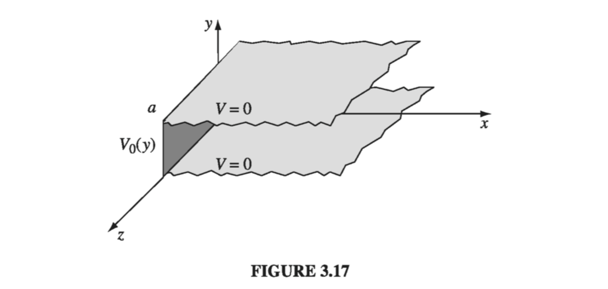
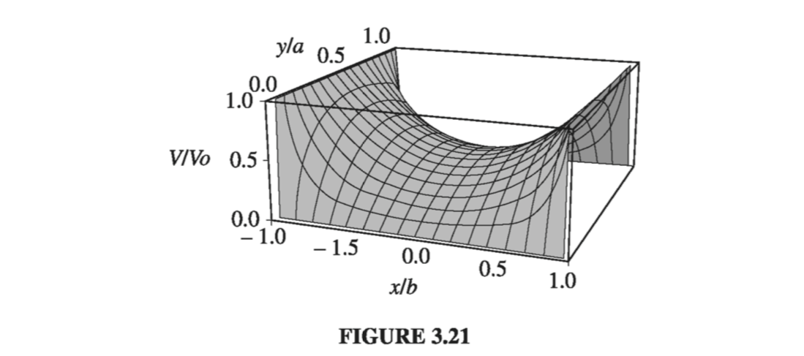

# 3.3: Separation of Variables

In this section we shall attack Laplace's equation directly, using the method of __separation of variables__, which is the physicist's favorite tool for solving partial differential equations. The method is applicable in circumstances where the potential \( (V) \) or the charge density \( (\sigma) \) is specified on the boundaries of some region, and we are asked to find the potential in the interior. The basic strategy is very simple: We look for solutions that are products of functions, each of which depends on only one of the coordinates. The algebraic details, however, can be formidable, so I'm going to develop the method through a sequence of examples. We'll start with Cartesian coordinates and then do spherical coordinates (I'll leave the cylindrical case for you to tackle on your own, in Prob 3.24).

## 3.3.1: Cartesian Coordinates

#### Example 3.3

!!! question "Two infinite grounded metal plates lie parallel to the xz plane, one at \( y = 0 \), the other at \( y = a \) (Fig. 3.17). The left end, at \( x = 0 \), is closed off with an infinite strip insulated from the two plates, and maintained at a specific potential \( V_0(y) \). Find the potential inside this 'slot.'"

    
    __Solution__
    The configuration is independent of z, so this is really a two-dimensional problem. In mathematical terms, we must solve Laplace's equation,
    $$
    \frac{\partial ^2 V}{\partial{x^2}} + \frac{\partial ^2 V}{\partial{y^2}} = 0 \label{3.20} \tag{3.20}
    $$
    subject to the boundary conditions
    
      - (i) \( V = 0 \) when \( y = 0 \)
      - (ii) \( V = 0 \) when \( y = a \)
      - (iii) \( V = V_0(y) \) when \( x = 0 \) 
      - (iv) \( V \rightarrow 0 \) as \( x \rightarrow \infty \) 

    (The latter, although not explicitly stated in the problem, is necessary on physical grounds: as you get farther and farther away from the "hot" strip at \( x = 0 \), the potential should drop to zero.) Since the potential is specified on all boundaries, the answer is uniquely determined.

    The first step is to look for solutions in the form of products:
    $$
    V(x, y) = X(x)Y(y) \tagl{3.22}
    $$
    On the face of it, this is an absurd restriction - the overwhelming majority of solutions to Laplace's equation do _not_ have such a form. For example, \( V(x, y) = (5x + 6y) \) satisfies the equation, but you can't express it as the product of a function of x times a function of y. Obviously, we're only going to get a tiny subset of all possible solutions by this means, and it would be a _miracle_ if one of them happened to fit the boundary conditions of our problem... But hang on, because the solutions we _do_ get are very special, and it turns out that by pasting them together we can construct the general solution.

    Anyway, putting \( \eqref{3.22} \) into \( \eqref{3.20} \) we obtain
    $$
    Y \frac{d^2X}{dx^2} + X \frac{d^2 Y}{dy^2} = 0 
    $$
    The next step is to "separate the variables" (that is, collect all the x-dependence into one term and all the y-dependence into another). Typically, this is accomplished by dividing through by V:
    $$
    \frac{1}{X} \frac{d^2 X}{dx^2} + \frac{1}{Y} \frac{d^2 Y}{dy^2} = 0 \tagl{3.23}
    $$
    Here the first term depends only on x and the second term only on y; in other words, we have an equation of the form
    $$
    f(x) + g(y) = 0 \label{3.24} \tag{3.24}
    $$
    Now, there's only one way this could possibly be true: _f and g must both be constant_. For what if \( f(x) \) changed, as you vary x - then if we held y fixed and fiddled with x, the sum \( f(x) + g(y) \) would change, in violation of \( \eqref{3.24} \), which says it's always zero. (That's a simple but somehow rather elusive argument; don't accept it without due thought, because the whole method rides on it.)

    It follows from \( \eqref{3.23} \), then, that
    $$
    \frac{1}{X} \frac{d^2 X}{dx^2} = C_1 \quad \text{ and } \quad \frac{1}{Y} \frac{d^2 Y}{dy^2} = C_2, \quad \text{ with } C_1 + C_2 = 0 \tagl{3.25}
    $$
    One of these constants is positive, the other negative (or perhaps both are zero). In general, one must investigate all possibilities; however in our particular problem we need \( C_1 \) positive and \( C_2 \) negative, for reasons that will appear in a moment. Thus
    $$
    \frac{d^2X}{dx^2} = k^2 X, \qquad \frac{d^2 Y}{dy^2} = - k^2 Y \tagl{3.26} 
    $$
    Notice what has happened: A partial differential equation has been converted into two ordinary differential equations. The advantage of this is obvious - ordinary differential equations are a lot easier to solve. Indeed:
    $$
    X(x) = A e^{kt} + B e^{-kt}, \qquad Y(y) = C \sin ky + D \cos ky
    $$
    so
    $$
    V(x, y) = (A e^{kt} + B e^{-kt})(C \sin ky + D \cos ky) \tagl{3.27}
    $$
    This is the appropriate separable solution to Laplace's equation; it remains to impose the boundary conditions, and see what they tell us about the constants. To begin at the end, condition (iv) requires tha A equal zero. Absorbing B into C and D, we are left with
    $$
    V(x, y) = e^{-kx} (C\sin ky + D \cos ky)
    $$
    Condition (i) now demands that D equal zero
    $$
    V(x, y) = C ^{-kx} \sin ky \tagl{3.28}
    $$
    Meanwhile (ii) yields \( \sin ka = 0 \), from which it follows that
    $$
    k = \frac{n \pi}{a} \quad (n = 1, 2, 3, \ldots) \tagl{3.29}
    $$
    (At this point you can see why I chose \( C_1 \) positive and \( C_2 \) negative: If X were sinusoidal, we could never manage for it to go to zero at infinity, and if Y were exponential we could not make it vanish at both 0 and _a_. Incidentally, \( n = 0 \) is no good, for in that case the potential vanishes everywhere. And we have already excluded negative n's)
    That's as far as we can go, using separable solutions, and unless \( V_0(y) \) just happens to have the form \( \sin(n \pi / a) \) for some integer _n_, we simply _can't fit_ the final boundary condition at \( x = 0 \). But now comes the crucial step that redeems the method: Separation of variables has given us an infinite family of solutions (one for each n), and whereas none of them by itself satisfies the final boundary condition, it is possible to combine them in a way that _does_. Laplace's equation is linear, in the sense that if \( V_1, V_2, V_3, \ldots \) satisfy it, so does any linear combination, for
    $$
    \laplacian{V} = \alpha_1 \laplacian{V_1} + \alpha_2 \laplacian{V_2} + \ldots = 0 \alpha_1 + 0 \alpha_2 + \ldots = 0
    $$
    Exploiting this fact, we can patch together the separable solutions \( \eqref{3.28} \) to construct a much more general solution:
    $$
    V(x, y) = \sum_{n=1} ^{\infty} C_n e^{-n \pi x / a} \sin (n \pi y / a) \tagl{3.30}
    $$
    This still satisfies three of the boundary conditions; the question is, can we (by astute choice of the coefficients \( C_n \)) fit the final boundary condition (iii)?
    $$
    V(0, y) = \sum_{n=1} ^{\infty} C_n \sin (n \pi y / a) = V_0(y) \tagl{3.31}
    $$
    Well, you may recognize this sum - it's a Fourier sine series. And Dirichlet's theorem guarantees that virtually _any_ function \( V_0(y) \) - it can even have a finite number of discontinuities - can be expanded in such a series.
    But how do we actually determine the coefficients \( C_n \), buried as they are in that infinite sum? The device for accomplishing this is so lovely it deserves a name - I call it _Fourier's trick_, though it seems Euler had used essentially the same idea somewhat earlier. Here's how it goes: Multiply \( \eqref{3.31} \) by \( \sin(n' \pi y /a) \) (where \( n' \)  is a positive integer), and integrate from 0 to a:
    $$
    \sum_{n=1} ^{\infty} C_n \int_{0} ^{a} \sin(n \pi y / a) \sin(n' \pi y/a) \dd{y} = \int_{0} ^a V_0(y) \sin (n' \pi /a) \dd{y} \tagl{3.32}
    $$
    You can work out the integral on the left yourself; the answer is
    $$
    \int_{0} ^a \sin (n \pi y /a) \sin (n' \pi y / a) \dd{y} = \begin{cases} 0 & \quad \text{if } n' \neq n \\ 
    \frac{a}{2} & \quad \text{if } n' = n \end{cases} \tagl{3.33}
    $$
    Thus all the terms in the series drop out, save only the one where \( n = n' \), and the left side of \( \eqref{3.32} \) reduces to \( (a/2)C_{n'} \). _Conclusion_:
    $$
    C_n = \frac{2}{a} \int_{0}^a V_0(y) \sin (n \pi y /a) \dd{y} \tagl{3.34}
    $$
    That _does_ it: \( \eqref{3.30} \) is the solution, with coefficients given by \( eqref{3.34} \). As a concrete example, suppose the strip at \( x = 0 \) is a metal plate with constant potential \( V_0 \) (remember, it's insulated from the grounded plates at \( y = 0 \) and \( y = a \). Then
    $$
    C_n = \frac{2V_0}{a} \int_0 ^a \sin (n \pi y / a) \dd y \\ = \frac{2 V_0}{n \pi} (1 - \cos n \pi) = \begin{cases} 
    0 & \quad \text{if n is even } \\
    \frac{4 V_0}{n \pi} & \quad \text{if n is odd}
    \end{cases} \tagl{3.35}
    $$
    Thus
    $$
    V(x, y) = \frac{4 V_0}{\pi} \sum_{n = 1, 3, 5, \ldots} \frac{1}{n} e^{- n \pi x / a} \sin (n \pi y / a) \tagl{3.36}
    $$
    Figure 3.18 is a plot of this potential; Fig. 3.10 shows how the first few terms in the Fourier series combine to make a better and better approximation to the constant \( V_0 \): (a) is the \( n=1 \) term only, (b) includes n up to 5, (c) is the sum of the first 10 terms, and (d) is the sum of the first 100 terms.
    
    Incidentally, the infinite series in Eq. 3.36 can be summed explicitly (try your hand at it if you like); the result is
    $$
    V(x, y) = \frac{2V_0}{\pi} \tan^{-1} \left( \frac{\sin(\pi y / a)}{\sinh(\pi x /a )}  \right) \tagl{3.37}
    $$
    In this form, it is easy to check that Laplace's equation is obeyed and the four boundary conditions are satisfied

The success of this method hinged on two extraordinary properties of the separable solutions \( \eqref{3.28} \) and \( \eqref{3.29} \): __completeness__ and __orthogonality__. A set of functions \( f_n(y) \) is said to be __complete__ if any other function \( f(y) \) can be expressed as a linear combination of them:
$$
f(y) = \sum_{n=1} ^{\infty} C_n f_n(y) \tagl{3.38}
$$
The functions \( \sin (n \pi y/a) \) are complete on the interval \( 0 \leq y \leq a \). It was this fact, guaranteed by Dirichlet's theorem, that assured us \( \eqref{3.31} \) could be satisfied, given the proper choice of the coefficients \( C_n \). (The _proof_ of completeness, for a particular set of functions, is an extremely difficult business, and I'm afraid physicists tend to _assume_ it's true and leave the checking to others.) A set of functions is __orthogonal__ if the integral of the product of any two different members of the set is zero:
$$
\int_0 ^a f_n(y) f_{n'} (y) \dd{y} = 0 \quad \text{for } n' \neq n
$$
The sine functions are orthogonal \( \eqref{3.33} \); that is the property on which Fourier's trick is based, allowing us to kill off all terms but one in the infinite series and thereby solve for the coefficients \( C_n \) (Proof of orthogonality is generally quite simple, either by direct integration or by analysis of the differential equation from which the functions came.)

#### Example 3.4

!!! question "Two infinitely-long grounded metal plates, again at \( y=0 \) and \( y=a \) are connected at \( x= \pm b \) by metal strips maintained at a constant potential \( V_0 \), as shown in Fig. 3.20 (a thin layer of insulation at each corner prevents them from shorting out). Find the potential inside the resulting rectangular pipe."

    
    __Solution__
    Once again, the configuration is independent of z. Our problem is to solve Laplace's equation
    $$
    \frac{\partial ^2 V}{\partial{x^2}} + \frac{\partial ^2 V}{\partial{y^2}} = 0
    $$
    subject to the boundary conditions

      - (i) \( V = 0 \) when \( y = 0 \)
      - (ii) \( V = 0 \) when \( y = a \)
      - (iii) \( V = V_0 \) when \( x = b \) 
      - (iv) \( V = V_0 \) when \( x = -b \)
    
    The argument runs as before, up to \( \eqref{3.27} \):
    $$
    V(x, y) = (A e^{kt} + B e^{-kt})(C \sin ky + D \cos ky)
    $$
    This time, however, we cannot set \( A = 0 \); the region in question does not extend to \( x = \infty \), so \( e^{kx} \) is perfectly acceptable. On the other hand, the situation is symmetric with respect to x, so \( V(-x, y) = V(x, y) \), and it follows that \( A = B \). Using
    $$
    e^{kx} + e^{-kx} = 2 \cosh kx
    $$
    and absorbing \( 2A \) into \( C \) and \( D \), we have
    $$
    V(x, y) = \cosh kx (C \sin ky + D\cos ky)
    $$
    Boundary conditions (i) and (ii) require, as before, that \( D = 0 \) and \( k = n\pi /a \), so
    $$
    V(x, y) = C \cosh (n \pi x /a )\sin(n \pi y/a) \tagl{3.41}
    $$
    Because \( V(x, y) \) is even in x, it will automatically meet conditions (iv) if it fits (iii). It remains, therefore, to construct the general linear combination
    $$
    V(x, y) = \sum _{n=1}^{\infty} C_n \cosh (n \pi x / a) \sin(n \pi y /a)
    $$
    and pick the coefficients \( C_n \) in such a way as to satisfy condition (iii):
    $$
    V(b, y) = \sum_{n=1}^{\infty} C_n \cosh (n \pi b /a) \sin(n \pi y/a) = V_0
    $$
    This is the same problem in Fourier analysis that we faced before; I quote the result from \( \eqref{3.35} \);
    $$
    C_n \cosh (n \pi b/a) = \begin{cases} 
    0 & \quad \text {if n is even} \\
    \frac{4 V_0}{n \pi} & \quad \text{if n is odd}
    \end{cases}
    $$
    _Conclusion_: The potential in this case is given by
    $$
    V(x, y) = \frac{4 V_0}{\pi} \sum_{n=1, 3, 5\ldots} \frac{1}{n} \frac{\cosh(n \pi x/a)}{\cosh(n \pi b/a)} \sin(n \pi y/a) \tagl{3.42}
    $$
    This function is shown in Fig. 3.21
    

#### Example 3.5

!!! question "An infinitely long rectangular metal pipe (sides a and b) is grounded, but one end, at \( x = 0 \), is maintained at a specified potential \( V_0(y, z) \), as indicated in Fig. 3.22. Find the potential inside the pipe."

    
    __Solution__
    This is genuinely a three-dimensional problem,
    $$
    \frac{\partial ^2 V}{\partial{x^2}} + \frac{\partial ^2 V}{\partial{y^2}} + \frac{\partial ^2 V}{\partial{z^2}} = 0 \tagl{3.43}
    $$
    subject to the boundary conditions
      - (i) \( V = 0 \) when \( y = 0 \)
      - (ii) \( V = 0 \) when \( y = a \)
      - (iii) \( V = 0 \) when \( z = 0 \) 
      - (iv) \( V = 0 \) when \( z = b \) 
      - (v) \( V \rightarrow 0 \) as \( x \rightarrow \infty \)
      - (vi) \( V = V_0(y, z) \) whem \( x = 0 \)
    As always, we look for solutions that are products:
    $$
    V(x, y, z) = X(x)Y(y)Z(z) \tagl{3.45}
    $$
    Putting this into \( \eqref{3.43} \) and dividing by V, we find
    $$
    \frac{1}{X} \frac{d^2 X}{dx^2} + \frac{1}{Y} \frac{d^2 Y}{dy^2} + \frac{1}{Z} \frac{d^2 Z}{dz^2} = 0
    $$
    It follows that 
    $$
    \frac{1}{X} \frac{d^2 X}{dx^2} = C_1 , \quad \frac{1}{Y} \frac{d^2 Y}{dy^2} = C_2 , \quad \frac{1}{Z} \frac{d^2 Z}{dz^2} = C_3 , \text{ with } C_1 + C_2 + C_3 = 0
    $$
    Our previous experience in Ex. 3.3 suggests that \( C_1 \) must be positive, \( C_2 \) and \( C_3 \) negative. Setting \( C_2 = -k^2 \)  and \( C_3 = -l^2 \), we have \( C_1 = k^2 + l^2 \), and hence
    $$
    \frac{d^2 X}{dx^2} = (k^2 + l^2)X, \quad  \frac{d^2 Y}{dy^2} = -k^2 Y, \quad \frac{d^2 Z}{dz^2} = -l^2 Z \tagl{3.46}
    $$
    Once again, separation of variables has turned a partial differential equation into ordinary differential equations. The solutions are
    $$
    \begin{align*}
    X(x) & = A e^{\sqrt{k^2 + l^2} x} + B e^{- \sqrt{k^2 + l^2} x} \\
    Y(y) & = C \sin ky + D \cos ky \\
    Z(z) & = E \sin lz + F \cos lz
    \end{align*}
    $$
    Boundary condition (v) implies \( A =0 \), (i) gives \( D = 0 \), and (iii) yields \( F = 0 \) whereas (ii) and (iv) require that \( k = n\pi /a \) and \( l =m \pi /b \), where _n_ and _m_ are positive integers. Combining the remaining constants, we are left with
    $$
    V(x, y, z) = C e^{-\pi \sqrt{(n/a)^2 + (m/b)^2}x} \sin (n \pi y / a) \sin(m \pi z /b) \tagl{3.47}
    $$
    This solution meets all the boundary conditions except (vi). It contains two unspecified integers (n and m), and the most general linear combination is a _double_ sum
    $$
    V(x, y, z) = \sum_{n=1} ^{\infty} \sum_{m = 1} ^{\infty} C e^{-\pi \sqrt{(n/a)^2 + (m/b)^2}x} \sin (n \pi y / a) \sin(m \pi z /b) = V_0(y, z) \tagl{3.48}
    $$
    We hope to fit the remaining boundary condition,
    $$
    V(0, y, z) = \sum_{n=1} ^{\infty} \sum_{m = 1} ^{\infty} C \sin (n \pi y / a) \sin(m \pi z /b) = V_0(y, z) \tagl{3.49}
    $$
    by appropriate choice of the coefficients \( C_{n, m} \). To determine these constants, we multiply by \(\sin(n' n \pi y/a) \sin(m' \pi z / b)\), where \( n' \) and \( m' \) are arbitrary positive integers, and integrate
    $$
    \sum_{n=1} ^{\infty} \sum_{m = 1} ^{\infty} C_{n, m} \int_0 ^a \sin (n \pi y/a) \sin(n' \pi y/a) \dd{y} \int_0 ^b \sin(m \pi z/b) \sin (m' \pi z/b) \dd{z} \\
    = \int_0 ^a \int_0 ^b V_0(y, z) \sin(n' \pi y/a) \sin(m' \pi z/b) \dd{y} \dd{z}
    $$
    Quoting \( \eqref{3.33} \), the left side is \( (ab/4) C_{n', m'} \), so
    $$
    C_{n, m} = \frac{4}{ab} \int_0 ^a \int_0 ^b V_0(y, z) \sin (n \pi y/a) \sin(m\pi z/b) \dd{y} \dd{z} \tagl{3.50}
    $$
    Equation \( \eqref{3.48} \), with the coefficients given by \( \eqref{3.50} \), is the solution to our problem.

    For instance, if the end of the tube is a conductor at constant potential \( V_0 \), 
    $$
    C_{n, m} = \frac{4}{ab} \int_0 ^a \sin(n \pi y/a) \dd{y} \int_0 ^b \sin(m \pi z/b) \dd{z} \\
     = \begin{cases}
     0 & \qquad \text{if n or m is even} \\
     \frac{16 V_0}{\pi^2 nm} & \qquad \text{if n and m are odd}
     \end{cases} \tagl{3.51} 
    $$
    In this case,
    $$
    V(x, y, z) = \frac{16V_0}{\pi^2} \sum_{n,m=1,3,5,\ldots} ^{\infty} \frac{1}{nm} e^{-\pi \sqrt{(n/a)^2 + (m/b)^2}x} \sin(n \pi y/a) \sin(m \pi z/b) \tagl{3.52}
    $$
    Notice that successive terms decrease rapidly; a reasonable approximation would be obtained by keeping only the first few.

## 3.3.2: Spherical Coordinates

In the examples considered so far, Cartesian coordinates were clearly appropriate, since the boundaries were planes. For round objects, spherical coordinates are more natural. In the spherical system, Laplace's equation reads:
$$
\frac{1}{r^2} \pdv{}{r} \left( r^2 \pdv{V}{r} \right) + \frac{1}{r^2 \sin \theta} \pdv{}{\theta} \left( \sin \theta \pdv{V}{\theta} \right) + \frac{1}{r^2\sin ^2 \theta} \frac{\partial ^2 V}{\partial \phi ^2} = 0 \tagl{3.53} 
$$

I shall assume the problem has __azimuthal symmetry__, so that V is independent of \( \phi \); In that case, \( \eqref{3.53} \) reduces to
$$
\pdv{}{r} \left( r^2 \pdv{V}{r} \right) + \frac{1}{\sin \theta} \pdv{}{\theta} \left( \sin \theta \pdv{V}{\theta} \right) = 0 \tagl{3.54}
$$
As before, we look for solutions that are products:
$$
V(r, \theta) = R(r) \Theta (\theta) \tagl{3.55}
$$
Putting this into \( \eqref{3.54} \), and dividing by _V_, 
$$
\frac{1}{R} \dv{}{r} \left( r^2 \dv{R}{r} \right) + \frac{1}{\Theta \sin \theta} \dv{}{\theta} \left( \sin \theta \dv{\Theta}{\theta} \right) = 0 \tagl{3.56}
$$
Since the first term depends only on _r_, and the second only on \( \theta \), it follows that each must be a constant:
$$
 \frac{1}{R} \dv{}{r} \left( r^2 \dv{R}{r} \right) = l(l+1), \quad \frac{1}{\Theta \sin \theta} \dv{}{\theta} \left( \sin \theta \dv{\Theta}{\theta} \right) = -l(l+1) \tagl{3.57}
$$
Here \( l(l+1) \) is just a fancy way of writing the separation constant, whose convenience will appear shortly.
As always, separation of variables has converted a _partial_ differential equation into ordinary differential equations. The radial equation,
$$
\dv{}{r} \left( r^2 \dv{R}{r} \right) = l(l+1)R \tagl{3.58}
$$
has the general solution
$$
R(r) = A r^l + \frac{B}{r^{l+1}} \tagl{3.59} 
$$
as you can easily check; A and B are the two arbitrary constants to be expected in the solution of a second-order differential equation. But the angular equation,
$$
\dv{}{\theta} \left( \sin \theta \dv{\Theta}{\theta} \right) = -l(l+1) \sin \theta \Theta \tagl{3.60}
$$
is not so simple. The solutions are __Legendre polynomials__ in the variable \( \cos \theta \):
$$
\Theta (\theta ) = P_l (\cos \theta )  \tagl{3.61}
$$

\( P_l (x) \) is most conveniently defined by the __Rodrigues formula__:

$$
P_l(x) \equiv \frac{1}{2^l l!}\left( \dv{}{x} \right)^l (x^2 - 1)^l \tagl{3.62}
$$
The first few Legendre polynomials are listed:

!!! info "Legendre Polynomials \( P_0 \) -  \(P_5 \) "

    $$
    \begin{align*}
    P_0(x) & = 1 \\
    P_1(x) & = x \\
    P_2(x) & = (3x^2 - 1)/2 \\
    P_3(x) & = (5x^3 - 3x)/2 \\
    P_4(x) & = (35x^4 - 30x^2 + 3)/8 \\
    P_5(x) & = (63x^5 - 70x^3 + 15x)/8
    \end{align*}
    $$

Notice that \( P_l(x) \) is (as the name suggests) an _l_th-order polynomial in x; it contains only even powers if l is even, and only odd powers if l is odd. The factor in front \( (1/2^l l! \) was chosen in order that
$$
P_l(1) = 1 \tagl{3.63}
$$

The Rodrigues formula obviously only works for nonnegative integer values of l. Moreover, it provides us with only _one_ solution. But \( \eqref{3.60} \) is second-order, and it should possess two independent solutions for every value of _l_. It turns out that these "other solutions" blow up at \( \theta = 0 \) and/or \( \theta = \pi \), and are therefore unacceptable on physical grounds. For instance, the second solution for \( l=0 \) is
$$
\Theta(\theta) = \ln \left( \tan \frac{\theta}{2}  \right) \tagl{3.64}
$$
You might want to check for yourself that this satisfies \( \eqref{3.60} \).

In the case of azimuthal symmetry, then, the most general separable solution to Laplace's equation, consistent with minimal physical requirements, is
$$
V(r, \theta) = \left( A r^l + \frac{B}{r^{l+1}} \right) P_l(\cos \theta)
$$
(There was no need to include an overall constant in \( \eqref{3.61} \) because it can be absorbed into A and B at this stage.) As before, separation of variables yields an infinite set of solutions, one for each _l_. The general solution is the linear combination of separable solutions:
$$
V(r, \theta) = \sum_{l=0} ^{\infty} \left( A r^l + \frac{B}{r^{l+1}} \right) P_l(\cos \theta) \tagl{3.65}
$$
The following examples illustrate the power of this important result.