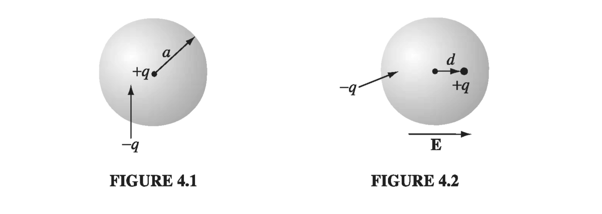
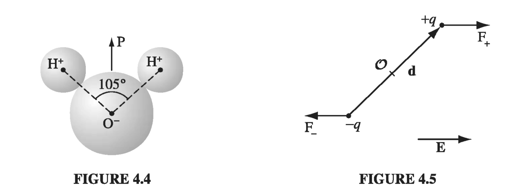

# 4.1: Polarization

## 4.1.1: Dielectrics

This chapter is all about what happens to an electric field when you take matter into account. Matter, of course, comes in many varieties - phase, composition, state, etc. - and depending upon which type of matter we're dealing with, the electrostatic field response can be very different. Nevertheless, most everyday objects belong (at least, to good approximation) to one of two large classes: __conductors__ and __insulators__ (or __dielectrics__). We have already gone over what happens to an electrostatic field in a conductor; the "unlimited" free charges within a conductor distribute themselves through the material so as to form an equipotential. In practice, this usually means that many electrons (one or two per atom, in a typical metal) are not associated with a particular nucleus, but roam around at will. In dielectrics, by contrast, _all charges are attached to specific atoms or molecules_ - they cannot escape their leash, and can only move a bit _within_ the atom or molecule. Such microscopic displacements are not as dramatic as the wholesale rearrangement of charge in a conductor, but their cumulative effects account for the characteristic behavior of dielectric materials. There are actually _two_ principal mechanisms by which electric fields can distort the charge distribution of a dielectric atom or molecule: stretching and rotating. In the next two sections I'll discuss these processes.

## 4.1.2: Induced Dipoles

Say we have a totally neutral atom and place it in an electric field __E__? What happens? At first guess, you might think "Nothing at all! The atom is not charged, so the field has no effect on it." That's incorrect. Although the atom as a whole is electrically neutral (just like the dipoles we looked at in the last chapter), there _is_ a positively charged core (the nucleus) and negatively charged electron(s) surrounding it. These two regions of charge within the atom are influenced by the field: the nucleus is pushed in the direction of the field, and the electrons the opposite way. In principle, if the field is large enough, it can pull the atom apart completely, "ionizing" it (the substance then becomes a conductor). With less extreme fields, however, an equilibrium is soon established, for if the center of the electron cloud does not coincide with the nucleus, these positive and negative charges attract one another, and that holds the atom together. The two opposing forces - __E__ pulling the electrons and nucleus apart, and their mutual attraction drawing them back together - reach a balance, leaving the atom __polarized__, with plus charge shifted slightly one way, and minus the other. The atom now has a tiny dipole moment __p__, which points in the same direction as __E__. Typically, this induced dipole moment is approximately proportional to the field (as long as the latter is not too strong):
$$
\vec{p} = \alpha \vec{E} \tagl{4.1}
$$
The constant of proportionality \( \alpha \) is called __atomic polarizability__. Its value depends on the detailed structure of the atom in question. Table 4.1 lists some experimentally determined atomic polarizabilities.

#### Example 4.1

!!! question "A primitive model for an atom consists of a point nucleus (+q) surrounded by a uniformly charged spherical cloud (-q) of radius _a_ (Fig 4.1). Calculate the atomic polarizability of such an atom."
    
    
    __Solution__
    In the presence of an external field __E__, the nucleus will be shifted slightly to the right and the electron cloud to the left, as shown in Fig 4.2. (Because the actual displacements involved are extremely small, as you'll see in Prob 4.1, it is reasonable to assume that the electron cloud retains its spherical shape.) Say that equilibrium occurs when the nucleus is displaced a distance _d_ from the center of the sphere. At that point, the external field pushing the nucleus to the right exactly balances the internal field pulling it to the left: \( E = E_e \), where \( E_e \) is the field produced by the electron cloud. Now the field at a distance _d_ from the center of a uniformly charged sphere is
    $$
    E_e = \frac{1}{4 \pi \epsilon_0} \frac{qd}{a^3} 
    $$
    At equilibrium, then
    $$
    E = \frac{1}{4 \pi \epsilon_0 } \frac{qd}{a^3}, \quad \text{ or } p = qd = (4 \pi \epsilon_0 a^3 ) E 
    $$
    The atomic polarizability is therefore
    $$
    \alpha = 4 \pi \epsilon_0 a^3 = 3 \epsilon_0 v \tagl{4.2}
    $$
    where _v_ is the volume of the atom. Although this atomic model is extremely crude, the result \( \eqref{4.2} \) is not too bad - it's accurate to within a factor of four or so for many simple atoms.

For molecules the situation is not quite so simple, because frequently they polarize more readily in some directions than in others. Carbon dioxide (Fig 4.3), for instance, has a polarizability of \( 4.5 \times 10^{-40} \) when you apply the field along the axis of the molecule, but only \( 2 \times 10^{-40} \) for fields perpendicular to this direction. When the field is at some angle to the axis, you must first resolve it into parallel and perpendicular components, and multiply each component by the pertinent polarizability
$$
\vec{p} = a_{\perp} E_{\perp} + \alpha_{\parallel} E_{\parallel} 
$$

In this case, the induced dipole moment may not even be in the same _direction_ as __E__. And \( CO_2 \) is relatively simple, as molecules go, since at least the atoms arrange themselves in a straight line; for a completely asymmetrical molecule, \( \eqref{4.1} \) is replaced by the most general linear relation between __E__ and __p__:
$$
 \begin{align*}
 p_x = \alpha_{xx} E_x + \alpha_{xy} E_y + \alpha_{xz} E_z\\
 p_y = \alpha_{yx} E_x + \alpha_{yy} E_y + \alpha_{yz} E_z\\
 p_z = \alpha_{zx} E_x + \alpha_{zy} E_y + \alpha_{zz} E_z
 \end{align*}
 \tagl{4.3}
 $$ 
 The set of nine constants \( \alpha_{ij} \) constitute the __polarizability tensor__ for the molecule. Their values depend on the orientation of the axes you use, though it is always possible to choose "principal" axes such that all off-diagonal terms vanish, leaving just three nonzero polarizabilities.

## 4.1.3: Alignment of Polar Molecules

The neutral atom discussed in section 4.1.2 had no dipole moment to start with - __p__ was entirely induced by the applied field. Some molecules have built-in, permanent dipole moments. In the water molecule, for example, the electrons tend to cluster around the oxygen atom (Fig 4.4), and since the molecule is bent at \( 105^{\circ} \), this leaves a negative charge at the vertex and a positive charge on the opposite side. (The dipole moment of water is unusually large: \( 6.1 \times 10^{-30} C \cdot m \); in fact, this is what accounts for its effectiveness as a solvent.) What happens when such molecules (called __polar molecules__) are placed in an electric field?

If the field is uniform, the _force_ on the positive end, \( \vec{F_+} = q \vec{E} \), exactly cancels the force on the negative end, \( \vec{F_-} = - q \vec{E} \) (Fig 4.5). However, there will be a torque:
$$
\vec{N } = (\vec{r_{+}} \cross \vec{F_+}) + (\vec{r_{-}} \cross \vec{F_{-}}) \\
= \left[ ( \vec{d}/2) \cross (q \vec{E}) \right] + \left[ ( -\vec{d}/2) \cross (- q \vec{E}) \right] = q \vec{d} \cross \vec{E}
$$ 

Thus a dipole \( \vec{p} = q \vec{d} \) in a uniform field \( \vec{E} \) experiences a torque
$$
\vec{N} = \vec{p} \cross \vec{E} \tagl{4.4}
$$

Notice that __N__ is in such a direction as to line __p__ up _parallel_ to __E__; a polar molecule that is free to rotate will swing around until it points in the direction of the applied field.

If the field is nonuniform, so that \( \vec{F_{+}} \) does not exactly balance \( \vec{F_-} \), there will be a net force on the dipole, in addition to the torque. Of course, __E__ must change rather abruptly for there to be significant variation in the space of one molecule, so this is not ordinarily a major consideration in discussing the behavior of dielectrics. Nevertheless, the formula for the force on a dipole in a nonuniform field is of some interest:
$$
\vec{F} =  \vec{F_{+}} + \vec{F_-} = q(\vec{E_+} - \vec{E_-}) = q(\Delta \vec{E})
$$
where \( \Delta \vec{E} \) represents the difference between the field at the plus end and the field at the minus end. Assuming the dipole is very short, we may use Eq 1.35 to approximate the small change in E
$$
\Delta \vec{E} = (\vec{d} \cdot \grad ) \vec{E}
$$
and therefore
$$
\vec{F} = ( \vec{p} \cdot \grad) \vec{E} \tagl{4.5}
$$
For a "perfect" dipole of infinitesimal length, \( \eqref{4.4} \) gives the torque about the center of the dipole even in a nonuniform field; about any other point, \( \vec{N} = ( \vec{p} \cross \vec{E}) + (\vec{r} \cross \vec{F}) \).

## 4.1.4: Polarization

In the previous two sections, we have considered the effect of an external electric field on an individual atom or molecule