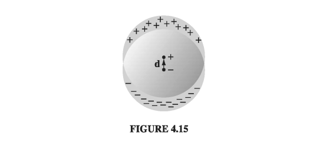

# 4.2: The Field of a Polarized Object

## 4.2.1: Bound Charges

Suppose we have a piece of polarized material - that is, an object containing a lot of microscopic dipoles lined up. The dipole moment per unit volume __P__ is given. _Question_: What is the field produced by this object (not the field that may have caused the polarization, but the field the polarization itself causes)? Well, we know what the field of an individual dipole looks like, so why not chop the material up into infinitesimal dipoles and integrate to get the total? As usual, it's easier to work with the potential. For a single dipole __p__ (Eq. 3.99)
$$
V(\vec{r}) = \frac{1}{4 \pi \epsilon_0} \frac{\vec{p} \cdot \vu{\gr}}{\gr ^2} \tagl{4.8}
$$
where \( \vec{\gr} \) is the vector from the dipole to the point at which we are evaluating the potential (Fig 4.8). In the present context, we have a dipole moment \( \vec{p} = \vec{P} \dd \tau' \) in each volume element \( \dd \tau' \), so the total potential is
$$
V(\vec{r}) = \frac{1}{4 \pi \epsilon_0} \int_{V} \frac{\vec{P}(\vec{r'}) \cdot \vu{\gr}}{\gr ^2} \dd \tau'
$$

That does it, in principle. But a little sleight of hand casts this integral into a much more illuminating form. Observing that
$$
\grad ' \left( \frac{1}{\gr} \right) = \frac{\vu{\gr}}{\gr ^2} 
$$
where the differentiation is with respect to the _source_ coordinates (r'), we have
$$
V = \frac{1}{4 \pi \epsilon_0} \int _V \vec{P} \cdot \grad ' \left( \frac{1}{\gr} \right) \dd \tau'
$$
Peeling the \( \grad \) leftwards with integration by parts, we have
$$
V = \frac{1}{4 \pi \epsilon_0} \left[ \int _V \grad' \cdot \left( \frac{\vec{P}}{\gr}  \right) \dd \tau' - \int _V \frac{1}{\gr} ( \grad' \cdot \vec{P} ) \dd \tau' \right]
$$
The left-hand integral is a volume integral of a divergence, so with Gauss's law
$$
V = \frac{1}{4 \pi \epsilon_0 } \oint _S \frac{1}{\gr } \vec{P} \cdot \dd \vec{a'} - \frac{1}{4 \pi \epsilon_0} \int _V \frac{1}{\gr} ( \grad' \cdot \vec{P} ) \dd \tau' \tagl{4.10}
$$
The first term looks like the potential of a surface charge
$$
\sigma_b \equiv \vec{P} \cdot \vu{n} \tagl{4.11}
$$
while the second term looks like the potential of a volume charge
$$
\rho_b \equiv - \div \vec{P} \tagl{4.12}
$$

With these definitions, \( \eqref{4.10} \) becomes
$$
V(\vec{r} = \frac{1}{4 \pi \epsilon_0} \oint_S \frac{\sigma_b}{\gr} \dd a' + \frac{1}{4 \pi \epsilon_0} \int_V \frac{\rho_b}{\gr} \dd \tau' \tagl{4.13}
$$
What this means is that the potential (and hence also the field) of a polarized object is the same as that produced by a volume charge density \( \rho_b = - \div \vec{P} \) plus a surface charge density \( \sigma_b = \vec{P} \cdot \vu{n} \). Instead of integrating the contributions of all the infinitesimal dipoles, we could just find those __bound charges__, and then calculate the fields they produce, in the same way we calculate the field of any other volume and surface charges.

#### Example 4.2

!!! question "Find the electric field produced by a uniformly polarized sphere of radius R"

    
    __Solution__

    We may as well choose the z axis to coincide with the direction of polarization (Fig 4.9). The volume bound charge density \( \rho_b \) is zero, since \( \vec{P} \) is uniform. The surface bound charge density is then
    $$
    \sigma_b = \vec{P} \cdot \vu{n} = P \cos \theta
    $$
    where \( \theta \) is the usual spherical coordinate. What we want, then is the field produced by a charge density \( P \cos \theta \)  plastered over the surface of a sphere. We happen to have already computed that potential in Exercise 3.9:
    $$
    V(r, \theta) = \begin{cases}
    \frac{P}{3 \epsilon_0} r \cos \theta, & \qquad \text{ for } r \leq R \\
    \frac{P}{3 \epsilon_0} \frac{R^3}{r^2} \cos \theta, & \qquad \text{ for } r \geq R
    \end{cases}
    $$
    Since \( r \cos \theta = z \), the field inside the sphere is _uniform_:
    $$
    \vec{E} = - \grad V = - \frac{P}{3 \epsilon_0} \vu{z} = - \frac{1}{3 \epsilon_0} \vec{P} , \quad \text{ for } r < R \tagl{4.14}
    $$
    This is a pretty remarkable result, and will be very useful in what follows. Outside the sphere the potential is the same as that of a perfect dipole at the origin
    $$
    V = \frac{1}{4 \pi \epsilon_0} \frac{\vec{p} \cdot \vu{r}}{r^2} , \quad \text{ for } r \geq R \tagl{4.15}
    $$
    
    whose dipole moment is, not surprisingly, equal to the total dipole moment of the sphere:
    $$
    \vec{p} = \frac{4}{3} \pi R^3 \vec{P} \tagl{4.16}
    $$
    The field of the uniformly polarized sphere is shown in Fig 4.10.

## 4.2.2: Physical Interpretation of Bound Charges

In the last section we found that the field of a polarized object is identical to the field that would be produced by a certain distribution of "bound charges," \( \sigma_b \) and \( \rho_b \). But this conclusion emerged in the course of abstract manipulations on the integral in Eq. 4.9, and left us with no clue as to the physical meaning of these bound charges. Indeed, some authors give you the impression that bound charges are in some sense "fictitious" - mere bookkeeping devices used to facilitate the calculation of fields. Nothing could be further from the truth: \( \rho_b \) and \( \sigma_b \) represent perfectly genuine accumulations of charge. In this section I'll explain how polarization leads to these charge distributions.

The basic idea is very simple: Suppose we have a long string of dipoles, as shown in Fig. 4.11. Along the line, the head of one effectively cancels the tail of its neighbor, but at the ends there are two charges left over: plus at the right end and minus at the left. It is as if we had peeled off an electron at one end and carried it all the way down to the other end, though in fact no single electron made the whole trip - a lot of tiny displacements add up to one large one. We call the net charge at the ends a bound charge to remind ourselves that it cannot be removed; in a dielectric every electron is attached to a specific atom or molecule. But apart from that, bound charge is no different from any other kind.

To calculate the actual amount of bound charge resulting from a given polarization, examine a "tube" of dielectric parallel to P. The dipole moment of the tiny chunk shown in Fig. 4.12 is \( P(Ad) \), where A is the cross-sectional area of the tube and dis the length of the chunk. In terms of the charge (q) at the end, this same dipole moment can be written \( qd \). The bound charge that piles up at the right end of the tube is therefore
$$
q = PA
$$
If the ends have been sliced off perpendicularly, the surface charge density is
$$
\sigma_b = \frac{q}{A}  = P
$$
For an oblique cut (Fig 4.13), the charge is still the same, but \( A = A_{end} \cos \theta \) so
$$
\sigma_b = \frac{1}{A_{end}}  = P \cos \theta = \vec{P} \cdot \vu{n}
$$
The effect of the polarization, then, is to paint a bound charge \( \sigma_b = \vec{P} \cdot \vu{n} \) over the surface of the material. This is exactly what we found by more rigorous means in Sect. 4.2.1. But now we know where the bound charge comes from.

If the polarization is nonuniform, we get accumulations of bound charge within the material, as well as on the surface. A glance at Fig. 4.14 suggests that a diverging __P__ results in a pileup of negative charge. Indeed, the net bound charge \( \int \rho_b \dd \tau \) in a given volume is equal and opposite to the amount that has been pushed out through the surface. The latter (by the same reasoning we used before) is \( \vec{P} \cdot \vu{n} \) per unit area, so
$$
\int_v \rho_b \dd \tau = - \oint _S \vec{P} \cdot \dd \vec{a} = - \int_V (\div \vec{P}) \dd \tau
$$
Since this is true for any volume, we have
$$
\rho_b = - \div \vec{P}
$$
confirming, again, the more rigorous conclusion of Sect. 4.2.1.

#### Example 4.3

!!! question "There is another way of analyzing the uniformly polarized sphere, which nicely illustrates the idea of bound charge. What we have, really, is two spheres of charge: a positive sphere and a negative sphere. Without polarization the two are superimposed and cancel completely. But when the material is uniformly polarized, all the plus charges move slightly upward (the z direction) and all the minus charges move slightly downward (Fig 4.15). The two spheres no longer overlap perfectly: at the top there's a 'cap' of leftover positive charge and at the bottom a cap of negative charge. This 'leftover' charge is precisely the bound surface charge \( \sigma_b \)"

    
    In Prob 2.18, you calculated the field in the region of overlap between two uniformly charged spheres; the answer was
    $$
    \vec{E} = - \frac{1}{4 \pi \epsilon_0}  \frac{1 \vec{d}}{R^3} 
    $$
    where _q_ is the total charge of the positive sphere, __d__ is the vector from the negative center to the positive center, and R is the radius of the sphere. We can express this in terms of the polarization of the sphere, \( \vec{p} = q \vec{d} = (\frac{4}{3} \pi R^3  )\vec{P} \), as
    $$
    \vec{E} = - \frac{1}{3 \epsilon_0} \vec{P}
    $$
    Meanwhile, for points outside, it is as though all charge on each sphere were concentrated at the respective center. We have, then, a dipole, with potential
    $$
    V = \frac{1}{4 \pi \epsilon_0} \frac{\vec{p} \cdot \vu{r}}{r^2} 
    $$
    (Remember that __d__ is some small fraction of an atomic radius; Fig 4.15 is grossly exaggerated). These answers agree, of course, wtih the results from Ex 4.2.

## 4.2.3: The Field Inside a Dielectric

I have been sloppy about the distinction between "pure" dipoles and "physical" dipoles. In developing the theory of bound charges, I assumed we were working with the pure kind - indeed, I stated in Eq 4.8 the formula for the potential of a perfect dipole. And yet an actual polarized dielectric consists of physical dipoles, albeit extremely tiny ones. What is more, I presumed to represent discrete molecular dipoles by a continuous density function __P__. How should I justify this method? Outside the dielectric there is no real problem: here we are far away from the molecules (\( \gr \)  is many times greater than the separation distance between plus and minus charges), so the dipole potential dominates overwhelmingly and the detailed "graininess" of the source is blurred by distance. Inside the dielectric, however, we can hardly pretend to be far from all the dipoles, and the procedure I used in Sect. 4.2.1 is open to serious challenge.

In fact, when you stop to think about it, the electric field inside matter must
be fantastically complicated, on the microscopic level. If you happen to be very near an electron, the field is gigantic, whereas a short distance away it may be small or may point in a totally different direction. Moreover, an instant later, as the atoms move about, the field will have altered entirely. This true microscopic field would be utterly impossible to calculate, nor would it be of much interest if you could. Just as, for macroscopic purposes, we regard water as a continuous fluid, ignoring its molecular structure, so also we can ignore the microscopic bumps and wrinkles in the electric field inside matter, and concentrate on the macroscopic field. This is defined as the average field over regions large enough to contain many thousands of atoms (so that the uninteresting microscopic fluctuations are smoothed over), and yet small enough to ensure that we do not wash out any significant large-scale variations in the field. (In practice, this means we must average over regions much smaller than the dimensions of the object itself.) Ordinarily, the macroscopic field is what people mean when they speak of "the" field inside matter.

It remains to show that the macroscopic field is what we actually obtain when
we use the methods of Sect. 4.2.1. The argument is subtle, so hang on. Suppose I want to calculate the macroscopic field at some point r within a dielectric. I know I must average the true (microscopic) field over an appropriate volume, so let me draw a small sphere about _r_, of radius, say, a thousand times the size of a molecule. The macroscopic field at r, then, consists of two parts: the average field over the sphere due to all charges outside, plus the average due to all charges inside:
$$
\vec{E} = \vec{E}_{out} + \vec{E}_{in}
$$
You proved in problem 3.47 that the average field over a sphere produced by charges outside is equal to the field they produce at the center, so \( \vec{E_{out}} \) is the field at __r__ due to the dipoles exterior to the sphere. These are far enough away that we can safely use Eq 4.9
$$
V_{out} = \frac{1}{4 \pi \epsilon_0} \int_{outside} \frac{\vec{P}(\vec{r'}) \cdot \vu{\gr}}{\gr ^2} \dd \tau' \tagl{4.17} 
$$
The dipoles inside the sphere are too close to treat in this fashion. But fortunately all we need is their average field, which we already know (Eq 3.105)
$$
\vec{E}_{in} = -\frac{1}{4 \pi \epsilon_0} \frac{\vec{p}}{R^3} 
$$
regardless of the details of the charge distribution within the sphere. The only relevant quantity is the total dipole moment, \( \vec{p} = (\frac{4}{3} \pi R^3 )\vec{P} \):
$$
\vec{E_{in}} = - \frac{1}{3 \epsilon_0} \vec{P} \tagl{4.18}
$$

Now, by assumption, the sphere is small enough that __P__ does not vary significantly over its volume, so the term left out of the integral in \( \eqref{4.17} \) corresponds to the field at the center of a uniformly polarized sphere, to wit: \( -(1/3\epsilon_0 )\vec{P} \eqref{4.14}\) . But this is precisely what \( \vec{E_{in}} \) puts back in! The macroscopic field, then, is given by the potential
$$
V(\vec{r}) = \frac{1}{4 \pi \epsilon_0} \int \frac{\vec{P}(\vec{r'}) \cdot \vu{\gr}}{\gr ^2} \dd \tau' \tagl{4.19} 
$$
where the integral runs over the _entire_ volume of the dielectric. This is, of course, what we used under the assumption of perfect dipoles in Sect 4.2.1; without realizing it, we were correctly calculating the averaged, macroscopic field, for points inside the dielectric.

Notice that this argument all revolves around the curious fact that the average field over any sphere (due to the charge inside) is the same as the field at the center of a _uniformly polarized_ sphere with the same total dipole moment. This means that no matter how crazy the actual microscopic charge configuration, we can replace it with a nice smooth distribution of perfect dipoles, if all we care about is the macroscopic (average) field. Incidentally, while the argument ostensibly relies on the spherical shape I chose to average over, the macroscopic field is certainly independent of the geometry of the averaging region, and this is reflected in the final answer \( \eqref{4.19} \). Presumably one could reproduce the same argument for a cube or ellipsoid or whatever by performing some more grueling calculations.
