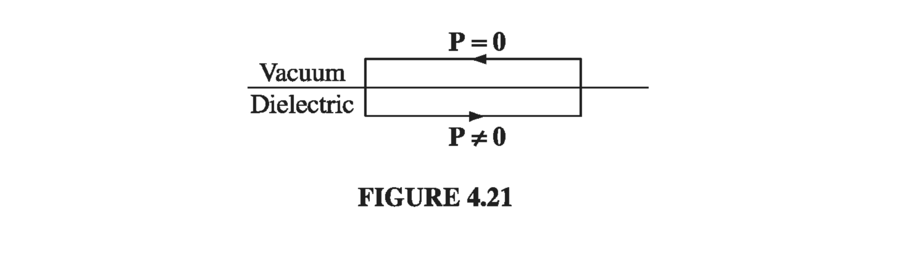
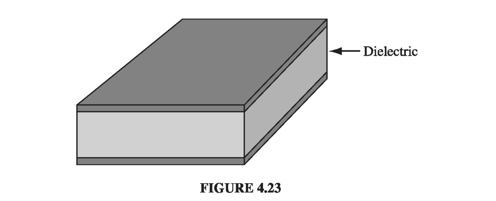

# 4.4: Linear Dielectrics

## 4.4.1: Susceptibility, Permittivity, Dielectric Constant

In the first few sections of this chapter we did not commit ourselves as to the _cause_ of __P__; we dealt only with the effects of polarization. From the qualitative essence of 4.1, though, we know that the polarization of a dielectric ordinarily results from an electric field, which lines up the atomic or molecular dipoles. For many substances, in fact, the polarization is proportional to the field, provided __E__ is not too strong:
$$
\vec{P} = \epsilon_0 \chi_e \vec{E} \tagl{4.30}
$$
The constant of proportionality, \( \chi_e \), is called the __electric susceptibility__ of the medium (a factor of \( \epsilon_0 \) has been extracted to make \( \chi_e \) dimensionless). The value of \( \chi_e \) depends on the microscopic structure of the substance in question (and also on external conditions such as temperature). I shall call materials that obey \( \eqref{4.30} \) __linear dielectrics__.

 > In modern optical applications, especially, nonlinear materials have become increasingly important. For these there is a second term relating __P__ to __E__ - typically a _cubic_ term. In general, Eq 4.30 can be regarded as the first (nonzero) term in the Taylor expansion of __P__ in powers of __E__.

Note that __E__ in \( \eqref{4.30} \) is the _total_ field; it may be due in part to free charges and in part to the polarization itself. If, for instance, we put a piece of dielectric into an external field \( \vec{E_0} \), we cannot compute __P__ directly from the linear susceptibility relation; the external field will polarize the material, and this polarization will produce its own field, which then contributes to the total field, and this in turn modifies the polarization, which... Breaking out of this infinite regress is not always easy. You'll see some examples in a moment. The simplest approach is to begin with the _displacement_, at least in those cases where __D__ can be deduced directly from the free charge distribution.
In linear media we have
$$
\vec{D} = \epsilon_0 \vec{E} + \vec{P} = \epsilon_0 \vec{E} + \epsilon_0 \chi_e \vec{E} = \epsilon_0 (1 + \chi_e) \vec{E} \tagl{4.31}
$$
so __D__ is also proportional to __E__
$$
\vec{E} = \epsilon \vec{E} \tagl{4.32}
$$
where
$$
\epsilon \equiv \epsilon_0 (1 + \chi_e) \tagl{4.33}
$$
This new constant \( \epsilon \) is called the __permittivity__ of the material. (In vacuum, where there is no matter to polarize, the susceptibility is zero, and the permittivity is \( \epsilon_0 \). That's why \( \epsilon_0 \) is called the permittivity of free space. I dislike the term, for it suggest that the vacuum is just a special kind of linear dielectric, in which the permittivity happens to have the value \( 8.85 \times 10^{-12} C^2 / N \cdot m^2 \) .) If you remove a factor of \( \epsilon_0 \), the remaining dimensionless quantity
$$
\epsilon_r  = 1 + \chi _e = \frac{\epsilon}{\epsilon_0} \tagl{4.34}
$$
is called the __relative permittivity__, or __dielectric constant__, of the material. Dielectric constants for some common substances are listed in Table 4.2. (Notice that \( \epsilon_r \) is greater than 1, for all ordinary materials.) Of course, the permittivity and the dielectric constant do not convey any information that was not already available in the susceptibility, nor is there anything essentially new in Eq 4.32: the physics of linear dielectrics is all contained in \( \eqref{4.30} \) 

#### Example 4.5

!!! question "A metal sphere of radius _a_ carries a charge _Q_ (Fig 4.20). It is surrounded, out to radius _b_, by linear dielectric material of permittivity \( \epsilon \). Find the potential at the center (relative to infinity)."

    
    __Solution__
    To compute V, we need to know E; to find E, we might first try to locate the bound charge; we could get the bound charge from __P__, but we can't calculate __P__ unless we already know __E__. What we _do_ know is the free charge, and our arrangement is spherically symmetric, so we can go straight for __D__ using Eq 4.23:
    $$
    \vec{D} = \frac{Q}{4 \pi r^2} \vu{r}, \quad \text{ for all points } r > a
    $$
    Inside the conducting sphere, all our electrostatic fields are zero. We then obtain __E__ via Eq 4.32:
    $$
    \vec{E} = \begin{cases}
    \frac{Q}{4 \pi \epsilon r^2} \vu{r} & \quad \text{ for } a < r < b \\
    \frac{Q}{4 \pi \epsilon_0 r^2} \vu{r} & \quad \text{ for } r > b
    \end{cases}
    $$
    We get the potential at the center by integrating __E__
    $$
    V = - \int _{\infty} ^0 \vec{E} \cdot \dd \vec{l} = \\
    - \int _{\infty} ^b \left( \frac{Q}{4 \pi \epsilon_0 r^2}  \right) \dd r - \int_b ^a \left( \frac{Q}{4 \pi \epsilon r^2}  \right) \dd r\\
     = \frac{Q}{4 \pi } \left( \frac{1}{\epsilon_0 b} + \frac{1}{\epsilon a} - \frac{1}{\epsilon b}  \right)
    $$
    In this case, we didn't need to compute the polarization or the bound charge explicitly, but we can easily do so now that we have __E__:
    $$
    \vec{P} = \epsilon_0 \chi_e \vec{E} = \frac{\epsilon_0 \chi_e Q}{4 \pi \epsilon r^2} \vu{r}
    $$
    within the dielectric, so that
    $$
    \rho_b = - \div \vec{P} = 0
    $$
    and
    $$
    \sigma_b = \vec{P} \cdot \vu{n} = \begin{cases}
    \frac{\epsilon_0 \chi_e Q}{4 \pi \epsilon b^2} & \qquad \text{ at the outer surface } \\
    \frac{- \epsilon_0 \chi_e Q}{4 \pi \epsilon a^2} & \qquad \text{ at the inner surface }
    \end{cases}
    $$
    Notice that the surface bound charge at _a_ is _negative_ (\( \vu{n} \) points outward with respect to the dielectric, which is \( + \vu{n} \) at b, but \( -\vu{r} \) at a). This is natural, since the charge on the metal sphere attracts its opposite in all the dielectric molecules. It is this layer of negative charge that reduces the field, within the dielectric, from \( 1 / 4 \pi \epsilon_0 (Q / r^2) \vu{r} \) to \( 1 / 4 \pi \epsilon (Q / r^2) \vu{r} \). In this respect, a dielectric is rather like an imperfect conductor: on a conducting shell the induced surface charge would be such as to cancel out the field of Q entirely in the region \( a < r < b \); the dielectric does the best it can, but the cancellation is only partial.

Since linear dielectrics give us cases where __P__ and __D__ are proportional to __E__, you might suppose that linear dielectrics escape the defect in the parallel between __E__ and __D__. Does it not follow that their curls, like __E__'s, must vanish? Unfortunately, it does not, for the line integral of __P__ around a closed path that straddles the boundary between one type of material and another need not be zero, even though the integral of __E__ around the same loop _must_ be. The reason is that the proportionality factor \( \epsilon_0 \chi_e \) is different on the two sides. For instance, at the interface between a polarized dielectric and the vacuum (Fig 4.21), __P__ is zero on one side but not on the other. Around this loop, \( \oint \vec{P} \cdot \dd \vec{l} \neq 0 \), and hence, by Stokes' theorem, the curl of __P__ cannot vanish everywhere within the loop (in fact, it is infinite at the boundary).

Of course, if space is _entirely_ filled with a homogeneous linear dielectric, then this objection is void; in this rather special circumstance
$$
\div \vec{D} = \rho_f \quad \text{and} \quad \curl \vec{D} = 0
$$
so __D__ can be found from the free charge just as though the dielectric were not there:
$$
\vec{D} = \epsilon_0 \vec{E_{vac}}
$$
where \( \vec{E_{vac}} \) is the field the same charge distribution would produce in the absence of any dielectric. According to \( \eqref{4.32} \) and \( \eqref{4.34} \), therefore,
$$
\vec{E} = \frac{1}{\epsilon} \vec{D} = \frac{1}{\epsilon_r} \vec{E_{vac}} \tagl{4.35}
$$
Conclusion: when all space is filled with a homogeneous linear dielectric, the field everywhere is simply reduced by a factor of one over the dielectric constant. (Actually it's not necessary for the dielectric to fill all space; in regions where the field is zero anyway, it can hardly matter whether the dielectric is present or not, since there's no polarization in any event.)

For example, if a free charge _q_ is embedded in a large dielectric, the field it produces is
$$
\vec{E} = \frac{1}{4 \pi \epsilon} \frac{q}{r^2} \vu{r} \tagl{4.36}
$$
(that's \( \epsilon \), not \( \epsilon_0 \)), and the force it exerts on nearby charges is reduced accordingly. But it's not that there is anything wrong with Coulomb's law; rather, the polarization of the medium partially "shields" the charge, by surrounding it with bound charge of the opposite sign (Fig 4.22)

#### Example 4.6

!!! question "A parallel-plate capacitor (Fig 4.23) is filled with insulating material of dielectric constant \( \epsilon_r \). What effect does this have on its capacitance?"

    
    __Solution__
    Since the field is confined to the space between the plates, the dielectric will reduce __E__, and hence also the potential difference V, by a factor \( 1 / \epsilon_r \). Accordingly, the capacitance \( C = Q / V \) is increased by a factor of the dielectric constant
    $$
    C = \epsilon_r C_{vac} \tagl{4.37}
    $$
    This is, in fact, a common way to beef up a capacitor

A _crystal_ is generally easier to polarize in some directions than others, and in this case Eq 4.30 is replaced by the general linear relation
$$
\begin{align*}
P_x & = \epsilon_0 (\chi_{e,xx} E_x + \chi_{e, xy} E_y + \chi_{e, xz} E_z) \\
P_y & = \epsilon_0 (\chi_{e,yx} E_x + \chi_{e, yy} E_y + \chi_{e, yz} E_z) \\
P_z & = \epsilon_0 (\chi_{e,zx} E_x + \chi_{e, zy} E_y + \chi_{e, zz} E_z) \\
\end{align*} \tagl{4.38}
$$
just as Eq. 4.1 was superseded by Eq. 4.3 for asymmetrical molecules. The nine coefficients constitute the __susceptibility tensor__

## 4.4.2: Boundary Value Problems with Linear Dielectrics

In a (homogeneous isotropic) linear dielectric, the bound charge density is proportional to the free charge density
$$
\rho_b = - \div \vec{P} = - \div \left( \epsilon_0 \frac{\chi_e}{\epsilon} \vec{D} \right) = - \left( \frac{\chi_e}{1 + \chi_e}  \right) \rho_f \tagl{4.39}
$$
In particular, unless free charge is actually embedded in the material, \( \rho = 0 \) and any net charge must reside at the surface. Within such a dielectric, then, the potential obeys Laplace's equation, and all the machinery of Chapter 3 carries over. It is convenient, however, to rewrite the boundary conditions in a way that makes reference only to the free charge. Equation 4.26 says
$$
\epsilon_{above} E_{above} ^{\perp} - \epsilon_{below} E_{below} ^{\perp} = \sigma_f \tagl{4.40}
$$
or, in terms of the potential,
$$
\epsilon_{above} \pdv{V_{above}}{n} - \epsilon_{below} \pdv{V_{below}}{n} = - \sigma_f \tagl{4.41}
$$
whereas the potential itself is, of course, continuous (Eq 2.34):
$$
V_{above} = V_{below} \tagl{4.42}
$$

#### Example 4.7

!!! question "A sphere of homogeneous linear dielectric material is placed in an otherwise uniform electric field \( \vec{E_0} \) (Fig 4.27). Find the electric field inside the sphere"
    
    
    __Solution__
    This is very similar to Ex 3.8, in which an uncharged conducting sphere was introduced into a uniform field. In that case, the field of the induced charge canceled \( \vec{E_0} \) within the sphere. In a dielectric, the cancellation from the bound charge is incomplete.

    Our problem is to solve Laplace's equation, for \( V_{in}(r, \theta) \) when \( r \leq R \) and \( V_{out}(r, \theta) \) when \( r \geq R \), subject to the boundary conditions
    $$
    \tag{i} V_{in} = V_{out} \qquad \text{ at } r = R
    $$
    $$
    \tag{ii} \epsilon \pdv{V_{in}}{r} = \epsilon_0 \pdv{V_{out}}{r} \qquad \text{ at } r = R
    $$
    $$
    V_{out} \rightarrow - E_0 r \cos \theta \qquad \text{ for } r \gg R
    $$
    (The second of these follows from Eq 4.41, since there is no free charge at the surface.) Inside the sphere, Eq 3.65 says
    $$
    V_{in}(r, \theta) = \sum_{l=0} ^{\infty} A_l r^l P_l(\cos \theta) \tagl{4.44}
    $$
    outside the sphere, in view of (iii), we have
    $$
    V_{out}(r, \theta) = - E_0 r \cos \theta + \sum_{l=0} ^\infty \frac{B_l}{r^{l+1}} P_l(\cos \theta) \tagl{4.45}
    $$
    Boundary condition (i) requires that
    $$
    \sum_{l=0} ^{\infty} A_l R^l P_l(\cos \theta) = - E_0 R \cos \theta + \sum_{l=0} ^\infty \frac{B_l}{R^{l+1}} P_l(\cos \theta)
    $$
    so
    $$
    A_l R^l = \frac{B_l}{R_{l+1}}, \qquad \text{ for } l \neq 1 \\
    A_1 R = - E_0 R + \frac{B_1}{R^2} \tagl{4.46} 
    $$