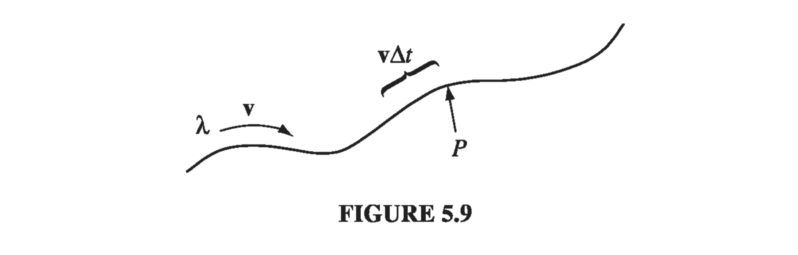

# 5.1: The Lorentz Force Law

## 5.1.1: Magnetic Fields

Remember the basic problem of classical electrodynamics: We have a collection of charges \( q_1, q_2, q_3, \ldots \) (the "source" charges), and we want to calculate the force they exert on some other charge _Q_ (the "test" charge). According to the principle of superposition, it is sufficient to find the force of a single source charge - the total is then the vector sum of all the individual forces. Up to now, we have confined our attention to the simplest case, electrostatics, in which the source charge is at rest (though the test charge need not be). The time has come to consider the forces between charges in motion.

To give you some sense of what is in store, imagine that I set up the following demonstration: Two wires hang from the ceiling, a few centimeters apart; when I turn on a current, so that it passes up one wire and back down the other, the wires jump apart - they evidently repel one another (Fig. 5.2(a)). How do we explain this? You might suppose that the battery (or whatever drives the current) is actually charging up the wire, and that the force is simply due to the electrical repulsion of like charges. But this is incorrect. I could hold up a test charge near these wires, and there would be no force on it, for the wires are in fact electrically neutral. (It's true that electrons are flowing down the line - that's what a current is - but there are just as many stationary plus charges as moving minus charges on any given segment.) Moreover, if I hook up my demonstration so as to make the current flow up both wires (Fig. 5.2(b)), they are found to attract! What's going on here?

Whatever force accounts for the attraction of parallel currents and the repulsion of anti-parallel ones is not electrostatic in nature. It is our first encounter with a magnetic force. Whereas a stationary charge produces only an electric field E in the space around it, a moving charge generates, in addition, a magnetic field __B__. In fact, magnetic fields are a lot easier to detect, in practice - all you need is a Boy Scout compass. How these devices work is irrelevant at the moment; it is enough to know that the needle points in the direction of the local magnetic field. Ordinarily, this means north, in response to the earth's magnetic field, but in the laboratory, where typical fields may be hundreds of times stronger than that, the compass indicates the direction of whatever magnetic field is present.

Now, if you hold up a tiny compass in the vicinity of a current-carrying wire, you quickly discover a very peculiar thing: The field does not point toward the wire, nor away from it, but rather it circles around the wire. In fact, if you grab the wire with your right hand-thumb in the direction of the current-your fingers curl around in the direction of the magnetic field (Fig. 5.3). How can such a field lead to a force of attraction on a nearby parallel current? At the second wire, the magnetic field points into the page (Fig. 5.4), the current is upward, and yet the resulting force is to the left! It's going to take a strange law to account for these directions.

## 5.1.2: Magnetic Forces

In fact, this contribution of directions is just right for a cross product: the magnetic force on a charge _Q_, moving with velocity __v__ in a magnetic field __B__ is
$$
\vec{F}_{mag} = Q(\vec{v} \cross \vec{B}) \tagl{5.1}
$$
This is known as the __Lorentz force law__. In the presence of both electric and magnetic fields, the net force on Q would be
$$
\vec{F} = q[ \vec{E} + ( \vec{V} \cross \vec{B} ) ] \tagl{5.2}
$$
I do not pretend to have derived \( \eqref{5.1} \), of course; it is a fundamental axiom of the theory, whose justification is to be found in experiments such as those I described in the previous section.

Our main job now is to calculate the magnetic field __B__ (and for that matter the electric field __E__ as well; the rules are more complicated when the source charges are in motion). But before we proceed, it is worthwhile to take a closer look at the Lorentz force law itself; it is a peculiar law, and it leads to some truly bizarre particle trajectories.

#### Example 5.1: Cyclotron Motion

!!! question "We have a charged particle moving in a constant magnetic field. What is the general form of the trajectory?"

    
    The archetypical motion of a charged particle in a magnetic field is circular, with the magnetic force providing the centripetal acceleration. In Fig 5.5, a uniform magnetic field points into the page; if the charge Q moves counterclockwise, with speed _v_, around a circle of radius _R_, the magnetic force points inward, and has a fixed magnitude _QvB_ - just right to sustain uniform circular motion:
    $$
    QvB = m \frac{v^2}{R} \quad \text{ or } \quad p = Q B R \tagl{5.3}
    $$
    where _m_ is the particle's mass, and \( p = mv \) is its momentum. Equation 5.3 is known as the __cyclotron formula__ because it describes the motion of a particle in a cyclotron - the first of the modern particle accelerators. It also suggests a simple experimental technique for finding the momentum of a charged particle: send it through a region of known magnetic field, and measure the radius of its trajectory. This is in fact the standard means for determining the momenta of elementary particles.

    I assumed that the charge moves in a plane perpendicular to __B__. If it starts out with some additional speed \( v_{\parallel} \) parallel to __B__, this component of the motion is unaffected by the magnetic field, and the particle moves in a _helix_ (Fig 5.6). The radius is given by Eq 5.3, but the velocity in question is now the component perpendicular to __B__, \( v_{\perp} \) 

#### Example 5.2: Cycloid Motion

!!! question "A more exotic trajectory occurs if we include a uniform electric field, at right angles to the magnetic one. Suppose, for instance, that __B__ points in the x-direction, and E in the z-direction, as shown in Fig. 5.7. A positive charge is released from the origin; what path will it follow?"

    __Solution__
    Let's think it through qualitatively, first. Initially, the particle is at rest, so the magnetic force is zero, and the electric field accelerates the charge in the z-direction. As it picks up speed, a magnetic force develops which, according to Eq. 5.1, pulls the charge around to the right. The faster it goes, the stronger \( F_{B} \) becomes; eventually, it curves the particle back around towards the y axis. At this point the charge is moving against the electrical force, so it begins to slow down - the magnetic force then decreases, and the electrical force takes over, bringing the particle to rest at point a, in Fig. 5.7. There the entire process commences anew, carrying the particle over to point b, and so on.
    Now let's do it quantitatively. There being no force in the x-direction, the position of the particle at any time _t_ can be described by the vector \( (0, y(t), z(t) ) \); the velocity is therefore
    $$
    \vec{v} = (0, \dot{y}, \dot{z})
    $$
    Thus,
    $$
    \vec{v} \cross \vec{B} = \begin{vmatrix} \vu{x} & \vu{y} & \vu{z} \\
    0 & \dot{y} & \dot{z} \\
    B & 0 & 0
    \end{vmatrix} = B \dot{z} \vu{y} - B \dot{y} \vu{z}
    $$
    and hence, applying Newton's second law,
    $$
    \vec{F} = Q(\vec{E} + \vec{v} \cross \vec{B}) = Q (E \vu{z} + B \dot{z} \vu{y} - B \dot{y} \vu{z}) = m \vec{a} = m(\ddot{y} \vu{y} + \ddot{z} \vu{z})
    $$
    Treating the y and z components separately,
    $$
    QB \dot{z} = m \ddot{y} \qquad Q E - Q B \dot{y} = m \ddot{z}
    $$
    Let's define a frequency
    $$
    \omega = \frac{Q B}{m} \tagl{5.4}
    $$
    (This is the __cyclotron frequency__, at which the particle would revolve in the absence of any electric field.) Then the equations of motion take the form
    $$
    \ddot{y} = \omega \dot{z} \qquad \ddot{z} = \omega \left( \frac{E}{B}  - \dot{y} \right) \tagl{5.5}
    $$
    We're left with a straightforward ODE, with solution
    $$
    \begin{align*}
    y(t) & = C_1 \cos \omega t + C_2 \sin \omega t + (E / B) t + C_3 \\
    z(t) & = C_2 \cos \omega t - C_1 \sin \omega t + C_4
    \end{align*} \tagl{5.6}
    $$
    But the particle started from rest (\( \dot{y}(0) = \dot{z}(0) = 0 ) \) at the origin \( ( y(0) = z(0) = 0) \); these four conditions determine the constants \( C_1, C_2, C_3, C_4 \):
    $$
    y(t) = \frac{E}{\omega B} (\omega t - \sin \omega t) \qquad z(t) = \frac{E}{\omega B} (1 - \cos \omega t) \tagl{5.7}
    $$
    In this form, the answer is not terribly enlightening, but if we let
    $$
    R \equiv \frac{E}{\omega B} \tagl{5.8}
    $$
    and eliminate the sines and cosines by exploiting the trigonometric identity \( \sin ^2 \omega t + \cos ^2 \omega t = 1 \), we find that
    $$
    (y - R \omega t)^2 + (z - R)^2 = R^2 \tagl{5.9}
    $$
    This is the formula for a circle, of radius R, whose center \( (0, R \omega t, R) \) travels in the y-direction at constant speed
    $$
    u = \omega R = \frac{E}{B} \tagl{5.10} 
    $$
    The particle moves as though it were a spot on the rim of a wheel rolling along the y-axis. The curve generated in this way is called a __cycloid__. Notice that the overall motion is not in the direction of __E__, as you might suppose, but perpendicular to it.

One implication of the Lorentz force law deserves special attention:

__Magnetic forces do no work__

For the magnetic force is, by definition, always perpendicular to the path of motion. Magnetic forces may alter the direction in which a particle moves, but they cannot speed it up or slow it down. The fact that magnetic forces do no work is an elementary and direct consequence of the Lorentz force law, but there are many situations where it appears so manifestly false that one's confidence is bound to waver. When a magnetic crane lifts the carcass of a junked car, for instance, _something_ is obviously doing work, and it seems perverse to deny that the magnetic force is responsible. Well, perverse or not, deny it we must, and it can be a very subtle matter to figure out who does deserve the credit in such circumstances. We'll see a cute example in the next section, but the full story will have to wait until we hit the key conservation laws much later.

## 5.1.3: Currents

The current in a wire is the charge per unit time passing a given point. By definition, negative charges moving to the left count the same as positive ones to the right. This conveniently reflects the physical fact that almost all phenomena involving moving charges depend on the product of charge and velocity - if you reverse the signs of _q_ and _v_, you get the same answer, so it doesn't really matter which you have. (The Lorentz force law is a case in point; the Hall effect (Prob. 5.41) is a notorious exception.) In practice, it is ordinarily the negatively charged electrons that do the moving - in the direction opposite to the electric current. To avoid the petty complications this entails, I shall often pretend it's the positive charges that move, as in fact everyone assumed they did for a century or so after Benjamin Franklin established his unfortunate convention. Current is measured in coulombs-per-second, or amperes (A):
$$
1 \text{ A} = 1 \text{ C/s} \tagl{5.12}
$$

A line charge \( \lambda \) traveling down a wire at speed _v_ (Fig 5.9) constitutes a current
$$
I = \lambda v \tagl{5.13}
$$
because a segment of length \( v \Delta t \), carrying charge \( \lambda v \Delta t \), passes point P in a time interval \( \Delta t \). Current is actually a vector
$$
\vec{I} = \lambda \vec{v} \tagl{5.14}
$$

Because the path of the flow is dictated by the shape of the wire, one doesn't ordinarily bother to display the direction of I explicitly, but when it comes to surface and volume currents we cannot afford to be so casual, and for the sake of notational consistency it is a good idea to acknowledge the vectorial character of currents right from the start. A neutral wire, of course, contains as many stationary positive charges as mobile negative ones. The former do not contribute to the current-the charge density \( \lambda \) in Eq. 5.13 refers only to the moving charges. In the unusual situation where both types move, I = \( \lambda_{+} \vec{v}_{+} + \lambda_{-}\vec{v}_{-}  \) .
The magnetic force on a segment of current-carrying wire is
$$
\vec{F}_B = \int (\vec{v} \cross \vec{B}) \dd q = \int (\vec{v} \cross \vec{B}) \lambda \dd l = \int (\vec{I} \cross \vec{B}) \dd l \tagl{5.15}
$$
Inasmuch as __I__ and dl both point in the same direction, we can just as well write this as
$$
\vec{F}_B = \int I ( \dd \vec{l} \cross \vec{B}) \tagl{5.16}
$$
Typically, the current is constant (in magnitude) along the wire, and in that case, I comes outside the integral:
$$
\vec{F}_B = I \int ( \dd \vec{l} \cross \vec{B}) \tagl{5.17}
$$

#### Example 5.3

!!! question "A rectangular loop of wire, supporting mass m, hangs vertically with one end in a uniform magnetic field __B__, which points into the page in the shaded region of Fig 5.10. For what current I, in the loop, would the magnetic force upward exactly balance the gravitational force downward?"

    
    __Solution__
    First of all, the current must circulate clockwise, in order for \( (\vec{I} \cross \vec{b}) \) in the horizontal segment to point upward. The force is
    $$
    F_B = I B a
    $$
    where _a_ is the width of the loop. The magnetic forces on the two vertical segments cancel.