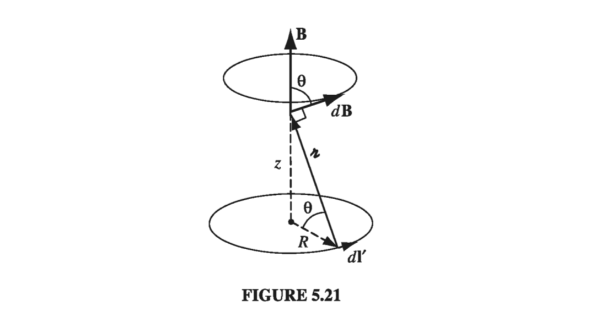

# 5.2: The Biot-Savart Law

5.1.2 Continued...

!!! question "Example: Mass Spectrometer"
    
    Suppose we have particles of several isotopes of a known element, and we wish to know exactly which mass isotopes are present (and separate them out) A mass spectrometer is an instrument which can measure the masses and relative concentrations of atoms and molecules. It makes use of the basic magnetic force on a moving charged particle. First, we ionize the particle, giving it a known net charge. We accelerate the particles through a known voltage into a constant magnetic field perpendicular to the velocity of the particle. The charged particles now undergo cyclotron motion (as we just described) of radius given by
    $$
    m v = q B R \rightarrow v^2 = \frac{q^2 B^2 R^2}{m^2} 
    $$
    We know that the energy per unit charge imparted by our known voltage difference is
    $$
    q | \Delta V| = \frac{1}{2} m v^2 \rightarrow v^2 = \frac{2 q | \Delta V|}{m} 
    $$
    We can measure the radius of the cyclotron motion by simply putting a detector wall 1/2 of the way around the circular motion, such that the ions will strike the detector a distance \( 2R \) from the output nozzle of the accelerating voltage. Putting our known quantities (\( \Delta V, B )\) together with the measured radius of the cyclotron motion, we get
    $$
    \frac{m}{q} = \frac{B^2 R^2}{2 | \Delta V|} 
    $$

## 5.2.1: Steady Currents

Stationary charges produce electric fields that are constant in time; hence the term __electrostatics__. Steady currents produce magnetic fields that are constant in time; the theory of steady currents is called __magnetostatics__.

By "__steady current__" I mean a continuous flow that has been going on forever, without change and without piling up anywhere (some people call them "stationary currents"; to my ear, that's a contradiction in terms). Formally, electro/magnetostatics is the regime
$$
\pdv{\rho}{t} = 0, \quad \pdv{\vec{J}}{t} = 0 \tagl{5.32}
$$
at all places and all times. Of course, there's no such thing in practice as a truly steady current, any more than there is a _truly_ stationary charge. In this sense, both electrostatics and magnetostatics describe artificial worlds that exist only in textbooks. However, they represent suitable approximations as long as the actual fluctuations are remote, or gradual - in fact, for most purposes magnetostatics applies very well to household currents, which alternate 120 times per second!

Notice that a moving point charge cannot possibly constitute a steady current. If it's here one instant, it's gone the next. This may seem like a minor thing to you, but it's a major headache for me. I developed each topic in electrostatics by starting out with the simple case of a point charge at rest; then I generalized to an arbitrary charge distribution by invoking the superposition principle. This approach is not open to us in magnetostatics because a moving point charge does not produce a static field in the first place. We are forced to deal with extended current distributions right from the start, and, as a result, the arguments are bound to be more cumbersome.
When a steady current flows in a wire, its magnitude I must be the same all along the line; otherwise, charge would be piling up somewhere, and it wouldn't be a steady current. More generally, since \( \partial \rho / \partial t = 0 \) in magnetostatics, the continuity equation (5.29) becomes
$$
\grad \vec{J} = 0 \tagl{5.33}
$$

## 5.2.2: The Magnetic Field of a Steady Current

The magnetic field of a steady line current is given by the __Biot-Savart law__:
$$
\vec{B}(r) = \frac{\mu_0}{4 \pi} \int \frac{\vec{I} \cross \vu{\gr}}{\gr ^2} \dd l' = \frac{ \mu_0}{4 \pi } I \int \frac{\dd \vec{l'} \cross \vu{\gr}}{\gr ^2} \tagl{5.34} 
$$
The integration is along the current path, in the direction of the flow; \( \dd \vec{l'} \) is an element of length along the wire, and \( \vu{\gr} \), as always, is the vector from the source to the point __r__ (Fig 5.17). The constant \( \mu_0 \) is called the __permeability of free space__:
$$
\mu_0 = 4 \pi \times 10^{-7} \text{N} / \text{A}^2 \tagl{5.35}
$$
This is an exact number, not an empirical constant. It serves to _define_ the ampereThese units are such that __B__ itself comes out in newtons per ampere-meter (as required by the Lorentz force law), or __teslas__ (T):
$$
1 \text{T} = 1 \text{N} / (\text{A} \cdot \text{m}) \tagl{5.36}
$$

  

As the starting point for magnetostatics, the Biot-Savart law plays a role analogous to Coulomb's law in electrostatics. Indeed, the \( 1/ \gr ^2 \) dependence is common to both laws

#### Example 5.5

!!! question "Find the magnetic field a distance _s_ from a long straight wire carrying a steady current _I_ (Fig 5.18)."
    
    
  

    __Solution__
    In the diagram, \( \dd \vec{l'} \cross \gr \) points out of the page, and has the magnitude
    $$
    \dd l' \sin \alpha = \dd l' \cos \theta
    $$
    Also, \( l' = s \tan \theta \), so
    $$
    \dd l' = \frac{s}{ \cos ^2 \theta} \dd \theta
    $$
    and \( s = \gr \cos \theta \), so
    $$
    \frac{1}{\gr^2} = \frac{\cos ^2 \theta}{s^2} 
    $$
    The Biot-Savart law gives the magnetic field as
    $$
    \begin{align*}
    B & = \frac{\mu_0 I}{4 \pi} \int _{\theta_1}^{\theta_2} \left( \frac{\cos ^2 \theta}{s^2}  \right) \left( \frac{s}{\cos ^2 \theta} \right) \cos \theta \dd \theta \\
    & = \frac{\mu_0}{4 \pi s} \int _{\theta_1}^{\theta_2} \cos \theta \dd \theta \\
    & = \frac{\mu_0 I}{4 \pi s} (\sin \theta_2 - \sin \theta_1) \tagl{5.37}
    \end{align*}
    $$
    That is the field of any straight segment of wire, in terms of the initial and final angles \( \theta_1 \) and \( \theta_2 \) (Fig 5.19). Of course, a finite segment by itself could never support a steady current (where would the charge go when it got to the end?), but it might be a piece of some closed circuit, and \( \eqref{5.37} \) would then represent its contribution to the total field. In the case of an infinite wire, \( \theta_1 = - \pi / 2 \) and \( \theta_2 = \pi / 2 \) so we obtain
    $$
    B = \frac{\mu_0 I}{2 \pi s} \tagl{5.38}
    $$
    Notice that the field is inversely proportional to the distance from the wire - just like the electric field of an infinite line charge. In the region below the wire, __B__ points into the page, and in general, it "circles around" the wire, in accordance with the right-hand rule
    $$
    \vec{B} = \frac{\mu_0 I}{2 \pi s} \vu{\phi} \tagl{5.39}
    $$
    As an application, let's find the force of attraction between two long, parallel wires a distance _d_ apart, carrying currents \( I_1 \) and \( I_2 \) (Fig 5.20). The field at (2) due to (1) is
    $$
    B = \frac{\mu_0 I_1}{2 \pi d}
    $$
    and it points into the page. The Lorentz force law (in the form appropriate to line currents) predicts a force directed upwards (1), of magnitude
    $$
    F = I_2 \left( \frac{\mu_0 I_1}{2 \pi d}  \right) \int \dd l
    $$
    The total force, not surprisingly, is infinite, but the force per unit length is
    $$
    f = \frac{ \mu_0}{2 \pi } \frac{I_1 I_2}{d} \tagl{5.40}
    $$
    If the currents are antiparallel (one up, one down), the force is repulsive - consistent again with the qualitative observations of Sect 5.1.1.
    
  

#### Example 5.6

!!! question "Find the magnetic field a distance z above the center of a circular loop of radius _R_, which carries a steady current _I_ (Fig 5.21)"

    
  

    __Solution__

    The field \( \dd \vec{B} \) attributable to the segment \( \dd \vec{l'} \) points as shown. As we integrate \( \dd \vec{l'} \)  around the loop, \( \dd \vec{B} \) sweeps out a cone. The horizontal components cancel, and the vertical components combine, to give
    $$
    B(z) = \frac{\mu_0 }{4 \pi} I \int \frac{\dd l'}{\gr ^2} \cos \theta
    $$
    (Notice that dl' and \( \gr \) are perpendicular, in this case; the factor of \( \cos \theta \) projects out the vertical component.) Now, \( \cos \theta \) and \( \gr ^2 \) are constants, and \( \int dl' \) is simply the circumference \( 2 \pi R \), so
    $$
    B(z) = \frac{\mu_0 I}{4 \pi} \left( \frac{\cos \theta}{\gr ^2} \right) 2 \pi R = \frac{\mu_0 I}{2} \frac{R^2}{(R^2 + z^2) ^{3/2}}  \tagl{5.41}
    $$

