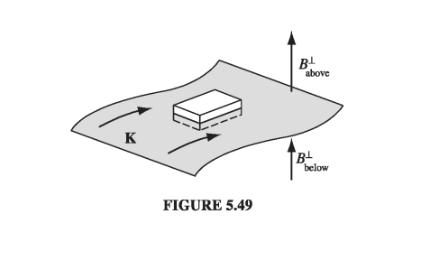

# 5.4: Magnetic Vector Potential

## 5.4.1: The Vector Potential

Just as \( \curl \vec{E} = 0 \) permitted us to introduce a scalar potential (V) in electrostatics, 
$$
\vec{E} = - \grad \vec{V}
$$
so \( \div \vec{B} = 0 \) invites the introduction of a vector potential __A__ in magnetostatics
$$
\vec{B} = \curl \vec{A} \tagl{5.61}
$$
We were allowed to define these potentials based on our extended proof of the Helmholtz theorem (back in Section 1.6). The potential formulation automatically takes care of \( \div \vec{B} = 0 \) since the divergence of a curl is always zero; there remains Ampere's law:
$$
\curl \vec{B} = \curl (\curl \vec{A}) = \grad (\div \vec{A}) - \grad ^2 \vec{A} = \mu_0 \vec{J} \tagl{5.62}
$$
Now, the electric potential had a built-in ambiguity: you can add to V any function whose gradient is zero (which is to say, a constant), without altering the physical quantity __E__. Likewise, you can add to __A__ any function whose curl vanishes (which is to say, the gradient of any scalar), with no effect on __B__. We can exploit this freedom to eliminate the divergence of __A__:
$$
\div \vec{A} = 0 \tagl{5.63}
$$
To prove that this is always possible, suppose that our original potential \( \vec{A_0} \) is _not_ divergenceless. If we add to it the gradient of \( \lambda \) \( (\vec{A} = \vec{A}_0 + \grad \lambda) \), the new divergence is
$$
\div \vec{A} = \div \vec{A_0} + \grad ^2 \lambda
$$
We can accommodate Eq. 5.63, then, if a function \( \lambda \) can be found that satisfies
$$
\grad ^2 \lambda = - \div \vec{A_0}
$$
But this is mathematically identical to Poisson's equation
$$
\grad ^2 \lambda = - \frac{\rho}{\epsilon_0} 
$$
with \( \div \vec{A}_0 \) in place of \( \rho / \epsilon_0 \) as the "source." And we know how to solve Poisson's equation - that's what electrostatics is all about. In particular, if \( \rho \) goes to infinity, the solution is Eq. 2.29:
$$
V = \frac{1}{4 \pi \epsilon_0} \int \frac{\rho}{\gr} \dd \tau'
$$
and by the same token, if \( \div \vec{A}_0 \) goes to zero at infinity, then
$$
\lambda = \frac{1}{4 \pi} \int \frac{\div \vec{A}_0}{\gr } \dd \tau'
$$

If \( \div \vec{A}_0 \) does not go to zero at infinity, then we'll have to use other means to discover the appropriate \( \lambda \), just as we get the electric potential by other means when the charge distribution extends to infinity. But the essential point remains: It is always possible to make the vector potential divergenceless. To put it the other way round,: the definition \( \vec{B} = \curl \vec{A} \) specifies the curl of __A__, but it doesn't say anything about the divergence - we are at liberty to pick that as we see fit, and zero is ordinarily the simplest choice.

With this condition on __A__, Ampere's law becomes
$$
\grad ^2 \vec{A} = - \mu_0 \vec{J} \tagl{5.64}
$$
This again is nothing but Poisson's equation, or rather it is three of them, one for each Cartesian coordinate. In Cartesian coordinates, \( \grad ^2 \vec{A} = (\grad ^2 A_x) \vu{x} + (\grad ^2 A_y) \vu{y} + (\grad ^2 A_z) \vu{z} \), so 5.64 reduces to \( \grad ^2 A_x = - \mu_0 J_x \), \( \grad ^2 A_y = - \mu_0 J_y \), and \( \grad ^2 A_z = - \mu_0 J_z \). In curvilinear coordinates, the unit vectors themselves are functions of position, and must be differentiated, so it is _not_ the case, for example, that \( \grad ^2 A_r = - \mu_0 J_r \). Remember that even if you plan to evaluate integrals such as 5.65 using curvilinear coordinates, you must first express \( \vec{J} \) in terms of its Cartesian components. Assuming __J__ goes to zero at infinity, we can read off the solution
$$
\vec{A} (\vec{r}) = \frac{\mu_0}{4 \pi} \int \frac{\vec{J}(r')}{\gr} \dd \tau' \tagl{5.65}
$$
For line and surface currents,
$$
\vec{A} = \frac{\mu_0}{4 \pi} \int \frac{\vec{I}}{\gr } \dd l' = \frac{\mu_0 \vec{I}}{4 \pi} \int \frac{1}{\gr} \dd \vec{l}'; \qquad \vec{A} = \frac{\mu_0}{4\pi} \int \frac{\vec{K}}{\gr} \dd a' \tagl{5.66}
$$
(If the current does not go to zero at infinity, we have to find other ways to get __A__; some of these are explored in Exercise 5.12 and in the problems at the end of the section.)

It must be said that __A__ is not as useful as V. For one thing, it's still a vector, and although Eqs. 5.65 and 5.66 are somewhat easier to work with than the Biot-Savart law, you still have to fuss with components. It would be nice if we could get away with a scalar potential
$$
\vec{B} = - \grad U
$$
but this is incompatible with Ampere's law, since the curl of a gradient is always zero.  (A magnetostatic scalar potential can be used, if you stick scrupulously to simply-connected, current-free regions, but as a theoretical tool, it is of limited interest. See problem 5.29.) Moreover, since magnetic forces do no work, __A__ does not admit a simple physical interpretation in terms of potential energy per unit charge. (In some contexts it can be interpreted as the momentum per unit charge.) Nevertheless, the vector potential has substantial theoretical importance, as we shall see in chapter 10.

#### Example 5.11

!!! question "A spherical shell of radius R, carrying a uniform surface charge \( \sigma \), is set spinning at angular velocity \( \omega \). Find the vector potential it produces at __r__ (Fig 5.45)."
    
  

    __Solution__
    While it might seem natural to set the polar axis along \( \omega \), in fact the integration is easier if we let __r__ lie on the z axis, so that \( \omega \) is tilted at an angle \( \psi \). We may as well orient the x axis so that \( \omega \) lies in the xz plane, as shown in Fig 5.46. According to Eq. 5.66,
    $$
    \vec{A}(r) = \frac{\mu_0}{4 \pi} \int \frac{\vec{K(r')}}{\gr} \dd a'
    $$
    where \( \vec{K} = \sigma \vec{v} \), \( \gr = \sqrt{R^2 + r^2 - 2 R r \cos \theta'} \), and \( \dd a' = R^2 \sin \theta' \dd \theta ' \dd \phi' \ \). Now the velocity of a point __r'__ in a rotating rigid body is \( \vec{\omega} \cross \vec{r'} \); in this case,
    $$
    \begin{align*}
    \vec{v} & = \vec{\omega} \cross \vec{r'} \\
    &  = \begin{vmatrix}
    \vu{x} & \vu{y} & \vu{z} \\
    \omega \sin \psi & 0 & \omega \cos \psi \\
    R \sin \theta' \cos \phi' & R \sin \theta' \sin \phi' & R \cos \theta'
    \end{vmatrix} \\
    & = R \omega [ - (\cos \psi \sin \theta' \sin \phi') \vu{x} \\
    & \qquad +  (\cos \psi \sin \theta' \cos \phi' - \sin \psi \cos \theta') \vu{y} \\
    & \qquad + (\sin \psi \sin \theta' \sin \phi') \vu{z} ]
    \end{align*}
    $$
    Notice that each of these terms, save one, involves either \( \sin \phi' \) or \( \cos \phi' \). Since
    $$
    \int _0 ^{2 \pi} \sin \phi' \dd \phi' = \int_0 ^{2\pi} \cos \phi' \dd \phi' = 0
    $$
    such terms do not contribute to the integral. There remains
    $$
    \vec{A}(r) = - \frac{\mu_0 R^3 \sigma \omega \sin \psi}{2} \left( \int_0 ^{\pi} \frac{\cos \theta' \sin \theta'}{\sqrt{R^2 + r^2 - 2 R r \cos \theta'}} \dd \theta' \right) \vu{y}
    $$
    Letting \( u \equiv \cos \theta' \), the integral becomes
    $$
    \int_{-1} ^{+1} \frac{u}{\sqrt{R^2 + r^2 - 2 R r u}} \dd u = \left. - \frac{(R^2 + r^2 + R r u)}{3 R^2 r^2} \sqrt{R^2 + r^2 - 2 R r u} \right|_{-1} ^{+1} \\
     = - \frac{1}{3 R^2 r^2} \left[ (R^2 + r^2 + R r ) | R - r| - (R^2 + r^2 - Rr)(R + r) \right]
    $$
    If the point __r__ lies inside the sphere, then \( R > r \) and this expression reduces to \( (2r / 3R^2) \); if __r__ lies outside the sphere, so that \( R < r \), it reduces to \( (2R / 3r^2) \). Noting that \( (\vec{\omega} \cross \vec{r}) = - \omega r \sin \psi \vu{y} \), we have finally
    $$
    \vec{A}(r) = \begin{cases}
    \frac{\mu_0 R \sigma}{3} (\vec{\omega} \cross \vec{r}), \qquad & \text{ for points inside the sphere} \\
    \frac{\mu_0 R^4 \sigma}{3 r^3} (\vec{\omega} \cross \vec{r}, \qquad & \text{ for points outside the sphere} 
    \end{cases} \tagl{5.68}
    $$
    Having evaluated the integral, I revert to the "natural" coordinates of Fig. 5.45, in which \( \vec{\omega} \) coincides with the z axis and the point __r__ is at \( (r, \theta, \phi) \):
    $$
    \vec{A}(r, \theta, \phi) =  \begin{cases}
    \frac{\mu_0 R \sigma \omega }{3} r \sin \theta \vu{\phi}, \qquad & (r \leq R) \\
    \frac{\mu_0 R^4 \omega \sigma}{3 r^3} \frac{\sin \theta}{r^2} \vu{\phi} , \qquad & (r \geq R)
    \end{cases} \tagl{5.69}
    $$
    Curiously, the field inside this spherical shell is uniform:
    $$
    \vec{B} = \curl \vec{A} = \frac{2 \mu_0 R \omega \sigma}{3} (\cos \theta \vu{r} - \sin \theta \vu{\theta}) = \frac{2}{3} \mu_0 R \omega \vu{z} = \frac{2}{3} \mu_0 \sigma R \vec{\omega} \tagl{5.70}
    $$

#### Example 5.12

!!! question "Find the vector potential of an infinite solenoid with n turns per unit length, radius R, and current I"

    __Solution__
    This time we cannot use Eq 5.66, since the current itself extends to infinity. But there is a cute method that does the job. Notice that
    $$
    \oint \vec{A} \cdot \dd \vec{l} = \int (\curl \vec{A}) \cdot \dd \vec{a} = \int \vec{B} \cdot \dd \vec{a} = \Phi \tagl{5.71}
    $$
    where \( \Phi \) is the flux of __B__ through the loop in question. This is reminiscent of Ampere's law in integral form (Eq. 5.57)
    $$
    \oint \vec{B} \cdot \dd \vec{a} = \mu_0 I_{enc}
    $$
    In fact, it's the same equation, with \( \vec{B} \rightarrow \vec{A} \) and \( \mu_0 I_{enc} \rightarrow \Phi \). If symmetry permits, we can determine __A__ from \( \Phi \) in the same way we got __B__ from \( I_{enc} \), in section 5.3.3. The present problem (with a uniform longitudinal magnetic field \( \mu_0 n I \) inside the solenoid and no field outside) is analogous to the Ampere's law problem of a fat wire carrying a uniformly distributed current. The vector potential is "circumferential" (it mimics the magnetic field in the analog); using a circular "Amperian loop" at radius s inside the solenoid, we have
    $$
    \oint \vec{A} \dd \vec{l} = A (2 \pi s) = \int \vec{B} \cdot \dd \vec{a} = \mu_0 n I (\pi s^2)
    $$
    so
    $$
    \vec{A} = \frac{\mu_0 n I}{2} s \vu{\phi}, \quad \text{ for } s \leq R \tagl{5.72}
    $$
    For an Amperian loop outside the solenoid, the flux is
    $$
    \int \vec{B} \cdot \dd \vec{a} = \mu_0 n I (\pi R^2)
    $$
    since the field only extends out to R. Thus
    $$
    \vec{A} = \frac{\mu_0 n I}{2} \frac{R^2}{s} \vu{\phi} \quad \text{ for } s \geq R \tagl{5.73}
    $$
    To check our work, we can make sure that \( \curl \vec{A} = \vec{B} \) and \( \div \vec{A} = 0 \). Inside the solenoid,
    $$
    \begin{align*}
    \div \vec{A} & = \frac{1}{s} \pdv{}{s} (s A_s) + \frac{1}{s} \pdv{A_\phi}{\phi} + \pdv{A_z}{z} \\
    & = \frac{1}{s} \pdv{}{\phi} \frac{\mu_0 n I}{2} s = 0 \\
    \curl \vec{A} & = \left( \frac{1}{s} \pdv{A_z}{\phi} - \pdv{A_{\phi}}{z} \right) \vu{s} \\
    & + \left( \pdv{A_s}{z} - \pdv{A_z}{s} \right) \vu{\phi} \\
    & + \frac{1}{s} \left[ \pdv{}{s} (s A_{\phi}) - \pdv{A_s}{\phi} \right] \vu{z} \\
    & = \frac{\mu_0 n I}{2} \frac{1}{s} \left( \pdv{}{s} s^2 \right) \\
    & = \mu_0 n I
    \end{align*}
    $$
    Outside the solenoid,
    $$
    \begin{align*}
    \div \vec{A} & = \frac{1}{s} \pdv{}{s} (s A_s) + \frac{1}{s} \pdv{A_\phi}{\phi} + \pdv{A_z}{z} \\
    & = \frac{1}{s} \pdv{}{\phi} \frac{\mu_0 n I}{2} \frac{R^2}{s} = 0 \\
    \curl \vec{A} & = \left( \frac{1}{s} \pdv{A_z}{\phi} - \pdv{A_{\phi}}{z} \right) \vu{s} \\
    & + \left( \pdv{A_s}{z} - \pdv{A_z}{s} \right) \vu{\phi} \\
    & + \frac{1}{s} \left[ \pdv{}{s} (s A_{\phi}) - \pdv{A_s}{\phi} \right] \vu{z} \\
    & = \frac{\mu_0 n I}{2} \frac{1}{s} \left( \pdv{}{s} R^2 \right) \\
    & = 0
    \end{align*}
    $$
    which is just the answer we got in section 5.3 by Biot-Savart.

Typically, the direction of __A__ mimics the direction of the current. For instance, both were azimuthal in Exs. 5.11 and 5.12. Indeed, if all the current flows in one direction, then Eq. 5.65 suggests that __A__ must point that way too. Thus the potential of a finite segment of straight wire (Prob. 5.23) is in the direction of the current. Of course, if the current extends to infinity you can't use Eq. 5.65 in the first place (see Probs. 5.26 and 5.27). Moreover, you can always add an arbitrary constant vector to __A__ - this is analogous to changing the reference point for _V_, and it won't affect the divergence or curl of __A__, which is all that matters (in Eq. 5.65 we have chosen the constant so that __A__ goes to zero at infinity). In principle you could even use a vector potential that is not divergenceless, in which case all bets are off. Despite these caveats, the essential point remains: Ordinarily the direction of __A__ will match the direction of the current.

## 5.4.2: Boundary Conditions

In Chapter 2, we had a triangular diagram to summarize the relations among the three fundamental quantities in electrostatics: the charge density \( \rho \), the electric field __E__, and the potential _V_. A similar figure can be constructed for magnetostatics (Fig 5.48), relating the current density __J__, the field __B__, and the potential __A__. There is one "missing link" in the diagram: the equation for __A__ in terms of __B__. It's unlikely you would ever need such a formula, but in case you are interested, see Probs. 5.52 and 5.53

  

Just as the electric field suffers a discontinuity at a surface charge, so the magnetic field is discontinuous at a surface current. Only this time it is the tangential component that changes. For if we apply Eq. 5.50 in integral form
$$
\oint \vec{B} \cdot \dd \vec{a} = 0
$$
to a wafer-thin pillbox straddling the surface (Fig 5.49), we get
$$
B_{above} ^\perp =  B_{below} ^\perp \tagl{5.74}
$$

As for the tangential components, an Amperian loop running perpendicular to the current (Fig 5.50) yields

$$
\oint \vec{B} \cdot \dd \vec{l} = \left( B_{above}^\parallel - B_{below} ^{\parallel} \right) l = \mu_0 I_{enc} = \mu_0 K l 
$$
or
$$
B_{above}^\parallel - B_{below} ^{\parallel} = \mu_0 K \tagl{5.75}
$$

  

  

Thus the component of __B__ that is parallel to the surface but perpendicular to the current is discontinuous in the amount \( \mu_0 L \). A similar Amperian loop running parallel to the current reveals that the parallel component is continuous. These results can be summarized in a single formula
$$
\vec{B}_{above} - \vec{B}_{below} = \mu_0 ( \vec{K} \cross \vu{n} ) \tagl{5.76}
$$
where \( \vu{n} \) is perpendicular to the surface, pointing "upward."

Like the scalar potential in electrostatics, the vector potential is continuous across any boundary:
$$
\vec{A}_{above} = \vec{A}_{below} \tagl{5.77}
$$
for \( \div \vec{A} = 0 \) guarantees that the normal component is continuous, and \( \curl \vec{A} = \vec{B} \) in the form
$$
\oint \vec{A} \cdot \dd \vec{l} = \int \vec{B} \cdot \dd \vec{a} = \Phi
$$
means that the tangential components are continuous (the flux through an Amperian loop of vanishing thickness is zero). But the derivative of __A__ inherits the discontinuity of __B__:
$$
\pdv{A_{above}}{n} - \pdv{A_{below}}{n} = - \mu_0 \vec{K} \tagl{5.78}
$$

## 5.4.3: Multipole Expansion of the Vector Potential

If you want an approximate formula for the vector potential of a localized current distribution, valid at distant points, a multipole expansion is in order. Remember: the idea of a multipole expansion is to write the potential in the form of a power series in \( 1/r \), where _r_ is the distance to the point in question (Fig 5.51); if _r_ is sufficiently large, the series will be dominated by the lowest nonvanishing contribution, and the higher terms can be ignored. As we found in Section 3.4.1,
$$
\frac{1}{\gr} = \frac{1}{r} \sum_{n=0}^\infty \left( \frac{r'}{r}  \right)^n P_n (\cos \alpha) \tagl{5.79}
$$

  

