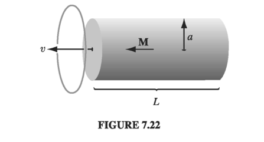
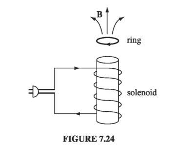

# 7.2: Electromagnetic Induction

---

## 7.2.1: Faraday's Law

In 1831 Michael Faraday reported on a series of experiments, including three that (with some violence to history) can be characterized as follows:

__Experiment 1:__. He pulled a loop of wire to the right through a magnetic field (Fig 7.21a). A current flowed in the loop.

__Experiment 2:__ He moved the magnet to the left, holding the loop still (Fig 7.21b). Again, a current flowed in the loop.

__Experiment 3:__ With both the loop and the magnet at rest (Fig 7.21c), he changed the strength of the field (he used an electromagnet, and varied the current in the coil). Once again, current flowed in the loop.

  

The first experiment, of course, is a straightforward case of motional emf; according to the flux rule:
$$
\mathcal{E} = - \dv{\Phi}{t}
$$
I don't think it will surprise you to learn that exactly the same emf arises in Experiment 2 - all that really matters is the relative motion of the magnet and the loop. Indeed, in the light of special relativity it has to be so. But Faraday knew nothing of relativity, and in classical electrodynamics this simple reciprocity is a remarkable coincidence. For if the loop moves, it's a magnetic force that sets up the emf, but if the loop is stationary, the force cannot be magnetic - stationary charges experience no magnetic forces. In that case, what is responsible? What sort of field exerts a force on charges at rest? Well, electric fields do, of course, but in this case there doesn't seem to be any electric field in sight.

Faraday had an ingenious inspiration:

$$
\textbf{A changing magnetic field induces an electric field}
$$
It is this induced electric field that accounts for the emf in Experiment 2. Indeed, if (as Faraday found empirically) the emf is again equal to the rate of change of the flux,
$$
\mathcal{E} = \oint \vec{E} \cdot \dd \vec{l} = - \dv{\Phi}{t} \tagl{7.14}
$$
then \( \vec{E} \) is related to the change in \( \vec{B} \) by the equation
$$
\oint \vec{E} \cdot \dd \vec{l} = - \int \pdv{\vec{B}}{t} \cdot \dd \vec{a} \tagl{7.15}
$$
This is __Faraday's law__, in integral form. We can convert it to differential form by applying Stokes' theorem:
$$
\curl \vec{E} = - \pdv{\vec{B}}{t} \tagl{7.16}
$$

Note that Faraday's law reduces to the old rule \( \oint \vec{E} \cdot \dd \vec{l} = 0 \) (or, in differential form, \( \curl \vec{E} = 0 \)) in the static case (constant \( \vec{B} \)), as, of course, it should.

In Experiment 3, the magnetic field changes for entirely different reasons, but according to Faraday's law an electric field will again be induced, giving rise to an emf \( - d \Phi / dt \). Indeed, one can subsume all three cases (and for that matter any combination of them) into a kind of __universal flux rule__:

!!! info "Whenever (and for whatever reason) the magnetic flux through a loop changes, an emf $$ \mathcal{E} = - \pdv{\Phi}{t} \tagl{7.17} $$ will appear in the loop."

Many people call this "Faraday's law." Maybe I'm overly fastidious, but I find this confusing. There are really two totally different mechanisms underlying Eq. 7.17, and to identify them both as "Faraday's law" is a little like saying that because identical twins look alike we ought to call them by the same name. In Faraday's first experiment, it's the Lorentz force law at work; the emf is magnetic. But in the other two it's an electric field (induced by the changing magnetic field) that does the job. Viewed in this light, it is quite astonishing that all three processes yield the same formula for the emf. In fact, it was precisely this "coincidence" that led Einstein to the special theory of relativity - he sought a deeper understanding of what is, in classical electrodynamics, a peculiar accident. But that's a story for chapter 12. In the meantime, I shall reserve the term "Faraday's law" for electric fields induced by changing magnetic fields, and I do not regard Experiment 1 as an instance of Faraday's law.

#### Example 7.5

!!! question "A long cylindrical magnet of length \( L \)  and radius \( a \)  carries a uniform magnetization \( \vec{M} \)  parallel to its axis. It passes at constant velocity \( \vec{v} \)  through a circular wire ring of slightly larger diameter (Fig. 7.22). Graph the emf induced in the ring, as a function of time."

    
  

    __Solution__
    The magnetic field is the same as that of a long solenoid with surface current \( \vec{K}_b = M \vu{\phi} \) . So the field inside is \( \vec{B} = \mu_0 \vec{M} \) , except near the ends, where it starts to spread out. The flux through the ring is zero when the magnet is far away; it builds up to a maximum of \( \mu_0 M \pi a^2 \)  as the leading end passes through; and it drops back to zero as the trailing end emerges (Fig. 7.23a). The emf is (minus) the derivative of \( \Phi \)  with respect to time, so it consists of two spikes, as shown in Fig. 7.23b.
    
  

Keeping track of the signs in Faraday's law can be a real headache. For instance, in Ex. 7.5 we would like to know which way around the ring the induced current flows. In principle, the right-hand rule does the job (we called \( \Phi \)  positive to the left, in Fig. 7.22, so the positive direction for current in the ring is counter-clockwise, as viewed from the left; since the first spike in Fig. 7.23b is negative, the first current pulse flows clockwise, and the second counterclockwise). But there's a handy rule, called Lenz's law, whose sole purpose is to help you get the directions right:

!!! info "Nature abhors a change in flux"

The induced current will flow in such a direction that the flux it produces tends to cancel the change. (As the front end of the magnet in Ex. 7.5 enters the ring, the flux increases, so the current in the ring must generate a field to the right - it therefore flows clockwise.) Notice that it is the change in flux, not the flux itself, that nature abhors (when the tail end of the magnet exits the ring, the flux drops, so the induced current flows counterclockwise, in an effort to restore it). Faraday induction is a kind of "inertial" phenomenon: A conducting loop "likes" to maintain a constant flux through it; if you try to change the flux, the loop responds by sending a current around in such a direction as to frustrate your efforts. (It doesn't succeed completely; the flux produced by the induced current is typically only a tiny fraction of the original. All Lenz's law tells you is the direction of the flow.)

#### Example 7.6

!!! question "The 'jumping ring' demonstration. If you wind a solenoidal coil around an iron core (the iron is there to beef up the magnetic field), place a metal ring on top, and plug it in, the ring will jump several feet in the air (Fig 7.24). Why?"

    
  

    __Solution__
    Before you turn on the current, the flux through the ring was zero. Afterward a flux appeared (upward in the diagram), and the emf generated in the ring led to a current (in the ring) which, according to Lenz's law, was in such a direction that its field tended to cancel this new flux. This means that the current in the loop is opposite to the current in the solenoid. As opposite currents repel (as we saw in our Biot-Savart calculations in the last chapter), the ring flies off.

## 7.2.2: The Induced Electric Field

Faraday's law generalizes the electrostatic rule \( \curl \vec{E} = 0 \)  to the time-dependent regime. The divergence of \( \vec{E} \)  is still given by Gauss's law (\( \div \vec{E} = \frac{1}{\epsilon_0} \rho \) ). If \( \vec{E} \)  is a pure Faraday field (due exclusively to a changing \( \vec{B} \) , with \( \rho = 0 \) ), then
$$
\div \vec{E} = 0 \qquad \curl \vec{E} = - \pdv{\vec{B}}{t}
$$
This is mathematically identical to magnetostatics
$$
\div \vec{B} = 0 \qquad \curl \vec{B} = \mu_0 \vec{J}
$$
Conclusion: Faraday-induced electric fields are determined by \( -(\partial \vec{B} / \partial t) \) in exactly the same way as magnetostatic fields are determined by \( \mu_0 \vec{J} \). The analog to Biot-Savart is
$$
\vec{E} = - \frac{1}{4 \pi} \int \frac{(\partial \vec{B} / \partial t) \cross \vu{\gr}}{\gr ^2} \dd \tau = - \frac{1}{4 \pi} \pdv{}{t} \int \frac{\vec{B} \cross \vu{\gr}}{\gr ^2} \dd \tau \tagl{7.18}
$$
and if symmetry permits, we can use all the tricks associated with Ampere's law in integral form (\( \oint \vec{B} \cdot \dd \vec{l} = \mu_0 I_{enc} \)), only now it's Faraday's law in integral form:
$$
\oint \vec{E} \cdot \dd \vec{l} = - \dv{\Phi}{t} \tagl{7.19}
$$
The rate of change of (magnetic) flux through the Amperian loop plays the role formerly assigned to \( \mu_0 I_{enc} \).

#### Example 7.7

!!! question "A uniform magnetic field \( \vec{B}(t) \), pointing straight up, fills the shaded circular region of Fig. 7.25. If \( \vec{B} \) is changing with time, what is the induced electric field?"

    
  

    __Solution__

    \( \vec{E} \) points in the circumferential direction, just like the magnetic field inside a long straight wire carrying a uniform current density. Draw an Amperian loop of radius \( s \), and apply Faraday's law:
    $$
    \oint \vec{E} \cdot \dd \vec{l} = E ( 2 \pi s) = - \dv{\Phi}{t} = - \dv{}{t} \left( \pi s^2 B(t) \right) = - \pi s^2 \dv{B}{t}
    $$
    Therefore
    $$
    \vec{E} = - \frac{s}{2} \dv{B}{t} \vu{\phi}
    $$
    If \( \vec{B} \) is increasing, \( \vec{E} \) runs clockwise, as viewed from above.