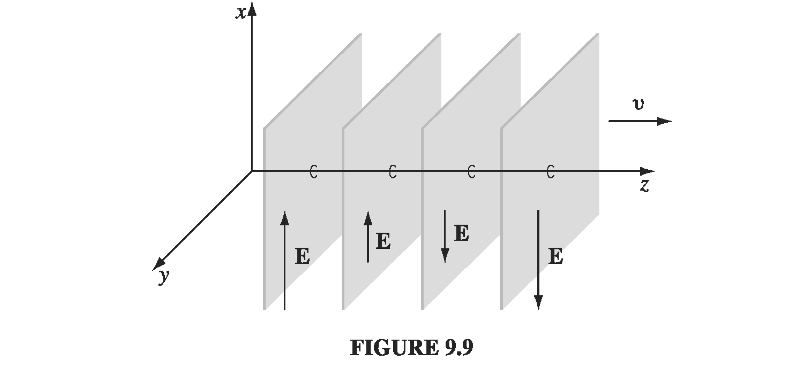

## 9.2 Electromagnetic Waves in Vacuum

Recall Maxwell's equations

$$ \begin{align*} (\text{i}) & \quad \div \vec{D} = \rho_f \quad \text{(Gauss's law)} \\ (\text{ii}) & \quad \div \vec{B} = 0 \quad \text{(Ng's Law)} \\ (\text{iii}) & \quad \curl \vec{E} = - \pdv{\vec{B}}{t} \quad \text{(Faraday's Law}) \\ (\text{iv}) & \quad \curl \vec{H} = \vec{J}_f + \pdv{\vec{D}}{t} \quad \text{(Ampere's Law)} \end{align*} $$

To get to a wave equation from these, we start with a curl of curl and use a standard vector identity
$$
\curl (\curl \vec E) = \grad ( \div \vec E) - \grad ^2 \vec E
$$
Use Faraday's law on the left hand side (and move the spatial derivative through the temporal one), and on the right hand side use Gauss' law to re-write the divergence
$$
\rightarrow - \pdv{}{t} ( \curl \vec B) = \frac{1}{\epsilon_0} \grad \rho - \grad ^2 \vec E
$$
$$
\rightarrow - \pdv{}{t} \left( \mu_0 \vec J + \mu_0 \epsilon_0 \pdv{\vec{E}}{t} \right) = - \mu_0 \pdv{\vec J}{t} - \mu_0 \epsilon_0 \frac{\partial ^2 \vec E}{\partial t ^2} = \frac{\grad \rho}{\epsilon_0} - \grad ^2 \vec E
$$
$$
\rightarrow \grad ^2 \vec E - \mu_0 \epsilon_0 \frac{\partial ^2 \vec E}{\partial t^2} = \frac{1}{\epsilon_0} \grad \rho + \mu_0 \pdv{\vec{J}}{t} \quad \text{"non-homogeneous" wave equation for E}
$$
In a vacuum, \( \rho = 0 \) and \( \vec J = 0 \) so
$$
\grad ^2 \vec E - \mu_0 \epsilon_0 \frac{\partial ^2 \vec E}{\partial t^2} = 0
$$
which is just a standard 3D wave equation. We can identify the speed of propagation based on the constant of proportionality \( v = \frac{1}{\sqrt{\mu_0 \epsilon_0}} = c \)

We could also have started with \( \curl (\curl \vec B) \) to obtain
$$
\grad ^2 \vec B - \mu_0 \epsilon_0 \frac{\partial ^2 \vec B}{\partial t^2} = - \mu_0 (\curl \vec J) \quad \text{"non-homogeneous" wave equation for B}
$$
So, in vacuum you get the exact same wave equation
$$
\grad ^2 \vec B - \mu_0 \epsilon_0 \frac{\partial ^2 \vec B}{\partial t^2} = 0
$$

So, both \( \vec E \) and \( \vec B \) must satisfy these wave equations. We know that the wave equations admit certain sets of solutions, but that's not the entire story. We'll see additional constraints on solutions to \( \vec E \) and \( \vec B \) due to the fact that the waves need to satisfy all of the Maxwell equations, so \( \vec E \) and \( \vec B \) are very intimately linked.

Consider monochromatic sine waves (plane waves) in a single direction, so that all variation happens in the z-direction. Again, using the superposition principle we'll be able to build up more complicated solutions.

$$
\vec E = \vec E_0 \cos (k z - \omega t + \delta) \qquad \vec B = \vec B_0 \cos (k z - \omega t + \delta)
$$
$$
\vec E_0 = E_{0, x} \vu x + E_{0, y} \vu y + E_{0, z} \vu z
$$

  

Let's apply Gauss' law (in vacuum)
$$
\div \vec E = 0
$$
$$
\div (\vec E_0 \cos (k z - \omega t + \delta) ) = 0
$$
$$
\rightarrow \pdv{E_{0, x}}{x} \cos (k z - \omega t + \delta ) + \pdv{E_{0, y}}{y} \cos (kz - \omega t + \delta)
$$
$$  + \pdv{E_{0, z}}{z} \cos (kz - \omega t + \delta) + E_{0,z}(- k \sin(kt - \omega t + \delta)) = 0
$$
We've decided that there is no variation in the x- and y-directions, so only the final term survives, and must be equal to zero
$$
E_{0, z} (- k \sin(kt - \omega t + \delta)) = 0 \quad \rightarrow \quad E_{0,z} = 0
$$
Which is to say that EM plane waves are "transverse" waves.

Let's also use Faraday's law to relate \( \vec E \) and \( \vec B \) :
$$
\curl \vec E = - \pdv{B}{t}
$$
$$
\curl \vec E = \begin{pmatrix}
 \vu x & \vu y & \vu z \\
 \pdv{}{x} & \pdv{}{y} & \pdv{}{z} \\
 E_{0, x} \cos (k z - \omega t) & E_{0, y} \cos (k z - \omega t) & 0
\end{pmatrix}
$$
$$
= \vu x ( E_{0, y} k \sin(kz - \omega t)) - \vu y (E_{0, x} k \sin(k z - \omega t))
$$
$$
- \pdv{B}{t} = - \vu x \pdv{}{t} B_{0, x} \cos (kz - \omega t) - \vu y \pdv{}{t}B_{0, y} \cos (kz - \omega t)
$$
$$
= - \vu x B_{0, x} \omega \sin (k z - \omega t) - \vu y B_{0, y} \omega \sin (kz - \omega t)
$$
Matching up components and canceling the sine functions,
$$
\rightarrow k E_{0, y} = - \omega B_{0, x} \qquad k E_{0, x} = \omega B_{0, y}
$$
So every time you have an \( \vec E \) field, you will have a \( \vec B \) field in an orthogonal direction - they are mutually orthogonal - and they have the same phase since the proportionality factors are _real_.